#### Como dice en el titulo del post trataré de hacer un tutorial de como implementar un sistema autenticación y de roles utilizando ROR, para esto crearé un proyecto en el que hay usuarios de 3 tipos (administrador, usuario, visitante) y cada usuario tiene posts y será una pequeña API por lo que no tendrá nada en el front, para la autenticación utilizaré el estandar JWT (Json Web Token) con la gema [ruby-jwt](https://github.com/jwt/ruby-jwt), y para el manejo de roles una librería de autorización que es la gema [cancancan](https://github.com/CanCanCommunity/cancancan/).

Y bueno empecemos, asumo que tienes rails y ruby instalado en tu pc, para este tutorial he utilizado las versiones:

```bash
$ ruby -v
> ruby 2.6.1p33 (2019-01-30 revision 66950) [x86_64-linux]
$ rails -v
> Rails 5.2.3
```

Lo primero que debemos hacer es crear el proyecto con `rails new authTutorial`

Siguiente a esto creamos los modelos

```bash
  rails g model Rol nombre:string
  rails g model Usuario correo:string password_digest:string rol:references
  rails g model Post titulo:string contenido:string usuario:references
```


> Importante el atributo password_digest que es el que le indica a rails que debe encriptar la contraseña al momento del registro.

> Importante crearlos en este orden para que no haya problemas al momento de migrar la base de datos.

Los anteriores comandos nos generarán tres modelos y tres migraciones.

Ahora debemos ir al modelo de usuarios en app/models/usuario.rb y decirle a rails que es un modelo al cual le debe encriptar la contraseña agregandole has_secure_password

```ruby
class Usuario < ApplicationRecord
  has_secure_password
  belongs_to :rol
end
```

El `belogns_to` se agrega automaticamente al momento de crear el modelo con el generador

Lo que haremos ahora será configurar nuestra base de datos en /config/database.yml en el cual para este tutorial yo utilizaré la gema mysql2, por lo tanto en el Gemfile reemplazaré sqlite3 por mysql2

database.yml

```yaml
default: &default
  adapter: mysql2
  pool: <%= ENV.fetch("RAILS_MAX_THREADS") { 5 } %>
  timeout: 5000

development:
  <<: *default
  database: authTutorial
  username: tutorial
  password: JoralmoPro
  
test:
  <<: *default
  #database: db/test.sqlite3

production:
  <<: *default
  #database: db/production.sqlite3
  
```

Una vez terminado con este archivo, pasamos al seed (ahora explico porque he comentado las bases de datos de los otros dos enviroments).

En el seed vamos a crear unos cuantos datos para la base de datos, utilizaré faker para estó, por lo tanto en el Gemfile toca agregar `gem'faker'` por lo menos yo lo he agregado solamente para el grupo de development y test, adicionalmente descomentar `gem 'bcrypt'` para la contraseña del usuario, luego hacemos `bundle install`

Una vez agregada la gema vamos al archivo db/seeds.rb

```ruby
administrador = Rol.create(nombre: "administrador")
cliente = Rol.create(nombre: "cliente")
visitante = Rol.create(nombre: "visitante")

Usuario.create(correo: "joralmopro@gmail.com", password: "123456", rol: administrador)

5.times do
    usuario = Usuario.create(correo: Faker::Internet.email, password: "cliente", rol: cliente)
    Post.create(titulo: Faker::Book.title, contenido: Faker::Lorem.paragraph, usuario: usuario)
end

p "#{Usuario.count} usuarios creados"
p "#{Rol.count} roles creados"
p "#{Post.count} post creados"
```

Esto creará los tres roles mencionados al principio, un usuario administrador y 5 usuarios normales y al final nos mostrará en consola cuantas entidades a creado de cada modelo.

Teniendo ya esto listo procedemos a ejecutar en la consola

`rails db:create; and rails db:migrate; and rails db:seed` **(Yo uso fish en ubuntu, si usas bash normal reemplazar los ; and por &&)**

El anterior comando es el motivo por el que he comentado las bases de datos de los otros dos enviromentes pues al hacer db:create intentará crear las bases de datos y dará error pues no tengo sqlite3, en caso de necesitarlas solo escribes en consola `rails db:environment:set RAILS_ENV=development` para que siempre utilice el enviroment development.

Despues de ejecutar el comando anterior deberas ver algo como esto en la consola

```bash
Created database 'authTutorial'
== 20190411210050 CreateRols: migrating =======================================
-- create_table(:rols)
   -> 0.2598s
== 20190411210050 CreateRols: migrated (0.2599s) ==============================

== 20190411210141 CreateUsuarios: migrating ===================================
-- create_table(:usuarios)
   -> 0.3437s
== 20190411210141 CreateUsuarios: migrated (0.3438s) ==========================

== 20190411210248 CreatePosts: migrating ======================================
-- create_table(:posts)
   -> 0.3559s
== 20190411210248 CreatePosts: migrated (0.3560s) =============================

"6 usuarios creados"
"3 roles creados"
"5 post creados"

```

Y hasta ahora todo bien, todo correcto :v

Pero empecemos con lo más interesante, vamos con la autenticación, para esto es necesario primero que todo incluir en el Gemfile dos gemas:

1. `gem 'jwt'`
2. `gem 'dotenv-rails'`

la primera es para jwt y la segunda es para poder utilizar el archivo .env que es donde colocaremos la key necesaria para el jwt, no olvidar el `bundle install` y luego en la raiz del proyecto crear el archivo `.env` y agregar `JWT_SECRET='l4m3j0rc14v3d31mund0'` donde la clave puede ser lo que quieras.

Continuamos ahora creando en /app una carpeta llamada jwt y dentro el archivo json_web_token.rb que es donde tendremos la clase JsonWebToken, el archivo contendra lo siguiente

```ruby
class JsonWebToken
    JWT_SECRET = ENV["JWT_SECRET"]
    def self.encode(payload, exp = 24.hours.from_now)
        payload[:exp] = exp.to_i
        JWT.encode(payload, JWT_SECRET)
    end
    def self.decode(token)
        body = JWT.decode(token, JWT_SECRET)[0]
        HashWithIndifferentAccess.new body
    rescue JWT::ExpiredSignature, JWT::VerificationError => e
        raise ManejadorDeExcepciones::TokenExpirado, e.message
    rescue JWT::DecodeError, JWT::VerificationError => e
        raise ManejadorDeExcepciones::TokenNoValido, e.message
    end
end
```

Dos funciones, `encode` y `decode`.

La primera recibe dos parametros (aunque el segundo puede ser vacio y por defecto le pondrá 24 horas), y crea el token.

La segunda solo recibe como parametro un token y lo decodifica, luego se hace un rescue para manejar los errores en caso de que el token haya vencido o no sea valido, este manejador de errores lo crearemos a continuación, por lo tanto procedemos a crear un archivo en app/controllers/concerns/manejador_de_excepciones.rb

```ruby

module ManejadorDeExcepciones extend ActiveSupport::Concern
    class TokenNoValido < StandardError; end
    class TokenExpirado < StandardError; end
    included do
        rescue_from ManejadorDeExcepciones::TokenNoValido do |_error|
            render json: {mensaje: "¡Acceso denegado!. Token inválido suministrado."}, status: :unauthorized
        end
        rescue_from ManejadorDeExcepciones::TokenExpirado do |_error|
            render json: {mensaje: "¡Acceso denegado!. Token expirado"}, status: :unauthorized
        end
    end
end
```

Esté archivo recibira los errores de la clase JWT y los manejará para devolver el mensaje de error, ahora tenemos que incluirlo en el appliation_controller para poder utilizarlo en las demás clases

```ruby
class ApplicationController < ActionController::Base
    include ManejadorDeExcepciones
end
```

Ahora procedemos a crear una carpeta llamada auth (o como quieran) dentro de app y dentro un archivo authentication.rb que es donde estará la clase Authentication que será la encargada de autenticar al usuario y generar el token, esperemos que se entienda con solo verla.

```ruby
class Authentication
    def initialize(usuario)
        @correo = usuario[:correo]
        @password = usuario[:password]
        @usuario = Usuario.find_by(correo: @correo)
    end

    def autenticar
        @usuario && @usuario.authenticate(@password)
    end

    def generar_token
        JsonWebToken.encode({usuario_id: @usuario.id, correo: @usuario.correo})
    end
end
```

teniendo esto, esperariamos que nuestra autenticación ya funcionara, entonces la probamos creando una ruta al controlador de sesión en config/routes.rb (como estoy manejando las carpetas ap1 y v1 en mi proyecto colocaré los namespace, si quieres los puedes obviar)

```ruby
Rails.application.routes.draw do
  namespace :api do
    namespace :v1 do
      post 'login', to: 'session#login'
    end
  end
end

```

Ahora creamos los controladores para ir probando que todo funciona hasta aquí, quedaría algo así (obviar las carpetas api y v1 si lo deseas)

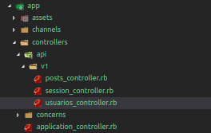

y en session_controller

```ruby
class Api::V1::SessionController < ApplicationController
    def login
        auth = Authentication.new(login_params)
        if(auth.autenticar)
            render json: {mensaje: "¡Inicio de sesión correcto!", token: auth.generar_token}, status: :ok
        else
            render json: {mensaje: "Correo o Contraseña incorrectos"}, status: :unauthorized
        end
    end
    private
    def login_params
        params.permit(:correo, :password)
    end
end
```

y luego para poder probar, ruby espera un csrf_token en cada solicitud pero aquí no lo utilizaremos por lo que nos toca deshabilitarlo agregando en application_controller `protect_from_forgery with: :null_session` y ahora si podremos probar (en mi caso lo haré con postman y enviando el usuario que he creado en el seed como admin)

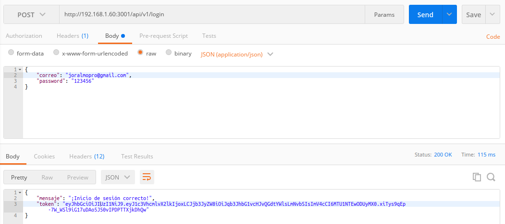

¡Y hasta aquí todo está funcionando correctamente!

pero hasta este punto todo el mundo puede hacer lo que le de la gana despues de haber obtenido el token, hasta un visitante podría eliminar o actualizar algo (en caso de tener creados los metodos en los controladores) y es cuando entra en juego la gema cancancan que es la que nos permitirá gestionar que permisos tiene cada usuario dependiendo de su rol, y lo hace de una manera muy elegante, lo primero entonces es instalarla agregando `gem 'cancancan'` en el Gemfile y luego como no ejecutar `bundle install`, a continuación despues de instalada debemos ejecutar en consola `rails g cancan:ability`  para que se cree el archivo ability.rb dentro de la carpeta app/models/, si da error pues lo crear manual xD.

Una vez ubicado el archivo vemos que tiene la clase Ability creada y el inicializador de está misma, como nuestro proyecto tiene 3 roles lo que haremos es que cada vez que soliciten autorización les devolveremos una función dependiendo del rol del usuario para saber que puede hacer y que no, así:

```ruby
class Ability
  include CanCan::Ability

  def initialize(usuario)
    send("#{usuario.rol.nombre}_permisos", usuario)
  end

  def administrador_permisos(usuario)
    can :manage, :all
  end
  
  def cliente_permisos(usuario)
    can :read, Post, :all
    can :manage, Post, { usuario_id: usuario.id}
    can [:read, :update], Usuario, { id: usuario.id }
  end

  def visitante_permisos(usuario)
    can :read, Post, :all
  end

  def lista_de_permisos
    rules.map do |rule|
     object = { acciones: rule.actions, sobre: rule.subjects.map{ |s| s.is_a?(Symbol) ? s : s.name } }
      object[:condiciones] = rule.conditions unless rule.conditions.blank?
      object[:inverted] = true unless rule.base_behavior
      object
    end
  end
end

```

Vemos  tres funciones una por cada rol, y lo que dice dentro de cada una es que el administrador puede hacer de todo, el cliente puede leer todos los post pero solo puede actualizar, crear, eliminar y borrar post que le pertenezcan a el y además solo podra ver y actualizar un usuario si es el mismo, en cuando al visitante solamente puede leer todos los post, esto es maravilloso nos ahorramos hacer un monton de if (que yo habría hecho si esta gema no existiera xD) en cada controlador dependiendo del rol del usuario; tambien vemos un metodo llamado lista_de_permisos que este lo que nos retorna es que puede hacer cada rol, ahora lo vemos.

Para probarlo en el controlador de usuarios escribiremos los siguientes metodos

```ruby
class Api::V1::UsuariosController < ApplicationController
    def index
        usuarios = Usuario.all
        render json: usuarios, status: :ok
    end

    def create
        usuario = Usuario.new(usuario_params)
        if usuario.save
            render json: usuario, status: :ok
        else
            render json: "error", status: :unprocessable_entity
        end
    end

    def show
        usuario = Usuario.find(params[:id])
        permisos = Ability.new(usuario).lista_de_permisos
        render json: {usuario: usuario, permisos: permisos}, status: :ok
    end

    private
    def usuario_params
        params.permit(:correo, :password, :rol_id)
    end
end
```

Y desde postman probamos con el usuario 1 que es el admin

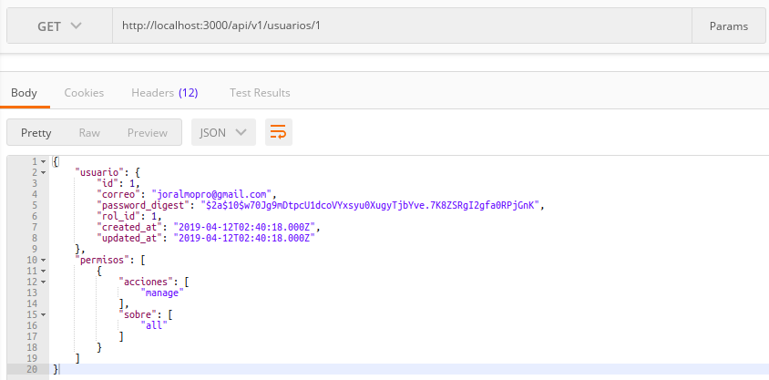

Con el usuario 2 que es un usuario normal (cliente)

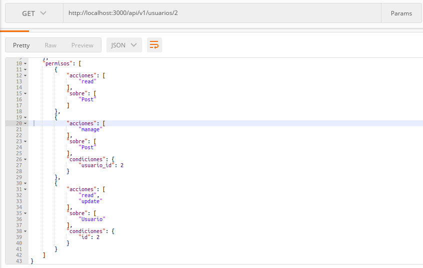

y vemos que por cada petición nos retorna los permisos del usuario, las acciones que puede hacer,  sobre que modelo y si tiene alguna condición para poder hacer esa acción, quizá para algo puede servir esté metodo en algun momento.

Pero continuemos con el proceso, ahora para que cancancan pueda saber que hacer al momento de hacer una petición a algún controlador donde definamos la autorización el asume que tenemos la clase ability (que ya la tenemos en la carpeta app/models) y tambien un metodo llamado current_user y por lo tanto este metodo es el que procederemos a escribir ahora, entonces nos vamos a app/controllers/application_controller.rb y es aquí donde escribiremos el metodo para poder tenerlo disponible en toda la aplicación quedando así

```ruby
class ApplicationController < ActionController::Base
    protect_from_forgery with: :null_session
    include ManejadorDeExcepciones

    rescue_from CanCan::AccessDenied do |exception|
        render json: { mensaje: exception.message }, status: 403
    end

    def current_user
        if token
            @usuario_actual ||= Usuario.find(token[:usuario_id])
        else
            @usuario_actual ||= Usuario.new(rol_id: 3)
        end
    end

    private
    def token
        valor = request.headers[:Authorization]
        return if valor.blank?
        @token ||= JsonWebToken.decode(valor.split(" ").last)
    end
end

```

Lo que agregamos ahora es un rescue para manejar el error cuando el acceso sea denegado y devolver un error de no autorizado, el metodo current user que recupera el usuario actual dependiendo del token que venga en la solicitud y en caso de no haber ningun token se tomará como usuario visitante por eso se le asigna el rol tres (asumo que el rol con id tres es el visitante, lo pueden hacer dinamico con una consulta a la tabla rols).

Luego de esto volvemos el metodo show el usuarios_controller normal y le agregamos la directiva para que cancancan aplique la autorización en esa clase, así

```ruby
class Api::V1::UsuariosController < ApplicationController
    load_and_authorize_resource class: "Usuario"

    def index
        usuarios = Usuario.all
        render json: usuarios, status: :ok
    end

    def create
        usuario = Usuario.new(usuario_params)
        if usuario.save
            render json: usuario, status: :ok
        else
            render json: "error", status: :unprocessable_entity
        end
    end

    def show
        usuario = Usuario.find(params[:id])
        render json: usuario, status: :ok
    end

    private
    def usuario_params
        params.permit(:correo, :password, :rol_id)
    end
end
```

Y probamos!

Pedimos el usuario con id 3 y enviamos el token del administrador, y lo devolverá sin problemas pues el puede realizar está acción

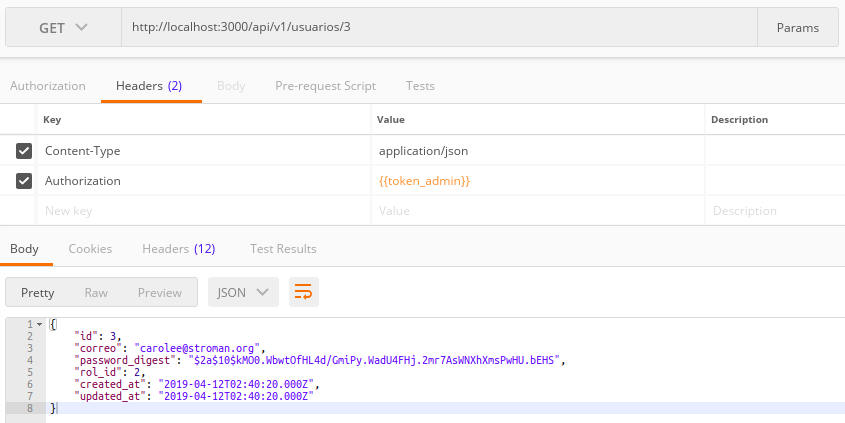

pero si lo hacemos con el token de un usuario normal

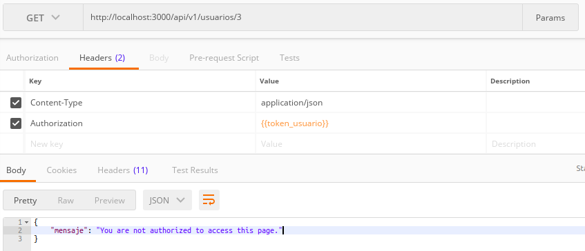

igual sucede con el usuario visitante

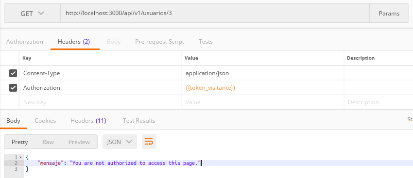

El enviroment en postman contiene los tokens (el del visitante simplemente no es nada)

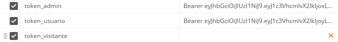

Y con estás pruebas podemos ver que todo está funcionando correctamente!, ahora simplemente por deseo personal me gustaría ver el mensaje de error en español y de forma personalizada, por lo que toca hacer lo siguiente, en config/locales/ crearé el archivo es.yml y tendrá lo siguiente

```yaml
es:
  unauthorized:
    manage:
      all: "No estás autorizado para: [%{action}] => [%{subject}]."
```

además de esto en application_controller agregamos un before_action y le pasamos una función para cambiar el locale de rails, quedaría así

```ruby
class ApplicationController < ActionController::Base
    before_action :set_locale
    protect_from_forgery with: :null_session
    include ManejadorDeExcepciones

    rescue_from CanCan::AccessDenied do |exception|
        render json: { mensaje: exception.message }, status: 403
    end

    def current_user
        if token
            @usuario_actual ||= Usuario.find(token[:usuario_id])
        else
            @usuario_actual ||= Usuario.new(rol_id: 3)
        end
    end

    private
    def token
        valor = request.headers[:Authorization]
        return if valor.blank?
        @token ||= JsonWebToken.decode(valor.split(" ").last)
    end
    def set_locale
        I18n.locale = "es"
    end
end

```

Haremos otra prueba y veremos los errores, en este caso trataremos de crear un nuevo usuario

Token de visitante

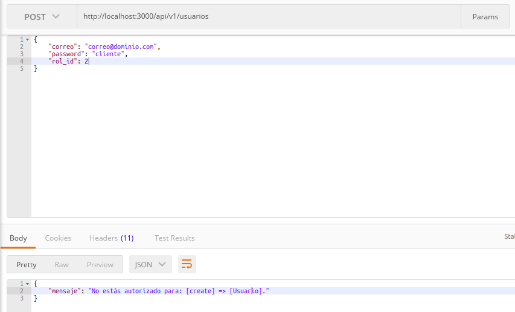

Token usuario

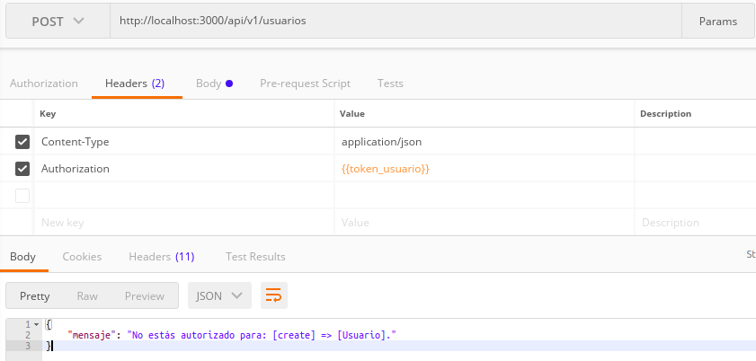

Y por ultimo con el administrador

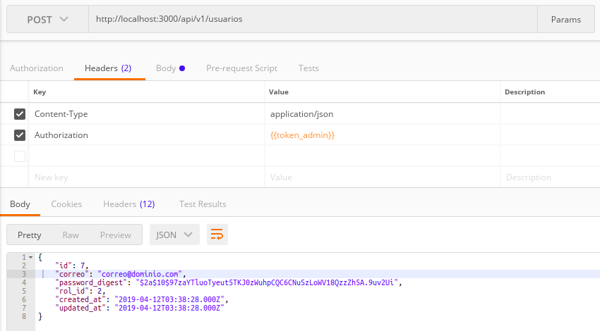

Y así mismo pasaría con los demás metodos, nuestra aplicación tendrá un manejo de autenticación un autorización un poco más organizado y mejor elaborado graciás a estás gemas.

Si algó no está bien escrito o hay algun error pido disculpas, para dudas o comentarios estoy en las redes como @JoralmoPro.

Para escribir este tutorial me he guidao y tal vez copiado algun trozo de código de [aquí](https://medium.com/@noordean/authentication-with-jwt-in-rails-api-71102387c0b0), [aquí](https://github.com/stalniy/rails-cancan-api-example), [aquí](https://github.com/CanCanCommunity/cancancan/wiki/exception-handling), [aquí](https://culttt.com/2016/01/20/implementing-roles-and-permissions-in-ruby-on-rails/) y [aquí](https://riptutorial.com/ruby-on-rails/example/10259/getting-started-with-cancan).

[Repositorio](https://gitlab.com/JoralmoPro/authrubyonrailstutorial)

> ¡Nos vemos el linea!