import VideoPlayer from './videoPlayer.js';

#### Holaaa 👋

Actualmente en el mundo del desarrollo de software y todo lo relacionado con agilidad, es bastante importante por nuestra parte como desarrolladores garantizar
la calidad de nuestro código. Una parte fundamental de este proceso sin duda alguna es realizar pruebas automatizadas para detectar posibles errores y así
poder solucionarlos antes de que exploten producción. En este tutorial veremos como aplicar pruebas unitarias en Angular con una herramienta que conocí hace poco
llamada Spectator (que me pareció genial), y para que sea mas interesante también veremos como aplicar pruebas end-to-end con Cypress. Ya hablaremos mas adelante de angular, pero también 
mencionaremos otros tipos de pruebas que existen (solo teoría) y como se relacionan con las pruebas unitarias y end-to-end, para así mantener una cobertura mas completa 
de pruebas para nuestra aplicación.

##### Veamos un poco de teoría

#### ¿Qué son las pruebas unitarias?
Las pruebas unitarias son un tipo de prueba en el desarrollo de software que se enfocan en verificar el funcionamiento correcto de unidades individuales de código, como funciones, métodos o componentes, de manera aislada. Estas pruebas se realizan para garantizar que cada unidad de código se comporte como se espera, validando su lógica interna y sus interacciones con otras unidades. En resumen, las pruebas unitarias se centran en probar pequeñas partes del código de forma independiente para asegurar su correcto funcionamiento.

#### ¿Qué son las pruebas end-to-end?
Las pruebas end-to-end (e2e) son un tipo de prueba en el desarrollo de software que se centran en simular el flujo completo de una aplicación, desde el inicio hasta el final, como si se tratara de un usuario real interactuando con ella. Estas pruebas se realizan para verificar que todos los componentes y funcionalidades de la aplicación funcionen correctamente en conjunto, incluyendo la interacción con bases de datos, APIs, navegadores y otros sistemas externos. En resumen, las pruebas end-to-end se enfocan en evaluar el comportamiento global de una aplicación, validando su correcto funcionamiento desde el punto de vista del usuario final.

##### ¿Qué vamos a hacer?

En este ejemplo, construiremos una aplicación para verificar contraseñas seguras. La aplicación constará de dos inputs y dos botones. En el primer input, podrás escribir tu contraseña y la aplicación verificará si cumple con los criterios de seguridad. Además, habrá un botón que generará automáticamente una contraseña segura sugerida.

En el segundo input, podrás añadir tu correo electrónico. Una vez que lo ingreses, se habilitará el segundo botón para simular el envío de la contraseña segura a tu correo electrónico. Después de unos segundos (simulando el envío del correo), se mostrará un mensaje indicando que el reporte de la contraseña ha sido enviado.

Con este ejemplo podremos poner en practica las pruebas antes mencionadas, pero antes de empezar, vamos a crear nuestra aplicación angular con el siguiente comando:

```bash
ng new secure-password
```

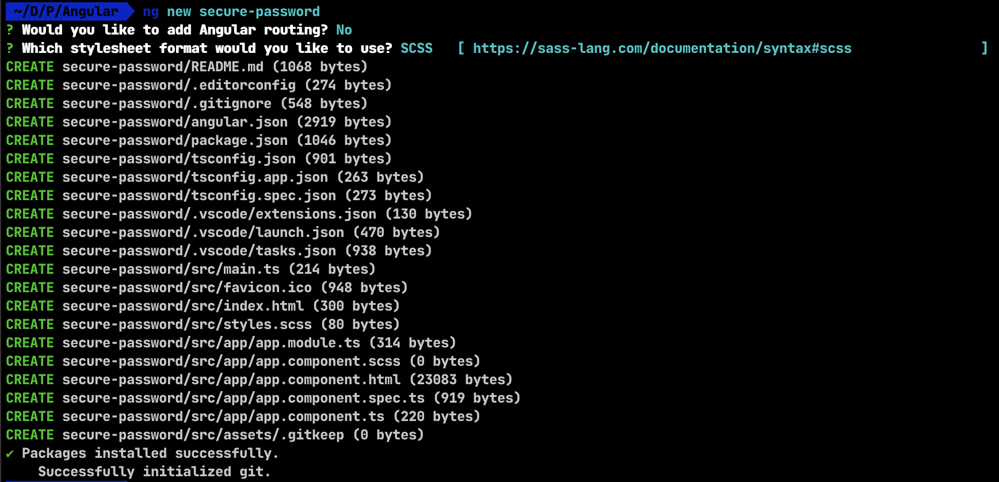

Entramos al proyecto y lo ejecutamos y veremos el proyecto por defecto de angular.

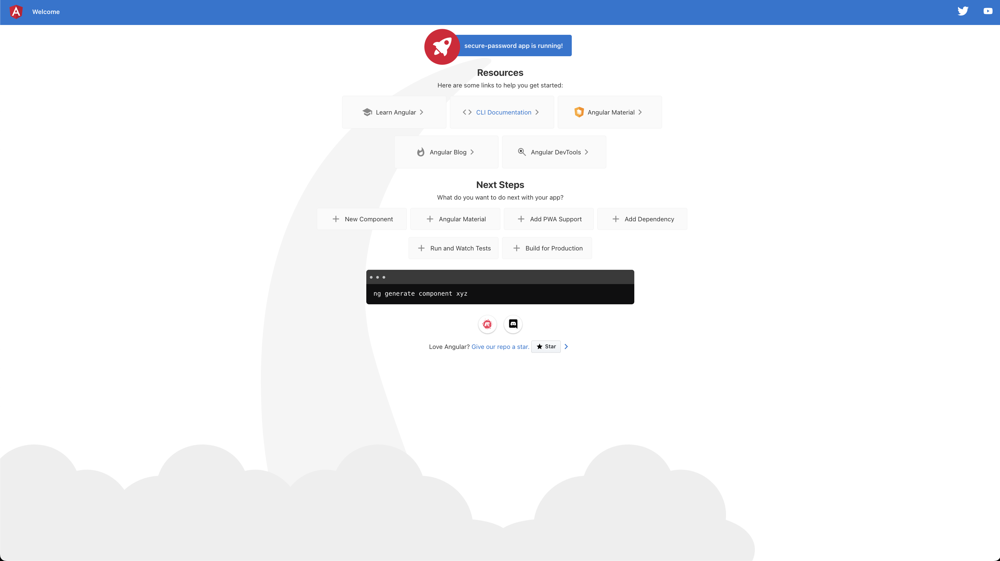

Generaré un nuevo componente Home, que será donde se encuentre la lógica de la aplicación, he instalado angular forms (@angular/forms) para poder usar los formularios de angular, también generaré otros componentes 
como inputs, un botón y un servicio que serán los que a continuación probaremos, pero en resumen el Home se vería algo como esto:

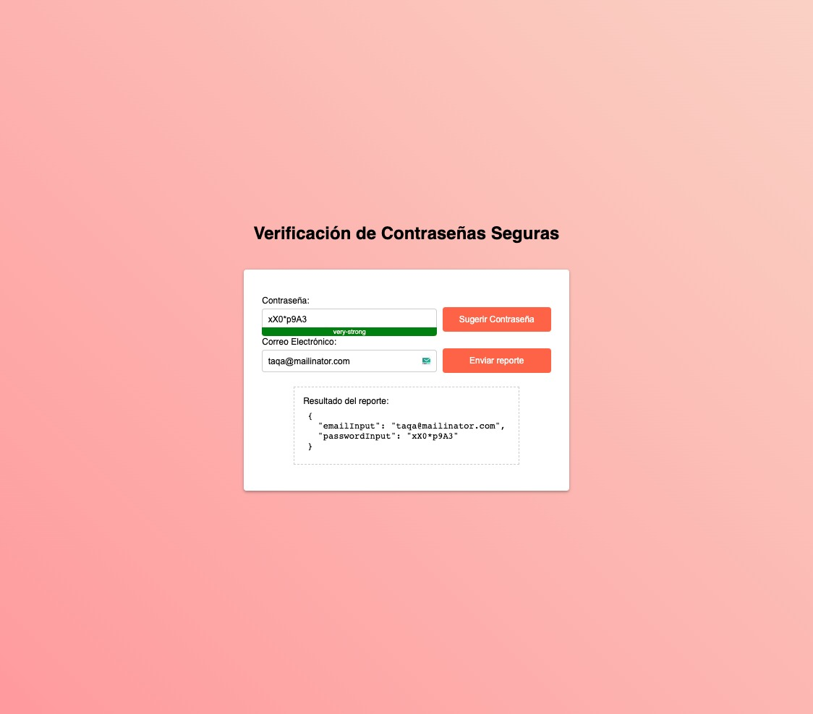

Como mencione anteriormente el ejemplo es bastante sencillo (y tal vez sin mucho sentido jajaja) pero sin duda nos 
servirá para lo que queremos hacer, ver como spectator nos facilita la aplicación de pruebas unitarias a nuestros componentes 
y servicios (a diferencia de Karma y Testbed que son las herramientas que angular nos provee por defecto para realizar pruebas unitarias)

##### ¿Qué es Spectator?

_Spectator es una herramienta que te ayuda a eliminar todo el trabajo repetitivo y tedioso al escribir pruebas unitarias en Angular. Con Spectator, puedes escribir pruebas para componentes, directivas, servicios y más, sin necesidad de aprender las complejas APIs de TestBed, ComponentFixture y DebugElement._

_Spectator te permite enfocarte en escribir pruebas más legibles, elegantes y simplificadas. Puedes crear pruebas de manera rápida y eficiente, sin tener que lidiar con la configuración y la complejidad de las API tradicionales._

_Spectator simplifica la escritura de pruebas al proporcionar una interfaz intuitiva y expresiva. Con Spectator, puedes acceder fácilmente a los elementos DOM, inyectar dependencias, simular eventos y realizar expectativas de forma clara y concisa._

Esta descripción de Spectator se basa en la página oficial de Spectator. pero en realidad si es verdad las pruebas 
con Karma y sus APIs pueden ser un poco tediosas y complejas de configurar, pero menos charla y mas acción, en la pantalla que les mostré 
anteriormente hay varios componentes, les muestro la estructura del proyecto

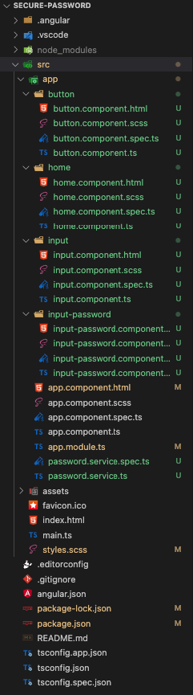

Aquí podemos ver a mas detalle los componentes que mencione anteriormente, el home (que contiene todo), el input, el input password y el 
botón

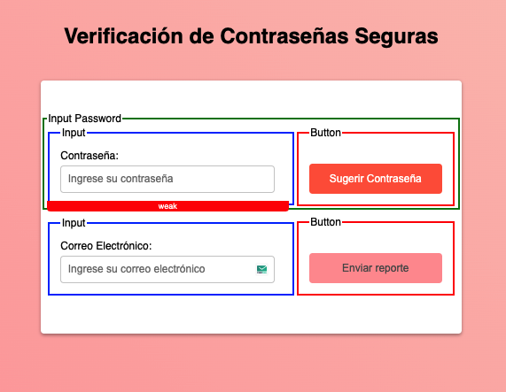

Empecemos entonces por el componente Button, tal vez el mas sencillo

```html:title=button.component.html
<button color="primary" [disabled]="disabled" (click)="onClick($event)">
  {{ label }}
</button>
```
```javascript:title=button.component.ts
import { Component, Input } from '@angular/core';

@Component({
  selector: 'app-button',
  templateUrl: './button.component.html',
  styleUrls: ['./button.component.scss']
})
export class ButtonComponent {
  @Input('disabled') disabled: boolean;
  @Input('onClick') onClick: ($event: Event) => void;
  @Input('label') label: string;

  constructor() {
    this.disabled = false;
    this.onClick = () => {};
    this.label = '';
  }

}
```

Este componente recibe como inputs el label (texto del botón), 
el onClick (función que se ejecutará al hacer click en el botón) y el disabled (para deshabilitar el botón) que 
por defecto es falso para que el botón esté habilitado.

Aquí podríamos aplicar algunas pruebas como por ejemplo:
- Prueba de renderizado: Verificar que el botón se renderice correctamente con el texto correcto.
- Prueba de deshabilitado: Verificar que el botón se deshabilite cuando se establece la propiedad disabled en true.
- Prueba de habilitado: Verificar que el botón esté habilitado de forma predeterminada cuando no se proporciona un valor para la propiedad disabled.
- Prueba de evento de clic: Verificar que la función onClick se llame correctamente cuando se hace clic en el botón.

Vamos a ello, pero en este punto ni siquiera hemos instalado spectator jajaja, así que lo instalamos:

```bash
npm install --save-dev jest @types/jest jest-preset-angular @ngneat/spectator
```

Instalamos jest que es el framework de pruebas que usa spectator y otras librerías necesarias para la configuración, una vez instalado 
configuramos Jest, creando el archivo jest.config.js en la raíz del proyecto con el siguiente contenido:

```javascript:title=jest.config.js
module.exports = {
  preset: 'jest-preset-angular',
  setupFilesAfterEnv: ['<rootDir>/src/setup-jest.ts'],
  testPathIgnorePatterns: ['/node_modules/', '/dist/'],
  collectCoverage: true
};
```

Creamos el archivo setup-jest.ts en la carpeta src con el siguiente contenido:

```javascript:title=setup-jest.ts
import 'jest-preset-angular/setup-jest';
```

y por ultimo actualizamos el archivo angular.json busca la sección "test" y actualiza el campo "builder" con el valor "jest". Debe verse como esto:
  
```javascript:title=angular.json
"test": {
  "builder": "jest:run",
  "options": {
    // Resto de las opciones...
  }
}
```

Y eso es todo, ahora a testear, en nuestro archivo .spec.ts 
lo que debemos hacer es importar Spectator, y la función createComponentFactory, que nos permitirá crear un componente de forma aislada en cada bloque 
de pruebas, esta función recibe una serie de parámetros (como imports, providers, mocks) que nos servirán para construir nuestro componente a probar (son opcionales) 
por ultimo debemos importar nuestro componente y ahí si empezar a probar, lo básico (ver si el componente existe) sería algo como esto:

```javascript title="button.component.spec.ts"
import { Spectator, createComponentFactory } from '@ngneat/spectator';
import { ButtonComponent } from './button.component';

describe('ButtonComponent', () => {
  let spectator: Spectator<ButtonComponent>;
  const createComponent = createComponentFactory(ButtonComponent);

  it('should create', () => {
    spectator = createComponent();
    expect(spectator.component).toBeTruthy();
  });
});
```

Probamos ahora que si esté funcionando, ejecutando la prueba y veremos el output
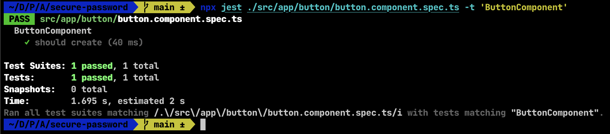

Pero ahora si continuemos con las demás pruebas, vamos 1 x 1

##### Prueba de renderizado: Verificar que el botón se renderice correctamente con el texto correcto.

```javascript:title=button.component.spec.ts
it('Debería renderizar el componente, con el texto "Click me!"', () => {
  spectator = createComponent({
    props: {
      label: 'Click me!'
    }
  });
  expect(spectator.query('button')).toHaveText('Click me!');
});
```

Ejecutamos esta prueba y veremos el output

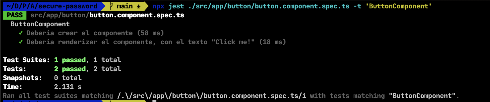

Pero todo se ve muy conveniente no? solo para verificar haré un cambio en el componente, en el archivo .html del componente 
le colocaré por defecto el texto "Hola mundo" y ejecutamos la prueba nuevamente

```html:title=button.component.html
<button color="primary" [disabled]="disabled" (click)="onClick($event)">
  Hola mundo
</button>
```

Ejecutamos las pruebas

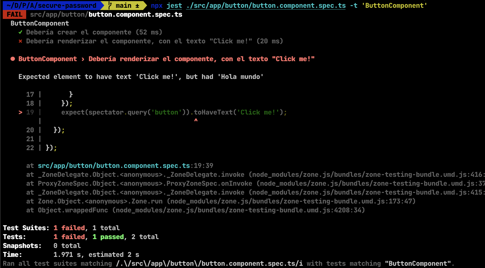

Corregimos eso y continuamos con los demás tests :D

##### Prueba de deshabilitado: Verificar que el botón se deshabilite cuando se establece la propiedad disabled en true.

```javascript:title=button.component.spec.ts
it('Debería deshabilitar el botón cuando se le pasa la propiedad disabled en true', () => {
  spectator = createComponent({
    props: {
      disabled: true
    }
  });
  expect(spectator.query('button')).toBeDisabled();
});

```

##### Prueba de habilitado: Verificar que el botón esté habilitado de forma predeterminada cuando no se proporciona un valor para la propiedad disabled.

```javascript:title=button.component.spec.ts
it('Debería estar habilitado por defecto sino se proporciona la propiedad disabled', () => {
  spectator = createComponent();
  expect(spectator.query('button')).not.toBeDisabled();
});
```

##### Prueba de evento de clic: Verificar que la función onClick se llame correctamente cuando se hace clic en el botón.

```javascript:title=button.component.spec.ts
it('Debería ejecutar la función recibida por parámetro al hacer click en el botón', () => {
  const mockFn = jest.fn();
  spectator = createComponent({
    props: {
      onClick: mockFn
    }
  });

  spectator.click('button');

  expect(mockFn).toHaveBeenCalled();
});
```

Como podemos ver se hace bastante sencillo usar spectator para este tipo de pruebas, la forma de instanciar el componente, 
de pasarle los parámetros necesarios, seleccionar elementos del DOM, simular eventos, etc. es bastante sencillo y 
legible, pero veamos un ejemplo un poquito mas "complejo" con el componente de Input.

```html:title=input.component.html
<div class="input-container">
  <label for="{{ id }}">{{ label }}</label>
  <input type="{{ type }}" id="{{ id }}" placeholder="{{ placeholder }}" class="input-field" [formControl]="control" (input)="emitValue()" />
</div>
```
```javascript:title=input.component.ts
import { Component, EventEmitter, Input, Output } from '@angular/core';
import { FormControl } from '@angular/forms';

@Component({
  selector: 'app-input',
  templateUrl: './input.component.html',
  styleUrls: ['./input.component.scss']
})
export class InputComponent {
  @Input('id') id: string;
  @Input('label') label: string;
  @Input('type') type: string;
  @Input('placeholder') placeholder: string;
  @Input('control') control: FormControl;
  @Output('fnEmit') fnEmit = new EventEmitter();

  constructor() { 
    this.id = '';
    this.label = '';
    this.type = 'text';
    this.placeholder = '';
    this.control = new FormControl();
  }

  emitValue(): void {
    this.fnEmit.emit();
  }
}
```

Este componente sirve para renderizar un campo de entrada de texto (input en html) para un formulario, recibe varios inputs 
como el id (id del input), el label (texto del label), el type (tipo de input), el placeholder (texto del placeholder) y el control (que es el control del formulario), 
también tiene un output que es una función que se ejecutará cuando se escriba algo en el input, para este componente podríamos aplicar las siguientes pruebas:

- Verificar que el componente se renderice correctamente
- Verificar que el componente se renderice correctamente con el texto correcto
- Verificar que el componente se renderice correctamente con el tipo correcto
- Verificar que el componente se renderice de tipo texto por defecto
- Verificar que el componente se renderice correctamente con el placeholder correcto
- Verificar que el componente se renderice correctamente con el id correcto
- Verificar que el componente se renderice correctamente con el label correcto
- Verificar que el componente se renderice correctamente con el control correcto
- Verificar la emisión del evento de entrada (fnEmit)

Las pruebas se ven bastante parecidas a las del componente anterior, de hecho las dos primeras quedaría algo como esto:

```javascript:title=input.component.spec.ts
it('Debería crear el componente', () => {
  spectator = createComponent();
  expect(spectator.component).toBeTruthy();
});

it('Debería renderizar en componente con el texto correcto', () => {
  spectator = createComponent({
    props: {
      label: 'Nombre'
    }
  });
  expect(spectator.query('label')).toHaveText('Nombre');
});
```

Al ejecutar estas pruebas pasan correctamente, pero tenemos un error en consola, y es que el componente no tiene un control asignado,

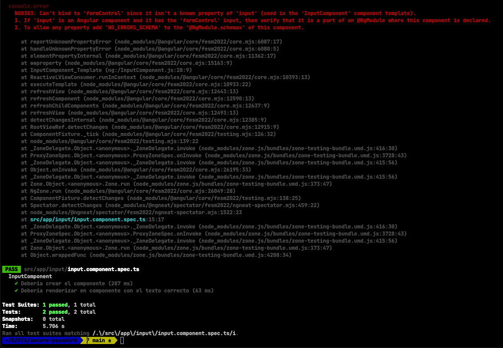

Entonces para corregir esto, para esto lo que debemos hacer es inyectar el modulo de formularios de angular en el componente,
cosa que Spectator nos ayuda a hacer de forma sencilla, importamos ReactiveFormsModule en el archivo .spec.ts del componente y
lo inyectamos como import en el createComponentFactory, y listo, el error desaparece, de esta forma vemos como podemos trabajar 
con módulos de angular en Spectator

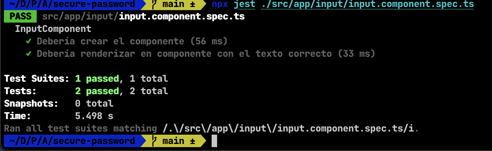

Pero continuemos con las demás pruebas, las pruebas faltantes serían algo como esto:

```javascript:title=input.component.spec.ts
it('Debería renderizar el con el type correcto', () => {
  spectator = createComponent({
    props: {
      type: 'password'
    }
  });
  expect(spectator.query('input')).toHaveAttribute('type', 'password');
});

it('Debería renderizar el componente type text por defecto', () => {
  spectator = createComponent();
  expect(spectator.query('input')).toHaveAttribute('type', 'text');
});

it('Debería renderizar el componente con el placeholder correcto', () => {
  spectator = createComponent({
    props: {
      placeholder: 'Ingrese su nombre'
    }
  });
  expect(spectator.query('input')).toHaveAttribute('placeholder', 'Ingrese su nombre');
});

it('Debería renderizar el componente con el id correcto', () => {
  spectator = createComponent({
    props: {
      id: 'nombre'
    }
  });
  expect(spectator.query('input')).toHaveAttribute('id', 'nombre');
});

it('Debería renderizar el componente con el label correcto', () => {
  spectator = createComponent({
    props: {
      label: 'Nombre'
    }
  });
  expect(spectator.query('label')).toHaveText('Nombre');
});

it('Debería renderizar el componente con el control correcto', () => {
  const control = new FormControl();
  spectator = createComponent({
    props: {
      control
    }
  });
  expect(spectator.component.control).toEqual(control);
  // expect(spectator.component.control).toBeTruthy();
  // expect(spectator.component.control).toBeInstanceOf(FormControl);
});
````

El archivo a mi parecer queda bastante sencillo y legible, además las formas de acceder a la información del componente tanto
la parte del DOM como la parte de la lógica del componente es bastante sencilla, además la forma en que instancia el componente
importando el modulo, no lo veo tan complejo a diferencia de como tocaría hacerlo con Karma, pero bueno continuemos con las pruebas, veamos el componente
InputPassword, prácticamente es igual, a diferencia que tenemos la inyección de un servicio y 3 funciones mas que hacen parte de la lógica del
componente, veamos el componente:

```html:title=input-password.component.html
<div class="input-and-bar">
  <app-input id="passwordInput" label="Contraseña:" placeholder="Ingrese su contraseña" [control]="control" (fnEmit)="checkPasswordStrength()"></app-input>
  <div id="passwordStrengthBar" [ngClass]="passwordStrength">
    <small>{{ passwordStrength }}</small>
  </div>
</div>
<app-button (click)="suggestPassword($event)" label="Sugerir Contraseña"></app-button>
```
```javascript:title=input-password.component.ts
import { Component, Input } from '@angular/core';
import { FormControl } from '@angular/forms';
import { PasswordService } from '../password.service';

@Component({
  selector: 'app-input-password',
  templateUrl: './input-password.component.html',
  styleUrls: ['./input-password.component.scss']
})
export class InputPasswordComponent {
  
  passwordStrength: string = "";
  @Input('id') id: string;
  @Input('label') label: string;
  @Input('type') type: string;
  @Input('placeholder') placeholder: string;
  @Input('control') control: FormControl;

  constructor(private passwordService: PasswordService) { 
    this.id = '';
    this.label = '';
    this.type = 'text';
    this.placeholder = '';
    this.control = new FormControl();
  }

  ngAfterContentInit(): void {
    this.checkPasswordStrength();
  }

  suggestPassword(event: Event): void {
    event.preventDefault();
    const passwordSuggested = this.passwordService.suggestStrongPassword();
    this.control.patchValue(passwordSuggested);
    this.checkPasswordStrength();
  }

  checkPasswordStrength(): void {
    this.passwordStrength = this.passwordService.checkPasswordStrength(this.control.value);
  }
}
```

Para fines de seguir un buen orden, vamos a probar primero el servicio PasswordService, veamos el código

```javascript:title=password.service.ts
import { Injectable } from '@angular/core';

@Injectable({
  providedIn: 'root'
})
export class PasswordService {

  private lowercaseLetters = 'abcdefghijklmnopqrstuvwxyz';
  private uppercaseLetters = 'ABCDEFGHIJKLMNOPQRSTUVWXYZ';
  private numbers = '0123456789';
  private specialCharacters = '!@#$%^&*()';

  constructor() { }

  checkPasswordStrength(password: string): string {
    let strength = 0;

    if (password.length >= 8) {
      strength += 33.3;
    }
    if (/[a-z]/.test(password) && /[A-Z]/.test(password) && /\d/.test(password)) {
      strength += 33.3;
    }
    if (/[!@#$%^&*()]/.test(password)) {
      strength += 33.3;
    }

    if (strength < 33.3) {
      return "weak";
    } else if (strength < 66.6) {
      return "medium";
    } else if (strength < 99) {
      return "strong";
    } else {
      return "very-strong";
    }
  }

  getRandomCharacter = (characters: string) => {
    if (characters === '') return '';
    const randomIndex = Math.floor(Math.random() * characters.length);
    return characters[randomIndex];
  };

  suggestStrongPassword(): string {
    let password = '';
    password += this.getRandomCharacter(this.lowercaseLetters);
    password += this.getRandomCharacter(this.uppercaseLetters);
    password += this.getRandomCharacter(this.numbers);
    password += this.getRandomCharacter(this.specialCharacters);
    const remainingLength = 8 - password.length;
    for (let i = 0; i < remainingLength; i++) {
      const allCharacters = this.lowercaseLetters + this.uppercaseLetters + this.numbers + this.specialCharacters;
      password += this.getRandomCharacter(allCharacters);
    }
    return password;
  }

  reportResult(data: Object): string {
    return JSON.stringify(data, undefined, 2);
  }
}
```

Este servicio en la aplicación es el responsable de proporcionar funcionalidad relacionada con la contraseña, como la validación de fuerza y también
generar una contraseña fuerte sugerida (la medición de la fuerza en este caso es medida lo mas básica posible), entonces procedamos a probar estos cuatro
métodos de este servicio, con la prueba de este servicio solo quiero mostrar que también es posible probar servicios (no solo componentes) con Spectator,
el archivo completo de pruebas quedaría algo como esto

```javascript:title=password.service.spec.ts
import { SpectatorService, createServiceFactory } from "@ngneat/spectator";
import { PasswordService } from "./password.service";

describe('PasswordService', () => {
  let spectator: SpectatorService<PasswordService>;
  const createService = createServiceFactory(PasswordService);

  beforeEach(() => spectator = createService());

  describe('checkPasswordStrength', () => {
    it('Debería devolver "weak" para una contraseña débil', () => {
      const password = '123456';
      const strength = spectator.service.checkPasswordStrength(password);
      expect(strength).toBe('weak');
    });
  
    it('Debería devolver "medium" para una contraseña de fuerza media', () => {
      const password = '123456789';
      const strength = spectator.service.checkPasswordStrength(password);
      expect(strength).toBe('medium');
    });
  
    it('Debería devolver "strong" para una contraseña fuerte', () => {
      const password = 'Abcdef123';
      const strength = spectator.service.checkPasswordStrength(password);
      expect(strength).toBe('strong');
    });
  
    it('Debería devolver "very-strong" para una contraseña muy fuerte', () => {
      const password = 'Abcdef123!@#';
      const strength = spectator.service.checkPasswordStrength(password);
      expect(strength).toBe('very-strong');
    });
  });

  describe('getRandomCharacter', () => {
    it('Debería devolver un carácter aleatorio de una cadena de caracteres', () => {
      const characters = 'abcdefghijklmnopqrstuvwxyz';
      const character = spectator.service.getRandomCharacter(characters);
      expect(characters.includes(character)).toBe(true);
    });
  
    it('Debería devolver vacío de una cadena de caracteres vacía', () => {
      const characters = '';
      const character = spectator.service.getRandomCharacter(characters);
      expect(character).toBe('');
    });
  
    it('Debería devolver un carácter aleatorio de una cadena de caracteres con un solo carácter', () => {
      const characters = 'a';
      const character = spectator.service.getRandomCharacter(characters);
      expect(character).toBe('a');
    });
  });

  describe('suggestStrongPassword', () => {
    it('Debería generar una contraseña segura de longitud 8', () => {
      const password = spectator.service.suggestStrongPassword();
      expect(password.length).toBe(8);
    });
  
    it('Debería generar una contraseña segura que contenga una letra minúscula', () => {
      const password = spectator.service.suggestStrongPassword();
      expect(password).toMatch(/[a-z]/);
    });
  
    it('Debería generar una contraseña segura que contenga una letra mayúscula', () => {
      const password = spectator.service.suggestStrongPassword();
      expect(password).toMatch(/[A-Z]/);
    });
  
    it('Debería generar una contraseña segura que contenga un número', () => {
      const password = spectator.service.suggestStrongPassword();
      expect(password).toMatch(/[0-9]/);
    });
  
    it('Debería generar una contraseña segura que contenga un carácter especial', () => {
      const password = spectator.service.suggestStrongPassword();
      expect(password).toMatch(/[!@#$%^&*()]/);
    });
  });

  describe('reportResult', () => {
    it('Debería devolver una representación en formato JSON del objeto proporcionado', () => {
      const data = {
        name: 'JoralmoPro',
        age: 30,
        city: 'Santa Marta'
      };
      const expectedResult = JSON.stringify(data, undefined, 2);
      const result = spectator.service.reportResult(data);
      expect(result).toEqual(expectedResult);
    });
  
    it('Debería devolver una representación en formato JSON de un objeto vacío', () => {
      const data = {};
      const expectedResult = JSON.stringify(data, undefined, 2);
      const result = spectator.service.reportResult(data);
      expect(result).toEqual(expectedResult);
    });
  });

});
```

Como podemos ver, es bastante sencillo probar servicios con Spectator, solo debemos importar SpectatorService y createServiceFactory y se hace muy
parecido a como se hace con los componentes, al ejecutar las pruebas veremos el output

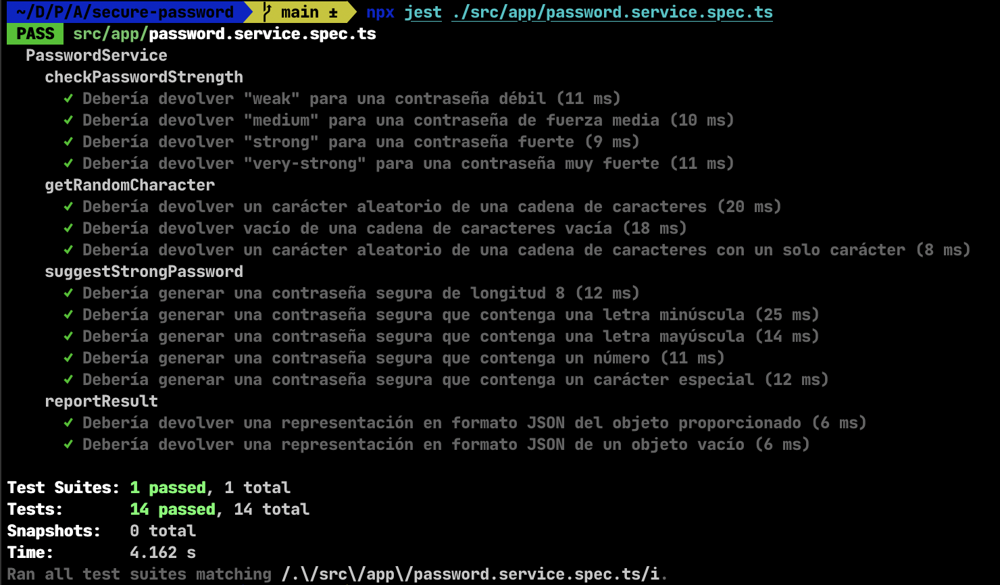

Y ahora si una vez testeado el servicio, procedemos a probar el componente que lo usa, el InputPasswordComponent, ya antes vimos su código y para que sirve
así que sobre este componente aplicaremos pruebas como:

- Prueba que el componente se crea correctamente.
- Prueba que los inputs (id, label, type, placeholder, control) se establecen correctamente.
- Prueba que la función checkPasswordStrength se llama apenas se crea el componente.
- Prueba que la función checkPasswordStrength() se llama correctamente y actualiza la variable passwordStrength.
- Prueba que al hacer clic en el botón "Sugerir Contraseña", se genera una contraseña segura y se asigna al campo de entrada de contraseña.
- Prueba que se apliquen las clases CSS correctas en la barra de fortaleza según el valor de passwordStrength.

Ya vemos que en este componente se hace ya un poquito mas compleja la prueba, hay mas interacción con el DOM, con el servicio, con el componente, etc. pero
veamos entonces la prueba mas sencilla, que se cree correctamente, teniendo en cuenta que este componente usa el servicio, y también usa el ButtonComponent y el InputComponent
además de que tiene la función ngAfterContentInit() que se ejecuta y trata de detectar la fuerza de la contraseña, por lo tanto quedaría así:

```javascript:title=input-password.component.spec.ts
import { Spectator, createComponentFactory } from "@ngneat/spectator";
import { InputPasswordComponent } from "./input-password.component";
import { InputComponent } from "../input/input.component";
import { ButtonComponent } from "../button/button.component";
import { ReactiveFormsModule, FormControl } from "@angular/forms";

describe('InputPasswordComponent', () => {
  let spectator: Spectator<InputPasswordComponent>;
  const createComponent = createComponentFactory({
    component: InputPasswordComponent,
    declarations: [ InputComponent, ButtonComponent ],
    imports: [ ReactiveFormsModule ]
  });

  it('Debería crear el componente', () => {
    const passwordControl = new FormControl('');
    spectator = createComponent({
      props: {
        control: passwordControl
      }
    });
    expect(spectator.component).toBeTruthy();
  });
});
```

Ya vemos que la prueba mas básica se extiende un poco en código ya que hay que hacer instancias de mas cosas, pero esto Spectator lo hace ver sencillo, de este modo
nuestra prueba inicial ya funciona, veamos como queda el archivo completo con todas las pruebas

```javascript:title=input-password.component.spec.ts
import { Spectator, createComponentFactory, typeInElement } from "@ngneat/spectator";
import { InputPasswordComponent } from "./input-password.component";
import { InputComponent } from "../input/input.component";
import { ButtonComponent } from "../button/button.component";
import { ReactiveFormsModule, FormControl } from "@angular/forms";
import { spyOn } from "jest-mock";

describe('InputPasswordComponent', () => {
  let spectator: Spectator<InputPasswordComponent>;
  let passwordControl: FormControl;
  const createComponent = createComponentFactory({
    component: InputPasswordComponent,
    declarations: [ InputComponent, ButtonComponent ],
    imports: [ ReactiveFormsModule ]
  });

  beforeEach(() => {
    passwordControl = new FormControl('');
    spectator = createComponent({ 
      props: {
        control: passwordControl
      }
    });
  });

  it('Debería crear el componente', () => {
    expect(spectator.component).toBeTruthy();
  });

  describe('inputs', () => {
    it('Debería renderizar el componente con el id correcto', () => {
      expect(spectator.query('input')).toHaveAttribute('id', 'passwordInput');
    });

    it('Debería renderizar el componente con el label correcto', () => {
      spectator.setInput('label', 'Contraseña');
      expect(spectator.query('label')).toHaveText('Contraseña');
    });

    it('Debería renderizar el componente con el type correcto', () => {
      expect(spectator.query('input')).toHaveAttribute('type', 'text');
    });

    it('Debería renderizar el componente con el placeholder correcto', () => {
      spectator.setInput('placeholder', 'Ingrese su contraseña');
      expect(spectator.query('input')).toHaveAttribute('placeholder', 'Ingrese su contraseña');
    });

    it('Debería renderizar el componente con el control correcto', () => {
      expect(spectator.component.control).toBe(passwordControl);
    });
  });

  it('Debería llamar al método checkPasswordStrength al inicializar el componente', () => {
    spyOn(spectator.component, 'checkPasswordStrength');
    spectator.component.ngAfterContentInit();
    expect(spectator.component.checkPasswordStrength).toHaveBeenCalled();
  });

  it('Debería llamar al método checkPasswordStrength y actualiza la variable passwordStrength al cambiar el valor del control', () => {
    spyOn(spectator.component, 'checkPasswordStrength');
    
    const inputElement: HTMLInputElement = spectator.query('#passwordInput input')!;

    typeInElement('123456', inputElement);

    spectator.detectChanges();

    expect(spectator.component.checkPasswordStrength).toHaveBeenCalled();
    expect(spectator.component.passwordStrength).toBe('weak');
  });

  it('Debería generar una contraseña segura y asignarla al control y al input al hacer click en el botón "Sugerir contraseña"', () => {
    const buttonElement: HTMLButtonElement = spectator.query('button')!;
    const inputElement: HTMLInputElement = spectator.query('#passwordInput input')!;

    expect(inputElement.value.length).toBe(0);
    expect(spectator.component.passwordStrength).toBe('weak');
    buttonElement.click();
    spectator.detectChanges();
    expect(inputElement.value.length).toBe(8);
    expect(spectator.component.passwordStrength).toBe('very-strong');
  });

  describe('passwordStrengthBar css class', () => {
    let passwordStrengthBar: HTMLElement;
    let inputElement: HTMLInputElement;
    beforeEach(() => {
      passwordStrengthBar = spectator.query('#passwordStrengthBar')!;
      inputElement = spectator.query('#passwordInput input')!;
    });

    it('Debería renderizar el componente con la clase "weak" si la contraseña es débil', () => {
      typeInElement('123456', inputElement);
      spectator.detectChanges();
      expect(passwordStrengthBar).toHaveClass('weak');
    });
    
    it('Debería renderizar el componente con la clase "medium" si la contraseña es de fuerza media', () => {
      typeInElement('123456789', inputElement);
      spectator.detectChanges();
      expect(passwordStrengthBar).toHaveClass('medium');
    });

    it('Debería renderizar el componente con la clase "strong" si la contraseña es fuerte', () => {
      typeInElement('Abcdef123', inputElement);
      spectator.detectChanges();
      expect(passwordStrengthBar).toHaveClass('strong');
    });

    it('Debería renderizar el componente con la clase "very-strong" si la contraseña es muy fuerte', () => {
      typeInElement('Abcdef123!@#', inputElement);
      spectator.detectChanges();
      expect(passwordStrengthBar).toHaveClass('very-strong');
    });
  });
});
```

Como podemos ver, el archivo de pruebas se extiende un poco mas, pero no es tan complejo, y la forma de acceder a los elementos del DOM,
simular eventos, detectar cambios, es bastante sencilla y legible a mi parecer.

En este punto solo nos queda por probar el componente Home, que es el componente que contiene a los demás componentes, así que bueno,
vamos a ello, veamos el código del componente

```html:title=home.component.html
<div class="container">
  <h1>Verificación de Contraseñas Seguras</h1>
  <form class="form-container" [formGroup]="form">
    <div class="row">
      <app-input-password id="passwordInput" [control]="passwordControl"></app-input-password>
    </div>
    <div class="row">
      <app-input id="emailInput" label="Correo Electrónico:" placeholder="Ingrese su correo electrónico" [control]="emailControl"></app-input>
      <app-button id="sendReport" [disabled]="form.invalid" (click)="sendReport($event)" label="Enviar reporte"></app-button>
    </div>
    <div class="loading-container" *ngIf="loading">
      <div class="loading">
        <span>Enviando reporte...</span>
      </div>
    </div>
    <div class="report-result" *ngIf="showReportResult">
      <span>Resultado del reporte:</span>
      <pre>{{ reportResult() }}</pre>
    </div>
  </form>
</div>
```
```javascript:title=home.component.ts
import { Component } from '@angular/core';
import { FormBuilder, FormControl, FormGroup, Validators } from '@angular/forms';
import { PasswordService } from '../password.service';

@Component({
  selector: 'app-home',
  templateUrl: './home.component.html',
  styleUrls: ['./home.component.scss']
})
export class HomeComponent {

  form: FormGroup;
  passwordControl: FormControl;
  emailControl: FormControl;
  loading: boolean = false;
  showReportResult: boolean = false;

  constructor(private formBuilder: FormBuilder, private passwordService: PasswordService) {
    this.form = this.formBuilder.group({
      emailInput: ['', [Validators.required, Validators.email]],
      passwordInput: ['', [Validators.required, Validators.minLength(8), Validators.pattern(/^(?=.*[a-z])(?=.*[A-Z])(?=.*\d).*$/)]]
    });

    this.passwordControl = this.form.get('passwordInput') as FormControl;
    this.emailControl = this.form.get('emailInput') as FormControl;
  }

  sendReport(event: Event): void {
    event.preventDefault();
    this.loading = true;
    setTimeout(() => {
      this.loading = false;
      this.showReportResult = true;
    }, 3000);
  }

  reportResult(): string {
    return this.passwordService.reportResult(this.form.value);
  }
}
```

Este componente es el que se encarga de renderizar el formulario completo!
además simula el envío de un reporte, y muestra el resultado del reporte, para este componente podríamos aplicar las siguientes pruebas:

- Prueba que el componente se crea correctamente.
- Prueba que el botón "Enviar reporte" se deshabilite cuando el formulario es inválido.
- Prueba que el botón "Enviar reporte" se habilite cuando el formulario es válido.
- Prueba que el botón "Enviar reporte" llame a la función sendReport() al hacer clic.
- Prueba de envío de reporte: Verificar que el componente muestre el mensaje "Enviando reporte..." cuando se envía el reporte.
- Prueba de visualización del reporte enviado: Verificar que el componente muestre el resultado del reporte cuando se envía el reporte.

Y bueno, veamos como quedaría el archivo de pruebas de este componente

```javascript:title=home.component.spec.ts
import { Spectator, createComponentFactory, typeInElement } from "@ngneat/spectator";
import { HomeComponent } from "./home.component";
import { InputComponent } from "../input/input.component";
import { ButtonComponent } from "../button/button.component";
import { InputPasswordComponent } from "../input-password/input-password.component";
import { ReactiveFormsModule } from "@angular/forms";
import { spyOn } from "jest-mock";
import { fakeAsync, tick } from "@angular/core/testing";

describe('HomeComponent', () => {
  let spectator: Spectator<HomeComponent>;
  let sendReportButton: HTMLButtonElement;
  let passwordInput: HTMLInputElement;
  let emailInput: HTMLInputElement;
  const createComponent = createComponentFactory({
    component: HomeComponent,
    declarations: [ InputComponent, ButtonComponent, InputPasswordComponent ],
    imports: [ ReactiveFormsModule ]
  });

  beforeEach(() => {
    spectator = createComponent();
    sendReportButton = spectator.query('#sendReport button') as HTMLButtonElement;
    passwordInput = spectator.query('#passwordInput input') as HTMLInputElement;
    emailInput = spectator.query('#emailInput input') as HTMLInputElement;
  });

  function typeValidData(): void {
    typeInElement('Abcdef123!@#', passwordInput);
    typeInElement('valid@mail.com', emailInput);
    spectator.detectChanges();
  }

  function clickSendReportButton(): void {
    sendReportButton.click();
    spectator.detectChanges();
  }

  it('Debería crear el componente', () => {
    expect(spectator.component).toBeTruthy();
  });

  it('Debería deshabilitar el botón "Enviar reporte" si el formulario es inválido', () => {
    typeInElement('12345678', passwordInput);
    typeInElement('invalidEmail', emailInput);
    spectator.detectChanges();
    expect(sendReportButton.disabled).toBe(true);
  });

  it('Debería habilitar el botón "Enviar reporte" si el formulario es válido', () => {
    typeValidData();
    expect(sendReportButton.disabled).toBe(false);
  });

  it('Debería llamar al método sendReport al hacer click en el botón "Enviar reporte"', () => {
    spyOn(spectator.component, 'sendReport');
    typeValidData();
    clickSendReportButton();
    expect(spectator.component.sendReport).toHaveBeenCalled();
  });

  it('Debería mostrar el mensaje "Enviando reporte..." al hacer click en el botón "Enviar reporte"', () => {
    typeValidData();
    clickSendReportButton();
    expect(spectator.element).toHaveText('Enviando reporte...');
  });

  it('Debería mostrar el resultado del reporte al hacer click en el botón "Enviar reporte"', fakeAsync (() => {

    typeValidData();
    clickSendReportButton();

    tick(3000);

    spectator.detectChanges();

    const reportResult = spectator.query('.report-result') as HTMLDivElement;

    expect(reportResult).toBeTruthy();
    expect(reportResult).toHaveText('Abcdef123!@#');
    expect(reportResult).toHaveText('valid@mail.com');
  }));
});
```

Con este ultimo archivo ya habríamos cubierto nuestras pruebas de la aplicación 😎,
pero hasta ahora hemos visto que me ha tocado correr los test archivo por archivo, deberíamos hacerlo como se debe y poder
correr los test con `ng test`, para eso debemos hacer algunos cambios:

- Instalamos @angular-builders/jest y lo configuramos en el archivo angular.json
  ```json:title=angular.json
  // Resto de la configuración...
  "test": {
    "builder": "@angular-builders/jest:run",
    "options": {
      "tsConfig": "./tsconfig.spec.json",
      "jestConfig": ["./jest.config.js"],
      "passWithNoTests": true
    }
  }
  // Resto de la configuración...
  ```
- en el archivo tsconfig.spec.json nos aseguramos de cambiar "jasmine" por "jest", "node"
  ```json:title=tsconfig.spec.json
  "compilerOptions": {
    // Resto de la configuración...
    "types": [
      "jest",
      "node"
    ]
    // Resto de la configuración...
  }
  ```

Y por ultimo ajustamos el app.component.spec.ts para que quede así:

```javascript:title=app.component.spec.ts
import { Spectator, createComponentFactory } from "@ngneat/spectator";
import { AppComponent } from "./app.component";
import { HomeComponent } from "./home/home.component";
import { InputComponent } from "./input/input.component";
import { ButtonComponent } from "./button/button.component";
import { InputPasswordComponent } from "./input-password/input-password.component";
import { ReactiveFormsModule } from "@angular/forms";

describe("AppComponent", () => {
  let spectator: Spectator<AppComponent>;
  const createComponent = createComponentFactory({
    component: AppComponent,
    declarations: [ HomeComponent, InputComponent, ButtonComponent, InputPasswordComponent ],
    imports: [ ReactiveFormsModule ]
  });

  beforeEach(() => spectator = createComponent());

  it("Debería crear el componente", () => {
    expect(spectator.component).toBeTruthy();
  });
});
````

y ahora si al ejecutar `ng test` (cuyo equivalente sería `npm run test`) vemos que todo funciona correctamente

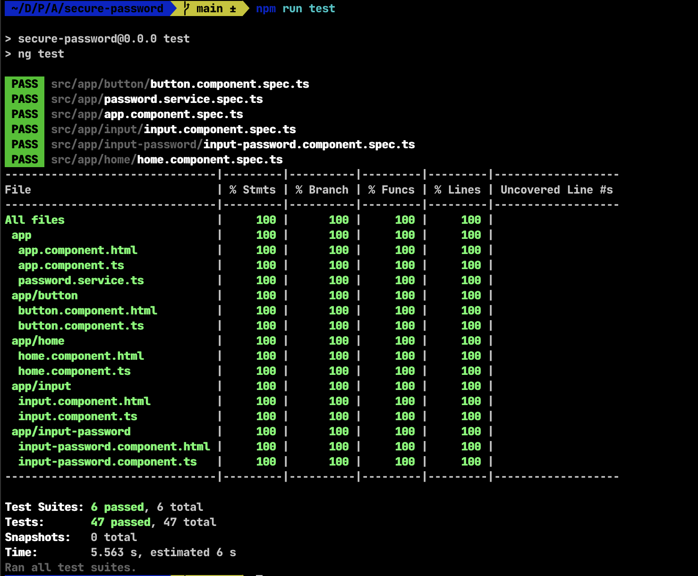

Pero mira no más ese coverage 🤤 (aunque la app no es que haga mucho, es satisfactorio jajaja)

<hr />

Hasta aquí espero haber cubierto lo básico de Spectator, y también haber abordado diferentes formas de aplicar pruebas unitarias
a componentes y servicios en Angular, y además lo mas importante que le pueda servir a alguien jajaja, pero hey espera, el titulo dice
"Mejorando la calidad de tus aplicaciones Angular con Spectator y Cypress", y hasta ahora solo hemos visto Spectator, pero este tutorial ya
está bastante extenso, dejaré por aquí el vídeo de la ejecución de Cypress y el <a href="https://github.com/Joralmo" target="_blank">código de la aplicación</a> para que lo puedas revisar con un poco
mas de detalle, y en otro tutorial tal vez abordemos Cypress mas en detalle, pero por ahora espero que te haya gustado este tutorial y que te haya
servido de algo, si es así, no olvides darle una estrellita al repositorio y compartirlo con tus amigos, y si no te ha gustado, pues también puedes
dejar tu comentario y decirme que puedo mejorar, o si tienes alguna duda, aparezco en todas las redes sociales como @JoralmoPro, aquí dejo el vídeo:

Hasta aquí espero haber cubierto lo básico de Spectator y haber abordado diferentes formas de aplicar pruebas unitarias a componentes y servicios en Angular. Lo más importante es que esta información te sea útil jajaja.

Sin embargo, el título de este tutorial es "Mejorando la calidad de tus aplicaciones Angular con Spectator y Cypress", y hasta ahora solo hemos visto Spectator. Este tutorial ya es bastante extenso, por lo que dejaré aquí el video de la ejecución de Cypress y el <a href="https://github.com/Joralmo" target="_blank">código fuente de la aplicación</a> para que puedas revisarlos con más detalle.

Si te ha gustado este tutorial y te ha sido útil, no olvides darle una estrellita al repositorio y compartirlo con tus amigos. Si tienes algún comentario sobre cómo puedo mejorar o si tienes alguna pregunta, puedes encontrarme en todas las redes sociales como @JoralmoPro.

Aquí está el video: 

<VideoPlayer src="https://joralmo.pro/cypressShow.mp4" />

<br />
Y aquí está el enlace al código de la aplicación: <a href="https://github.com/Joralmo" target="_blank">Repositorio</a>

Espero que hayas disfrutado de este tutorial tanto como yo escribiéndolo y que te haya sido útil.

> Nos vemos en línea