#### Bienvenido a éste post donde trataré de explicar como crear un bot utilizando DialogFlow y algunos paquetes de npm con un proyecto de Node.js, empecemos.

#### Primero que todo veamos que es DialogFlow (traducido de su doc. oficial):

> Ofrezca a los usuarios nuevas formas de interactuar con su producto creando interfaces de conversación atractivas basadas en texto y voz, como aplicaciones de voz y chatbots, con tecnología de AI. Conéctese con los usuarios de su sitio web, la aplicación móvil, el Asistente de Google, Amazon Alexa, Facebook Messenger y otras plataformas y dispositivos populares.

##### Habiendo leído un poco, vemos que dialogflow permite crear chatbots de manera más sencilla ofreciéndonos gran cantidad de herramientas para facilitarnos el proceso.

Lo primero que debemos hacer es ir a la pagina de [DialogFlow][df], ir a la consola e iniciar sesión.

luego estando en la consola, hacemos click en "Create a new agent"


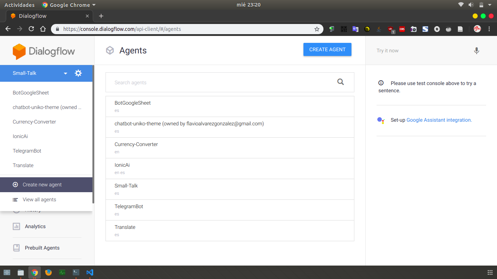


le deberan poner un nombre, elegir un idioma y un proyecto de google asociado, para crear un nuevo proyecto de google elegir "Create a new Google project"


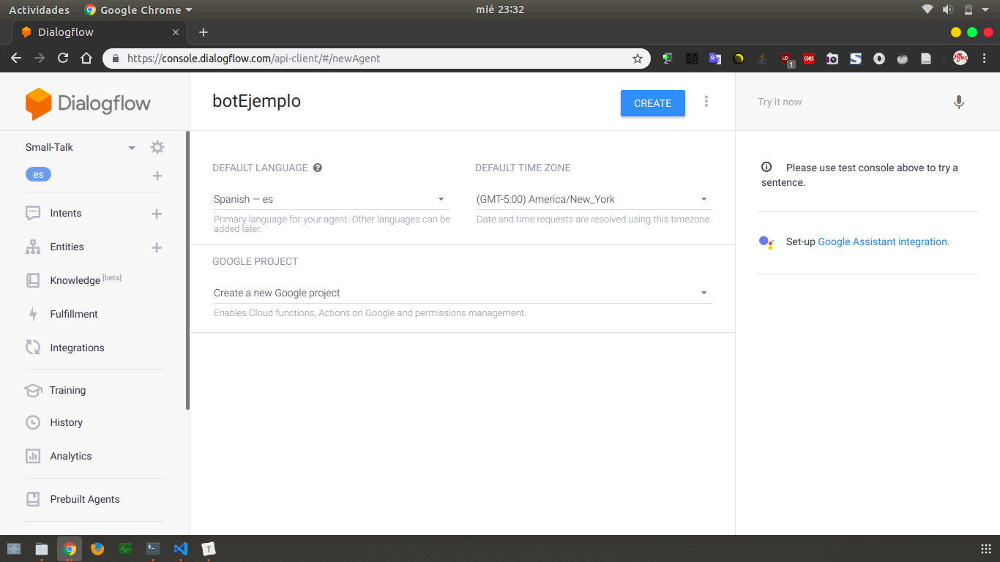


Al pulsar el crear tardará un momento mientras se prepara el nuevo agente por parte de google.

Una vez creado tendremos 2 "Intents" creados, un Intent es lo que le permite al bot poder enterder una frase y saber como proceder, por ejemplo el intent "Default Welcome Intent" reconoce expresiones de usuario como


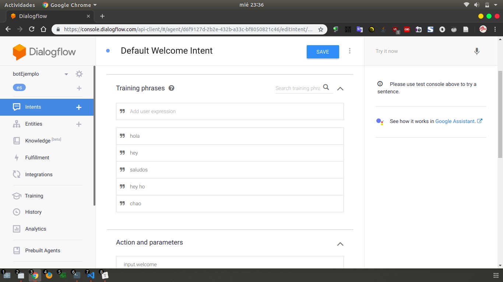


a lo que respondería cosas como


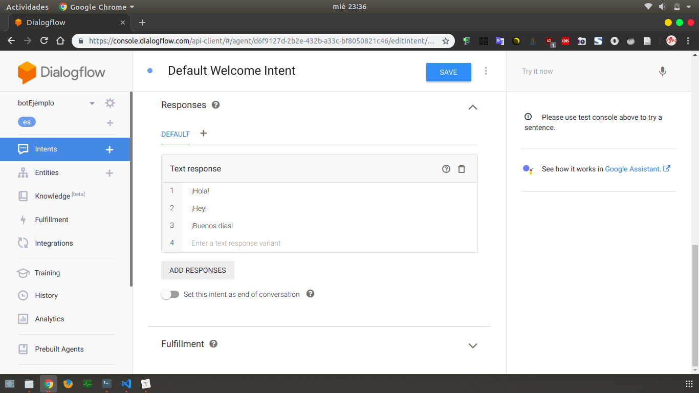


o sea que siempre que recibamos un mensaje de "Hola" por ejemplo, el bot contestará "¡Hola!" o alguna de las otras respuestas, lo podemos ver en el input "Try it now" de la parte superior derecha


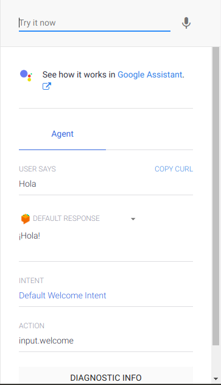


"user says" es lo que he dicho

"Default response" es lo que me ha contestado

"Intent" es el intent que ha procesado lo que el usuario ha dicho

"Action" es la acción que se ha ejecutado dentro del input al recibir el mensaje de Hola.


Tambien vemos que hay un intent llamado "Default Fallback Intent" que es el que se ejecuta cuando el usuario dice una frase que ningun intent puede procesar, a lo que el bot contestaría algo como "Ups, no he entendido a que te refieres.", "¿Podrías repetirlo, por favor?" o "¿Disculpa?".

En esté tutorial buscaremos crear un bot que nos responda a cosas como:

> Usuario: ¿Cuánto es 2+2?

> Bot: 2+2 es 4

> Usuario: 2-2

> Bot: 2-2 es 0

> Usuario: 2*2

> Bot: 2*2 es 4

Y así con la división; para lograr esto, debemos crear intents para manejar cada mensaje del usuario y darle el manejo respectivo a cada uno, para eso en el panel izquierdo, al lado de "Intents" hay un + para crear nuevos intents, clickeamos, le damos un nombre y luego guardar:

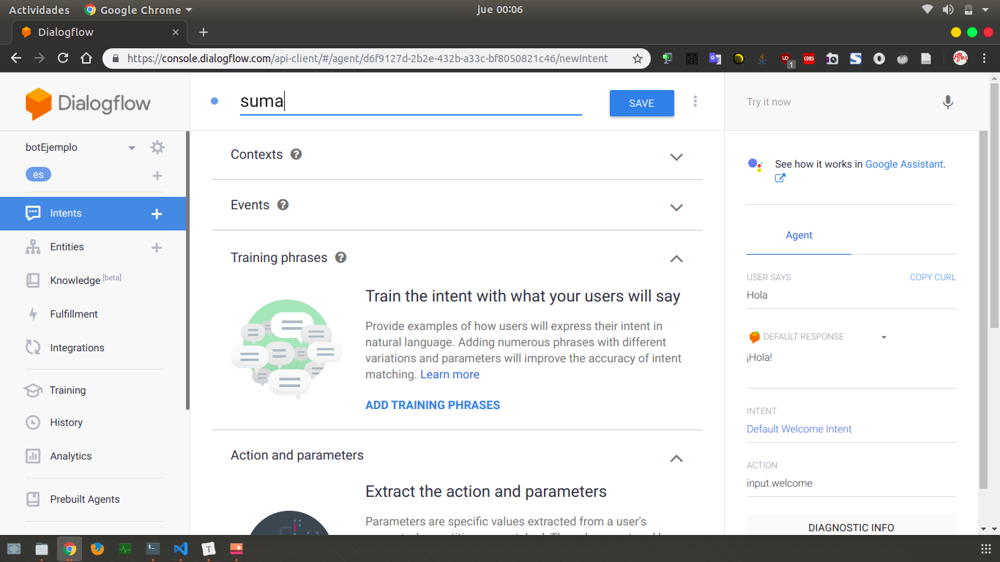

Luego de creado clickeamos "Add Training Phrases" para entrenar al bot con frases dichas por el usuario, pero a diferencia de los dos intents antes mostrados este tendrá dos variables, num1 y num2 para saber a que numeros aplicarle la operación de suma y eso lo hacemos de la siguiente manera

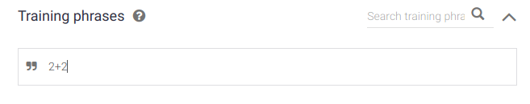

luego de escribir 2+2, seleccionamos el primer 2 y se despliega una ventanita

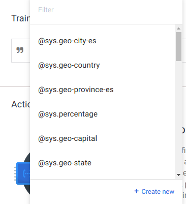

en la que debemos elegir el tipo de dato de la variable, o tambien conocidos como "Entities", pueden leer mas acerca de los tipos [aquí][entities], para éste caso elegiremos @sys.number y le pondremos de nombre num1

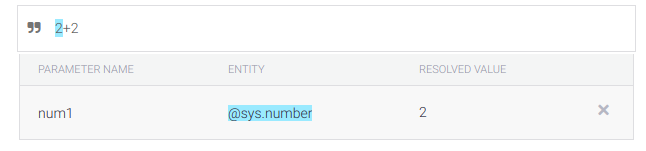

y lo mismo con el otro número, quedando así

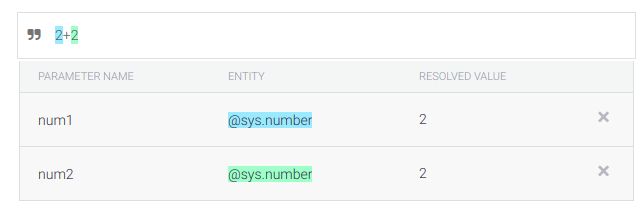

por último pulsamos enter, al agregar mas frases automáticamente se reconocerán las variables luego de pulsar enter, he agregado tres más

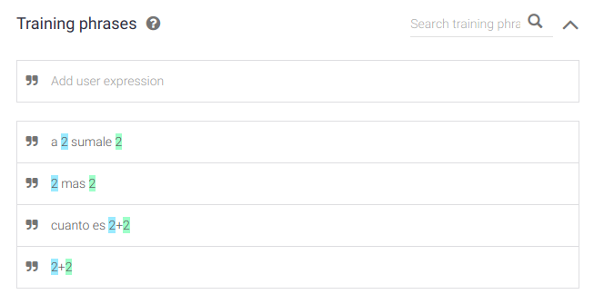

En este caso no tendremos respuestas en el "Response" sino que manejaremos cada petición por medio de un [webhook](https://es.wikipedia.org/wiki/Webhook) que más adelante prepararemos, pero para esto debemos habilitar el "Fulfillment" en el intent, está al final solo clickeamos en "Enable Fulfillment" y luego en "Enable webhook call for this intent".

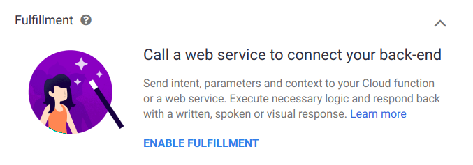

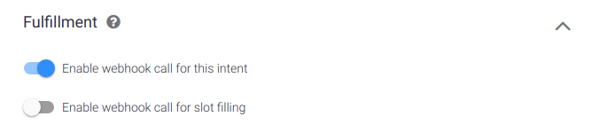

También debemos ponerle un nombre a la acción que se está ejecutando en ese intent para saber como manejarla, y colocar como requeridos los 2 parametros necesarios para dar una respuesta, en este caso num1 y num2, así

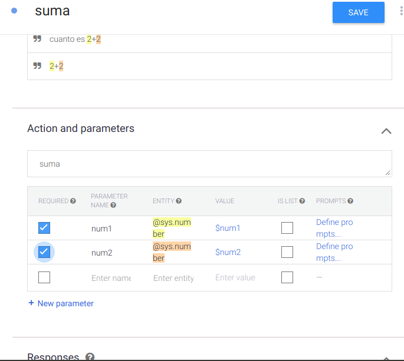

Luego de todo esto es importante dar click en "Save" para guardar lo que hemos hecho, después de eso veremos unas alertas que dicen

> Intent saved

> Agent training started

> Agent training completed

Lo que nos dicen que el intent se guardó, se empezó a entrenar el agente y luego que se terminó el entrenamiento, no podemos aún probar su funcionamiento pues no hemos preparado aun el webhook para poder dar una respuesta, y es aquí cuando entra al juego Node.js que es el que utilizaremos para hacer un servidor y manejar todas las solicitudes hechas al bot y poder dar una respuesta al usuario, veamos como.

Lo primero es crear una carpeta (yo le pondré de nombre "botEjemplo") y dentro de esta creamos un nuevo proyecto de node con 

```bash
npm init -y
```

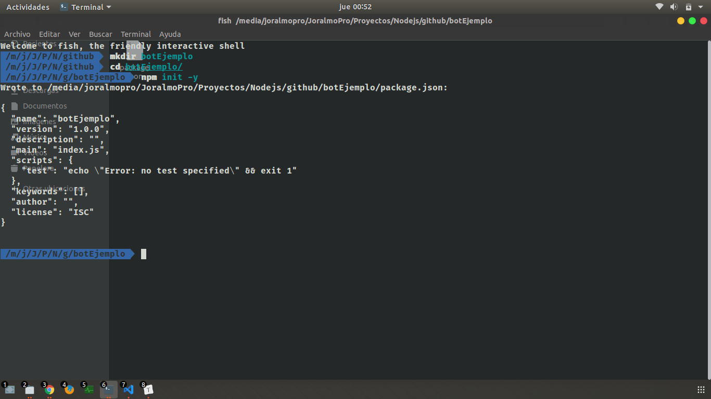

Seguido de eso instalaremos algunos paquetes para poder montar el servidor

```bash
npm i body-parser express ngrok -D
```

Luego creamos el archivo index.js y lo abrimos en nuestro editor de codigo preferido y escribimos por el momento lo siguiente

```javascript
var express = require("express");
var bodyParser = require("body-parser");
const ngrok = require('ngrok');

var app = express();

var port = process.env.PORT || 3000;
var ip = process.env.IP || "127.0.0.1";

app.use(bodyParser.urlencoded({ extended: false }));
app.use(bodyParser.json());

app.post('/', function (req, res) {
    if (req.body.queryResult.action == "suma") {
        let num1 = parseFloat(req.body.queryResult.parameters.num1);
        let num2 = parseFloat(req.body.queryResult.parameters.num2);
        let sum = num1 + num2;
        response = num1 + " + " + num2 + " es " + sum;
        res.json({
            "fulfillmentText": response
        });
    }
});

app.listen(port, ip);

(async function () {
    const url = await ngrok.connect(port);
    console.log(url);
})();
```

Para explicar un poco, el anterior código prepara un servidor con express, esto es porque al habilitar el webhook en dialogflow lo que pasará cada vez que le hagamos una pregunta al bot el dirigirá la petición a la url que le proporcionemos del webhook para procesar la pregunta y dar una respuesta, es por eso que instalamos [ngrok](https://ngrok.com/)

> ngrok expone los servidores locales detrás de NAT y firewalls a la Internet pública a través de túneles seguros.
>

todas estas solicitudes son enviadas a la raiz del servidor "/" es por esto que es importante colocar un nombre a la acción del intent, para saber como manejarla dentro del servidor, dialogflow nos envía una serie de datos en cada solicitud, entre estas el "queryResult.action" que es donde viene la acción ejecutada desde ese intent, tambien "queryResult.parameters" que es donde vienen los parámetros que el usuario proporcionó en el mensaje, mas especificamente en esté caso los dos numeros (num1, num2) , luego de poner a escuchar el servidor ejecutamos una función para poner en "linea" nuestro servidor con ngrok, la url que nos aparecerá en consola luego de hacer "node index.js" es la que colocaremos de webhook en dialogflow así

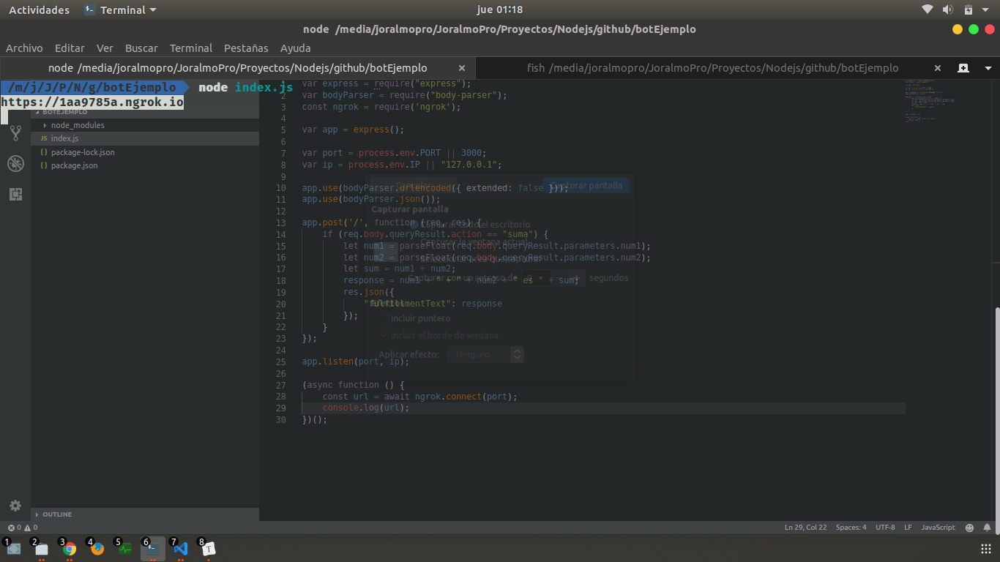

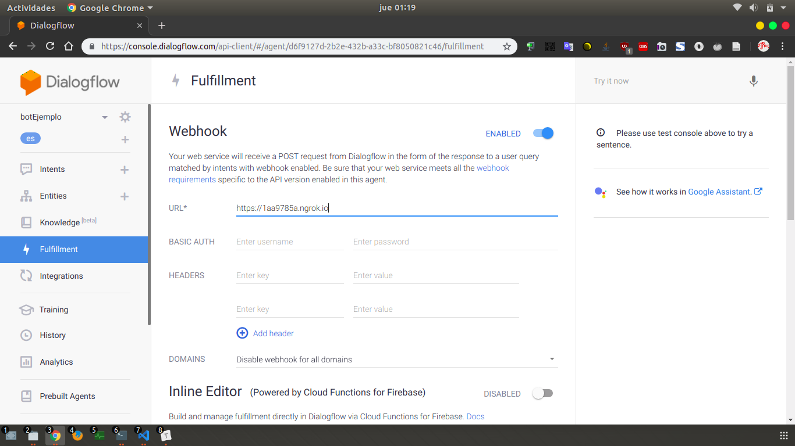

luego de habilitar el webhook bajamos y hacemos click en "Save" para guardar, luego de esto podemos probar el bot con la suma

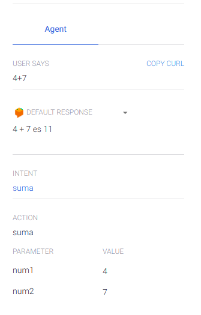

y ¡boom! el bot está funcionando, en la anterior captura se puede ver de nuevo lo enviado por el usuario, la respuesta (que hemos enviado desde el servidor de node), el intent, la acción y los parametros.

Ahora de igual modo crearemos los intent para restar, multiplicar y dividir y agregaremos su respectiva funcionalidad en el código del servidor.

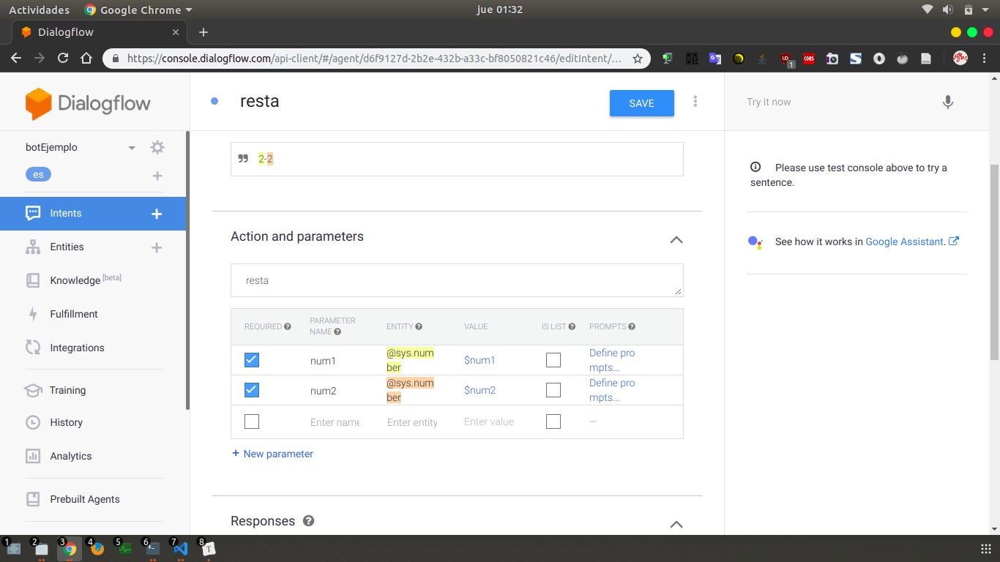


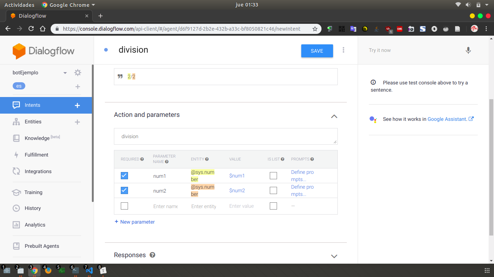

## No olvidar colocar el nombre de la acción, colocar los parámetros como requeridos y activar el fulfillment


Y el código:

```javascript
if (req.body.queryResult.action == "suma") {
        let num1 = parseFloat(req.body.queryResult.parameters.num1);
        let num2 = parseFloat(req.body.queryResult.parameters.num2);
        let sum = num1 + num2;
        response = num1 + " + " + num2 + " es " + sum;
        res.json({
            "fulfillmentText": response
        });
    }else if(req.body.queryResult.action == "resta") {
        let num1 = parseFloat(req.body.queryResult.parameters.num1);
        let num2 = parseFloat(req.body.queryResult.parameters.num2);
        let sum = num1 - num2;
        response = num1 + " - " + num2 + " es " + sum;
        res.json({
            "fulfillmentText": response
        });
    }else if(req.body.queryResult.action == "multiplicacion") {
        let num1 = parseFloat(req.body.queryResult.parameters.num1);
        let num2 = parseFloat(req.body.queryResult.parameters.num2);
        let sum = num1 * num2;
        response = num1 + " * " + num2 + " es " + sum;
        res.json({
            "fulfillmentText": response
        });
    }else if(req.body.queryResult.action == "division") {
        let num1 = parseFloat(req.body.queryResult.parameters.num1);
        let num2 = parseFloat(req.body.queryResult.parameters.num2);
        let sum = num1 / num2;
        response = num1 + " / " + num2 + " es " + sum;
        res.json({
            "fulfillmentText": response
        });
    }
```

Guardamos y volvemos a correr el servidor

### Importante cambiar la url del fulfillment cada vez que corramos el servidor

y de esté modo ya estária nuestro bot funcionando, de manera rápida haremos una integración con telegram para probar el bot de manera mas comoda.

Lo primero es ir al apartado de "Integrations" en DialogFlow y habilitar Telegram, nos pedirá un token

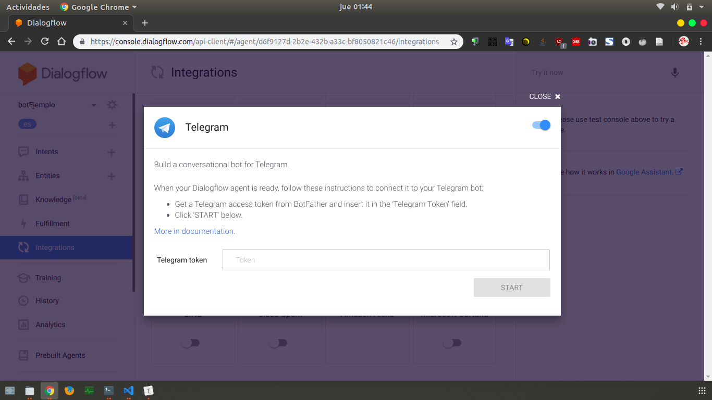

Para conseguir este token debemos creal el bot en telegram, [aquí](https://web.telegram.org/#/im?p=@BotFather), estando en el chat con el BotFather en telegram le escribimos

```bash
/newbot
```

y nos preguntará el nombre del bot y el nombre de usuario del bot

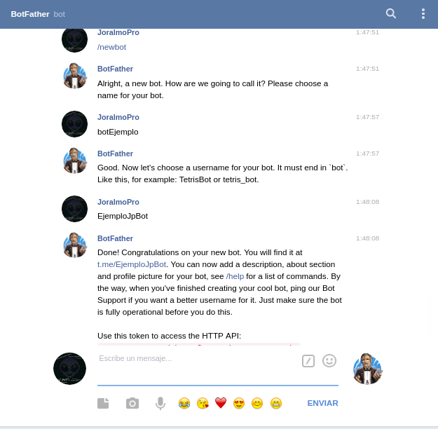

nos resaltará el token en rojo, es el que pondremos en DialogFlow, lo pegamos y pulsamos start y listo ya tendremos la integración con telegram, probamos, para probar hay que iniciar la conversación con el bot en telegram, a mi bot le he puesto por nombre de usuario "EjemploJpBot" por lo tanto para poder iniciar la conversación con el debo ir a la url https://web.telegram.org/#/im?p=@EjemploJpBot, deberan editar la url con el nombre de usuario de su bot al final, al probar:

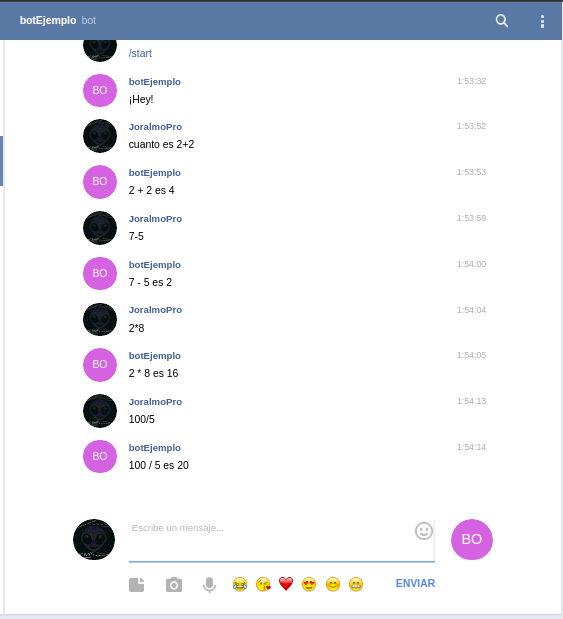

### Asegurarse de tener corriendo el servidor de node para que funcione el bot


Y listo, estó seria todo por esté tutorial, creo que son buenas bases para poder crear nuevas y mejores cosas con dialogflow, espero haberme explicado bien y que hayas entendido esté paso a paso.

[Código del servidor][github]

> ¡Nos vemos en línea!

[df]: <https://dialogflow.com/>
[entities]: <https://dialogflow.com/docs/reference/system-entities>

[github]:<https://github.com/Joralmo/botEjemplo>
