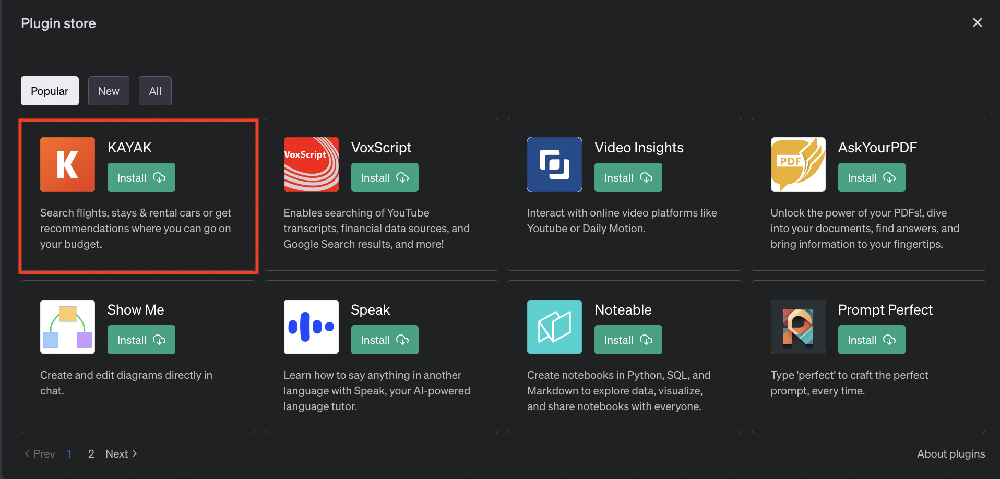
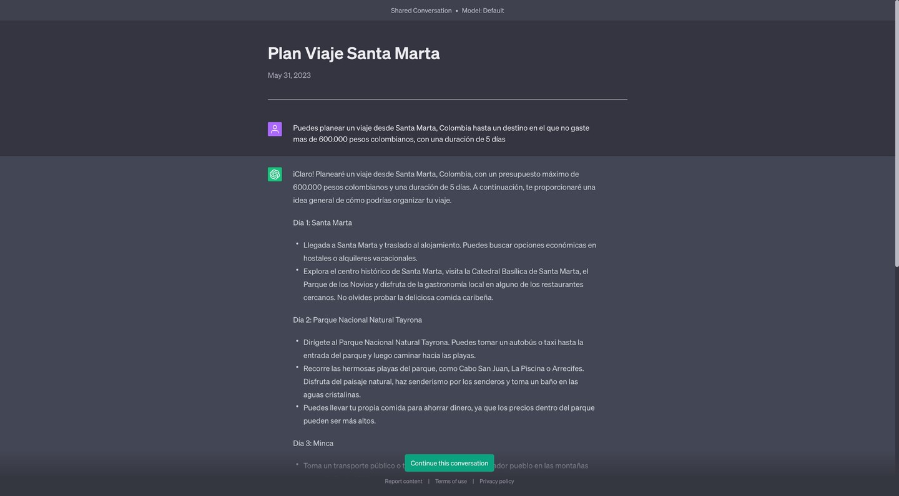
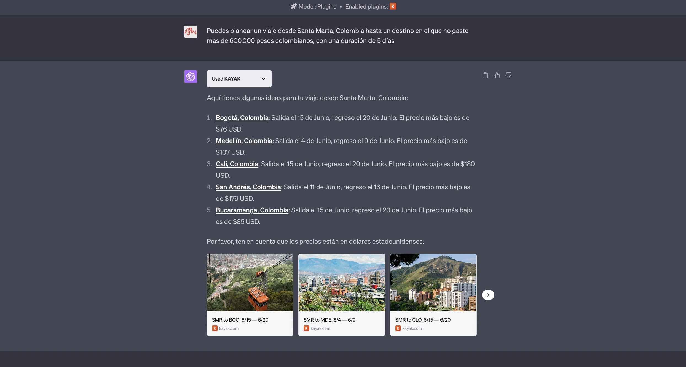
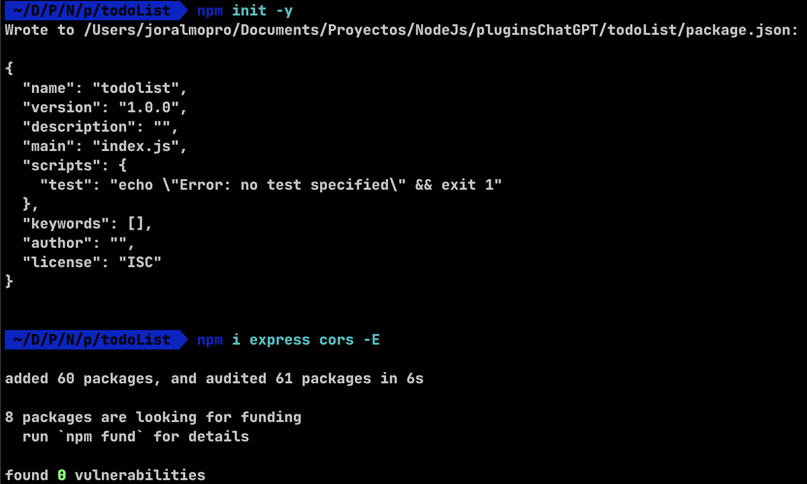
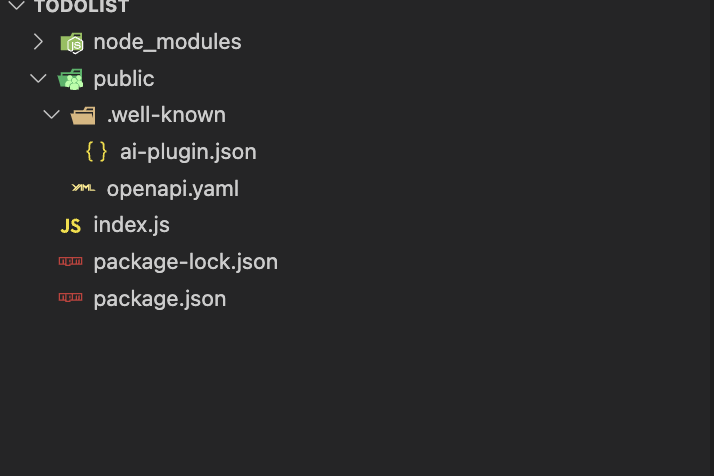
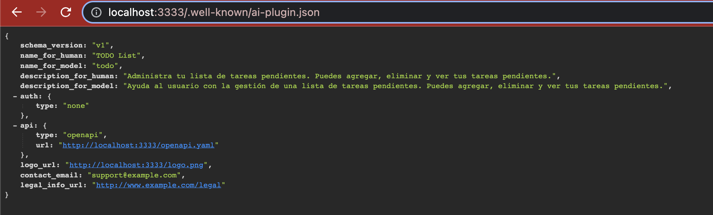
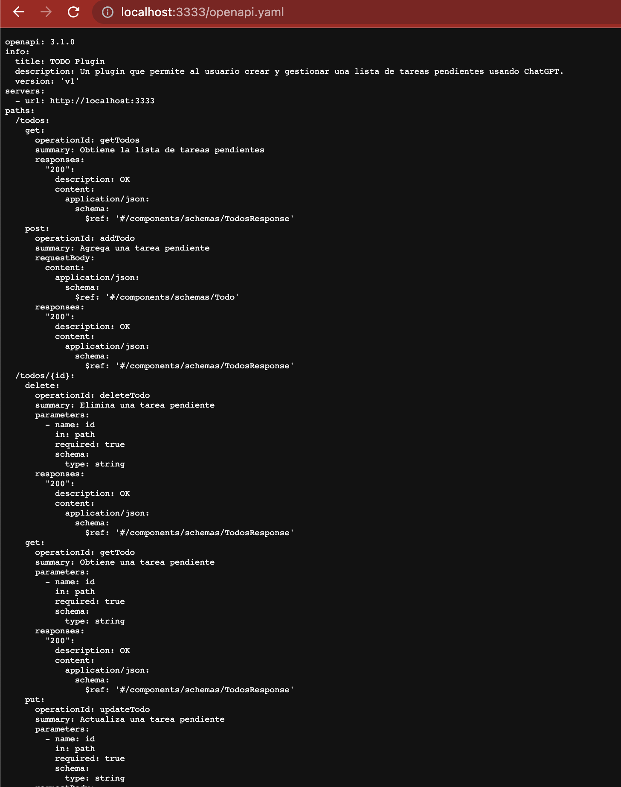

> # Actualmente no tengo acceso a la whitelist de desarrolladores de plugin de openAI (estoy esperando invitación) por lo que este post está incompleto.

#### Holaaa 👋

### El día de hoy veremos como crear un plugin para el famoso ChatGPT, pero empecemos por el comienzo:

### ¿Qué es ChatGPT?

No me digas que ¿no has usado ChatGPT? Jajaja, bueno igual te comento en términos sencillos, ChatGPT es un programa de computadora inteligente que puede entender y escribir texto como si fuera una persona. Es capaz de responder preguntas, completar oraciones y ayudar con diferentes tareas relacionadas con el lenguaje. Fue entrenado con mucha información de texto para poder aprender y ofrecer respuestas útiles y creativas. En pocas palabras, es como tener a alguien que te ayuda a escribir y entender cosas en línea. 🚀

### ¿Qué es un plugin?

Un plugin es como un complemento o una extensión que puedes agregar a un programa o una página web para hacer cosas adicionales. Es como cuando añades accesorios a un carro para que haga más cosas o se vea diferente. Los plugins son como piezas de software que amplían las capacidades de lo que ya tienes, sin tener que cambiarlo por completo. Pueden agregar nuevas funciones o personalizaciones especiales según lo que necesites. En resumen, los plugins son como "añadidos" que mejoran o personalizan algo que ya existe. 🔌

Para el caso especifico de ChatGPT podemos encontrar varios plugin que le dan super poderes, uno con el que te puedo dar un excelente ejemplo es el que hasta hoy es el mas popular en la tienda de plugins de ChatGPT


Si normalmente le preguntamos a ChatGPT "Puedes planear un viaje desde Santa Marta, Colombia hasta un destino en el que no gaste mas de 600.000 pesos colombianos, con una duración de 5 días" nos respondería algo como esto:


<a href="https://chat.openai.com/share/7ae704b5-5d14-488c-9892-b0a6b3a2a6cf" target="_blank">Plan Viaje Santa Marta (conversación completa)</a>

Pero si le preguntamos lo mismo con el plugin de viajes nos respondería algo como esto:


<a href="https://chat.openai.com/share/4d5ba55a-3a5a-4d38-8542-b50f73740c5e" target="_blank">Plan Viaje Santa Marta usando un Plugin (conversación completa)</a>

Al analizar las respuestas, podemos notar que la primera no está mal, pero se enfoca principalmente en destinos que ya conoce, especialmente aquellos ubicados en o cerca de Santa Marta. Además, al final de la respuesta, se proporciona una recomendación sobre el presupuesto, aunque no se tiene en cuenta de manera exhaustiva. Por otro lado, la segunda respuesta está mejor organizada, incluye precios actualizados en tiempo real (algo que sin el plugin no podría hacer) y, además, al final se ofrecen enlaces directos para reservar el viaje.

Y así como este hay una lista bastante larga de plugins que le dan super poderes a ChatGPT, pero ¿qué tal si creamos uno nosotros mismos? 🤔.

Durante este tutorial vamos a desarrollar dos plugins, uno que será sencillo que nos permitirá simular un TODO list, esto básicamente permite ver, agregar, editar y eliminar tareas; por otro lado desarrollaremos otro plugin
que permitirá consultar información de películas (actualizadas) usando el api de TMDB esto para darle "acceso a internet" a ChatGPT de tal manera que prodremos preguntarle por ejemplo por películas del 2023 (sin plugin no sería posible ya que su base de conocimiento es hasta 2021) y algo que se me acaba de ocurrir
(si después estás leyendo esto es porque si me funcionó xD) es hacer un remix de ambos plugins, pedirle a ChatGPT que busque cierta película y la añada como nueva tarea a nuestro TODO list, ¿qué tal? 🤯

Antes de empezar a desarrollar nuestros plugins, es importante recalcar que lo que haremos será dos apis (la del TODO List y la de películas) 
que serán las encargadas de nuestra lógica, pero para que ChatGPT pueda "reconocer" estas apis como plugins y poder interactuar con ellas (de una manera increíble) 
es necesario dos archivos importantes, el primero:

### ai-plugin.json
El archivo ai-plugin.json es necesario para cada plugin. Este archivo debe ser alojado en el dominio de la API. Por ejemplo, si una empresa llamada ejemplo.com tiene su API alojada en ese dominio, el archivo JSON del plugin debe estar accesible a través de https://ejemplo.com. Cuando instalas el plugin a través de la interfaz de ChatGPT, en el backend se busca un archivo ubicado en /.well-known/ai-plugin.json. La carpeta /.well-known es requerida y debe existir en tu dominio para que ChatGPT se pueda conectar con tu plugin. Si no se encuentra el archivo, no se puede instalar el plugin. Para el desarrollo local, puedes usar HTTP, pero si apuntas a un servidor remoto, se requiere HTTPS.

La definición mínima del archivo ai-plugin.json se ve así:

```json
{
    "schema_version": "v1",
    "name_for_human": "TODO List",
    "name_for_model": "todo",
    "description_for_human": "Administra tu lista de tareas pendientes. Puedes agregar, eliminar y ver tus tareas pendientes.",
    "description_for_model": "Ayuda al usuario con la gestión de una lista de tareas pendientes. Puedes agregar, eliminar y ver tus tareas pendientes.",
    "auth": {
        "type": "none"
    },
    "api": {
        "type": "openapi",
        "url": "http://localhost:3333/openapi.yaml"
    },
    "logo_url": "http://localhost:3333/logo.png",
    "contact_email": "support@example.com",
    "legal_info_url": "http://www.example.com/legal"
}
```

El archivo ai-plugin.json contiene metadatos relevantes (y en el ejemplo anterior los mínimos y obligatorios) para el plugin, como el nombre, descripción, información de autenticación, especificación de la API, URL del logo, correo de contacto y URL de información legal.

Es importante seguir las directrices de nombre y límites de caracteres establecidos por ChatGPT. Además, el archivo debe incluir información de autenticación, que puede variar según el método utilizado (por ejemplo, tokens de API a nivel de aplicación, autenticación HTTP a nivel de usuario o autenticación OAuth).

El archivo ai-plugin.json es fundamental para que ChatGPT pueda interactuar con tu plugin. Es importante asegurarse de que esté alojado correctamente y de que todos los campos requeridos estén completos.

Recuerda que hay límites de longitud para algunos campos, y también hay un límite máximo de 100,000 caracteres para la respuesta de la API, por lo que se recomienda ser conciso en la descripción y respuestas para que se ajusten al contexto limitado de los modelos.

Podemos observar que también en el archivo anterior hay una pista para el otro archivo necesario que es el que contiene la especificación de la API:

### openapi.yaml

Este archivo es completamente necesario, es en que debemos construir la especificación OpenAPI para documentar la API. El modelo en ChatGPT no sabe nada acerca de tu API, excepto lo que está definido en la especificación OpenAPI y en el archivo de manifest. Esto significa que si tienes una API extensa, no es necesario exponer todas las funcionalidades al modelo y puedes elegir endpoints específicos.

La especificación OpenAPI es el envoltorio que se sitúa sobre tu API. Una especificación básica de OpenAPI se verá así:

```yaml
openapi: 3.0.1
info:
  title: TODO Plugin
  description: Un plugin que permite al usuario crear y gestionar una lista de tareas pendientes usando ChatGPT.
  version: 'v1'
servers:
  - url: http://localhost:3333
paths:
  /todos:
    get:
      operationId: getTodos
      summary: Obtiene la lista de tareas pendientes
      responses:
        "200":
          description: OK
          content:
            application/json:
              schema:
                $ref: '#/components/schemas/getTodosResponse'
components:
  schemas:
    getTodosResponse:
      type: object
      properties:
        todos:
          type: array
          items:
            type: string
          description: La lista de tareas pendientes.
```

Comenzamos definiendo la versión de la especificación, el título, la descripción y el número de versión. Cuando se ejecuta una consulta en ChatGPT, se revisa la descripción definida en la sección de información (info) para determinar si el plugin es relevante para la consulta del usuario, 
siendo esto tan importante (la descripción) que openAi tiene una sección dedicada para explicar <a href="https://platform.openai.com/docs/plugins/getting-started/writing-descriptions" target="_blank">como escribir una buena descripción</a>.

Ten en cuenta los siguientes límites en tu especificación de OpenAPI, que pueden cambiar:

- Máximo de 200 caracteres para cada descripción/resumen de endpoint de la API en la especificación.
- Máximo de 200 caracteres para cada descripción de parámetro de la API en la especificación.

Puedes profundizar mas sobre estos dos archivos en la <a href="https://platform.openai.com/docs/plugins/getting-started" target="_blank">documentación oficial</a> de ChatGPT.

Pero bueno, menos charla y mas código, ¿no?,
empecemos entonces con el primer plugin:

### TODO List

Como les comenté antes, los plugins primeramente consisten en apis, por lo que comenzaremos con lo de siempre, crear un proyecto de nodejs e instalamos el siempre confiable 
express y como no, los cors para evitar problemas de CORS en el futuro:



Adicional creamos los dos archivos mencionados anteriormente, importante que el archivo ai-plugin.json esté dentro de la carpeta .well-known ya que es la que ChatGPT buscará para instalar el plugin, con estos archivos 
y el proyecto de nodejs inicializado, nuestro proyecto se verá así:


En el archivo ai-plugin.json he colocado tal cual como está en el ejemplo de arriba y en el archivo openapi.yaml también lo de arriba pero adicionando los paths de post, put y delete para poder crear, editar y eliminar tareas 
(los he colocado dentro de la carpeta public para poder servirlos con express mas fácilmente).

Pasamos ahora a crear nuestro index.js donde haremos la lógica de la aplicación, pero primero que todo lo que haremos será servir estos dos archivos para que ChatGPT pueda encontrarlos cuando los requiera, así:

```javascript
import express from "express";

const app = express();
app.use(express.static("public"));

const port = process.env.PORT || 3333;

app.listen(port, () => {
  console.log(`Listening on port ${port}`);
});
```

corremos nuestro servidor 

```bash
node --watch index.js
```
aprovechando que el poderoso node ya soporta el modo watch que nos muestra cambios al guardar los archivos sin usar nodemon, y si vamos a http://localhost:3333/.well-known/ai-plugin.json



y a http://localhost:3333/openapi.yaml



Nos aseguramos que todo esté bien y que ChatGPT pueda encontrar nuestros archivos, ahora si, pasamos a la lógica de la aplicación, lo primero que haremos será crear un array de tareas que por defecto y por 
cuestiones del ejemplo le colocaré tres tareas (usamos la librería crypto para generar un id único para cada tarea), y de paso hacemos los endpoints para obtener todas las tareas, crear una nueva tarea, editar una tarea y eliminar una tarea:

> NOTA: importante importar y usar los cors y decirle a express que soporte los json en el body de las peticiones.

```javascript
import express, { json } from "express";
import crypto from "node:crypto";
import cors from "cors";

const app = express();
app.use(express.static("public"));
app.use(json());

const port = process.env.PORT || 3333;

app.use(
  cors({
    methods: ["GET", "POST", "PUT", "DELETE"],
    origin: [`https://localhost:${port}`, "https://chat.openai.com"],
  })
);

let TODOS = [
  {
    id: crypto.randomUUID(),
    title: "Aprender mas de Node.js",
  },
  {
    id: crypto.randomUUID(),
    title: "Crear un plugin para ChatGPT",
  },
  {
    id: crypto.randomUUID(),
    title: "Be happy",
  },
];

app.get("/todos", (req, res) => {
  res.json(TODOS);
});

app.post("/todos", (req, res) => {
  const { title } = req.body;
  const todo = {
    id: crypto.randomUUID(),
    title,
  };
  TODOS.push(todo);
  res.json(todo);
});

app.delete("/todos/:id", (req, res) => {
  const { id } = req.params;
  TODOS = TODOS.filter((todo) => todo.id !== id);
  res.json({ id });
});

app.put("/todos/:id", (req, res) => {
  const { id } = req.params;
  const { title } = req.body;
  TODOS = TODOS.map((todo) => {
    if (todo.id === id) {
      return {
        ...todo,
        title,
      };
    }
    return todo;
  });
  res.json({ id });
});

app.listen(port, () => {
  console.log(`Listening on port ${port}`);
});
```

Aquí como pueden ver es un ejemplo sencillo de un TODO list, sin persistencia de memoria ni nada, pero para el ejemplo esto nos sirve, ahora si, pasamos a la parte mas interesante, 
probaremos nuestro plugin en ChatGPT (yo he probado previamente los endpoints en postman para asegurarme que todo esté bien), en ese orden de ideas, vamos a la página de ChatGPT
