#### Holaaa 👋 aquí vamos de nuevo con un tutorial, donde veremos como desplegar un proyecto de Go con Fiber en Railway por medio del CI/CD de Gitlab, ya que cuando intenté hacerlo la documentación al respecto es poca, así que aquí vamos a ver como hacerlo paso a paso, pero primero:

쯈ué es <a href="https://gitlab.com/" target="_blank">GitLab</a>? 游뱂
Gitlab es una plataforma de desarrollo colaborativo para alojar repositorios de código, gestionar proyectos y controlar la actividad de los desarrolladores, 
muy similar a GitHub pero con algunas diferencias, también es gratis y tiene en su plan gratis el servicio de CI/CD que nos permite ejecutar acciones a partir
de un push a un repositorio, como por ejemplo desplegar una aplicación en un servidor.<br/><br/>
쯈ué es <a href="https://railway.app/" target="_blank">Railway</a>? 游뱂
Railway es una plataforma de hosting para desplegar aplicaciones web, es gratuita y tiene un plan de pago, en el plan gratuito podemos desplegar una aplicación automáticamente al configurar un token que usaremos desde gitlab para desplegar la aplicación, también podemos desplegar una aplicación manualmente, pero en este tutorial veremos como desplegarla automáticamente.

#### Empecemos 🚀

Para este tutorial he preparado este pequeño proyecto en Go con Fiber, una pequeña api con dos enpoints, uno para ver que está funcionando y otro protegido por una api-key (esto para ver como configurar variables de entorno en railway) y que nos devuelve un array de string a modo de ejemplo, puedes clonar el proyecto desde <a href="https://gitlab.com/JoralmoPro/gotorailwaytutorial" target="_blank">aquí</a>.

```go:title=api-code
package main

import (
	"os"

	"github.com/fiberweb/apikey/v2"
	"github.com/gofiber/fiber/v2"
)

func main() {

	app := fiber.New()

	app.Get("/", func(c *fiber.Ctx) error {
		return c.SendString("¡Api It's working!")
	})

	app.Use(apikey.New(apikey.Config{Key: os.Getenv("API_KEY")}))

	app.Get("/services", func(c *fiber.Ctx) error {
		services := []string{"service1", "service2", "service3"}
		return c.JSON(services)
	})

	port := os.Getenv("PORT")

	if port == "" {
		port = "3000"
	}

	app.Listen(":" + port)

}
```

#### Configuración de Railway 🚀

Seguidamente procedemos con railway para la configuración del proyecto y del servicio desde su dashboard, railway permite desplegar aplicaciones incluso sin estar logeados
pero para este caso necesitamos estar logeados para generar un token que es el que utilizaremos para enviar el proyecto desde el CI/CD de gitlab, para esto, una vez ingresamos a la página de railway y nos logeamos,
vamos a crear un nuevo proyecto:
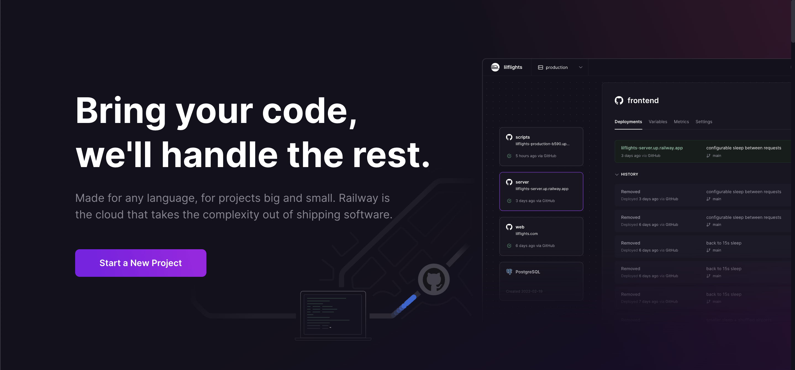
Seguidamente elegimos la opción para crear un proyecto vacío:
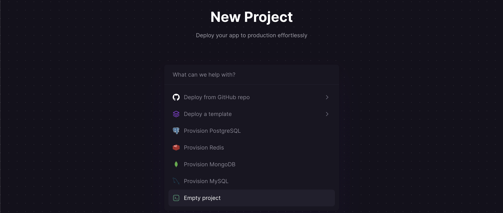
Una vez nuestro proyecto se ha creado, procedemos a agregar un nuevo servicio vacío:
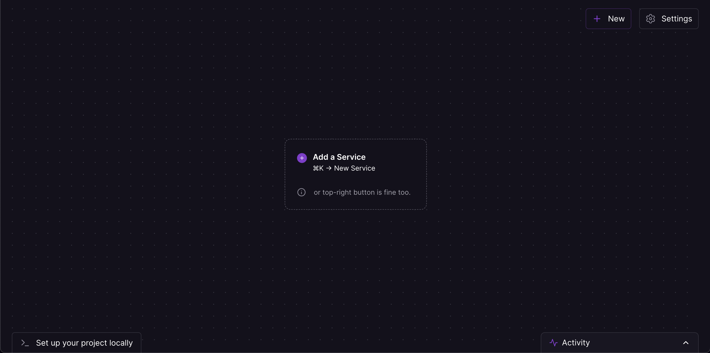
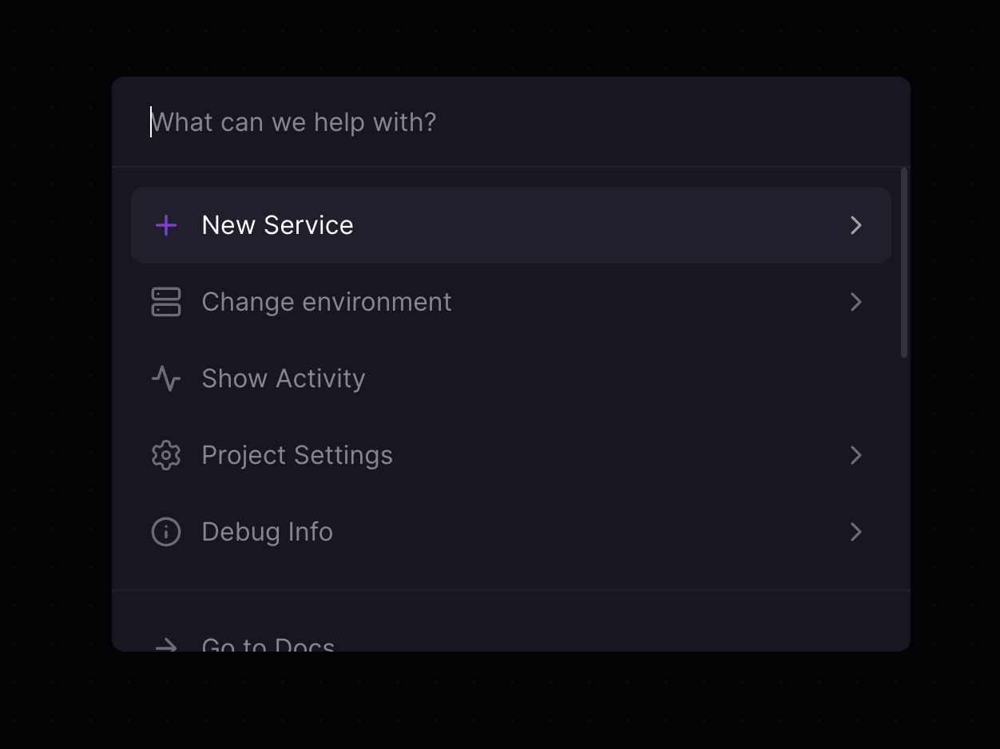
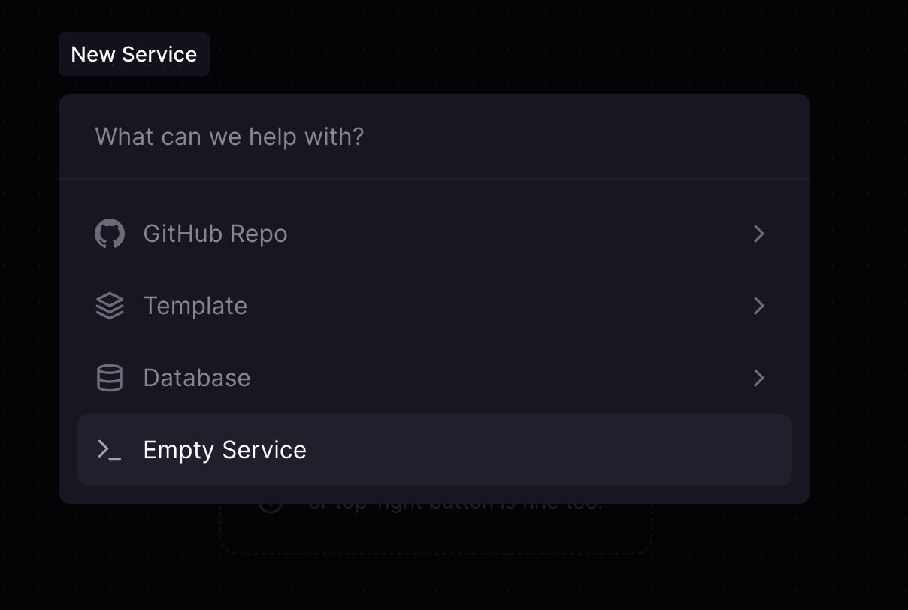

Al hacer click sobre el servicio creado lo podremos editar, y vamos a colocarle un nombre mas amigable 😁
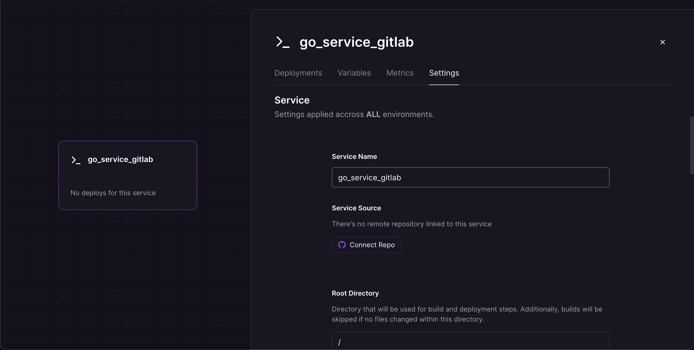
Ahora en la esquina superior derecha en los settings del proyecto vamos a generar un token para poder desplegar la aplicación desde el CI/CD de gitlab:
### Importante copiarlo apenas sea generado ya que solo se puede ver una vez
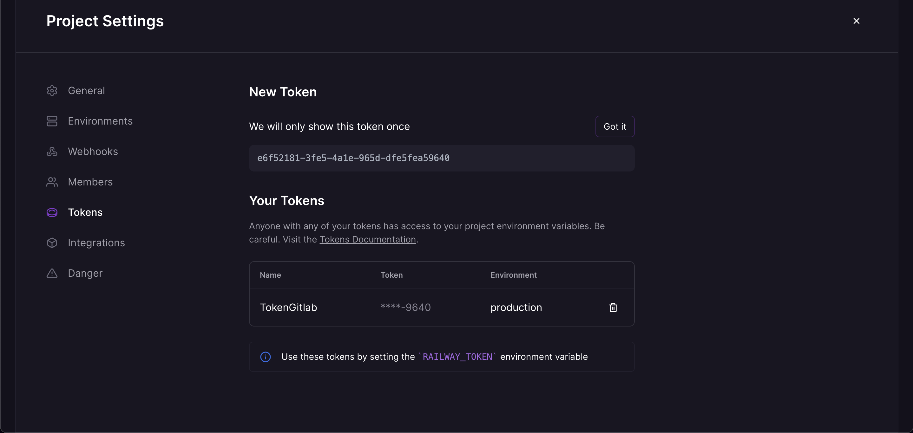
Y de momento por parte de railway ya tenemos todo listo para desplegar la aplicación, ahora vamos a configurar el CI/CD de gitlab.

#### Configuración de GitLab 🚀
En las configuraciones de nuestro repositorio, en el apartado de CI/CD vamos a agregar una variable de entorno llamada RAILWAY_TOKEN y RAILWAY_SERVICE_NAME donde pegamos el token que generamos en railway y el nombre de nuestro servicio:
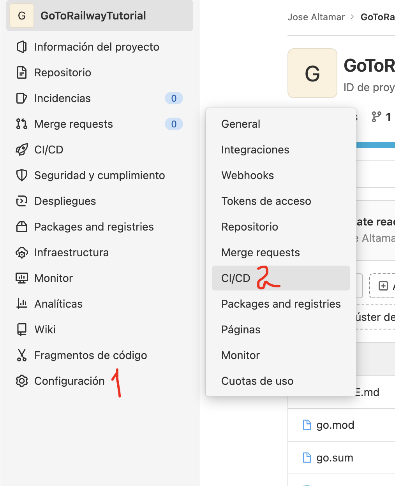
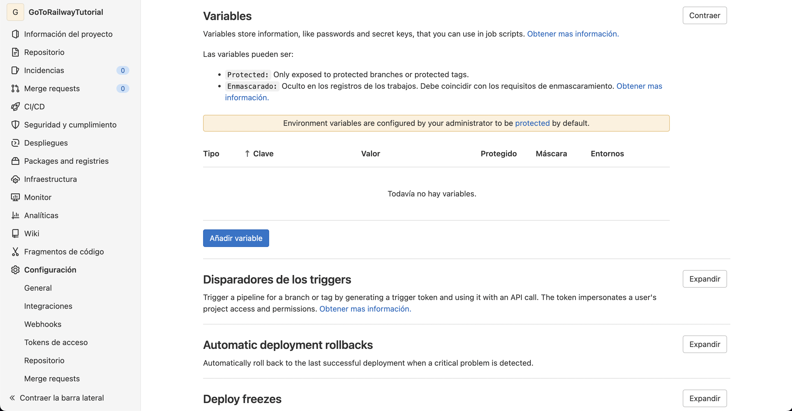
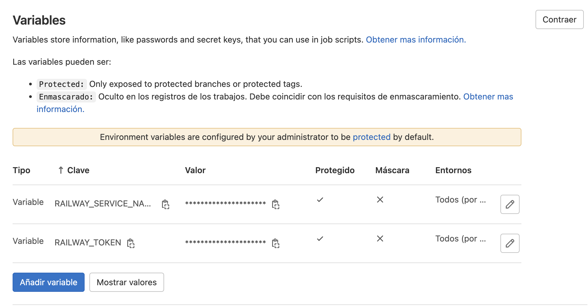
Y ahora procedemos a crear el archivo .gitlab-ci.yml en nuestro repositorio con el siguiente contenido:
```yml:title=.gitlab-ci.yml
stages:
  - deploy

deploy-railway:
  stage: deploy
  image: ubuntu
  only:
    - pushes
    - main
  script:
    - apt-get update && apt-get install -y curl
    - curl -fsSL https://railway.app/install.sh | sh
    - railway up --service=$RAILWAY_SERVICE_NAME -d
```
Railway por defecto busca la variable de entorno RAILWAY_TOKEN para autenticarse, por lo que no es necesario agregarla en el archivo .gitlab-ci.yml, ahora solo nos queda hacer un push a nuestro repositorio y ver como se despliega la aplicación automáticamente en railway.
Ahora una vez añadido el archivo y luego de hacer push, podemos ver en la sección de CI/CD de gitlab como empieza a ejecutarse el pipeline:
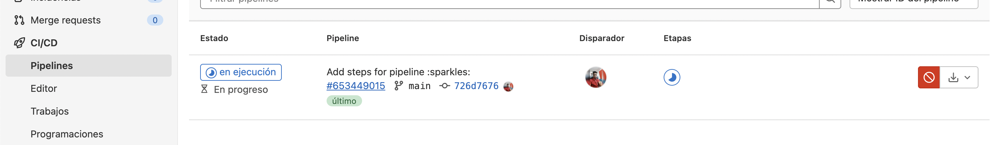
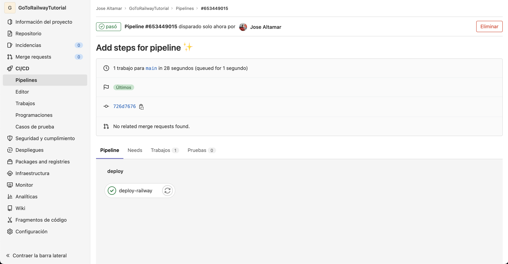
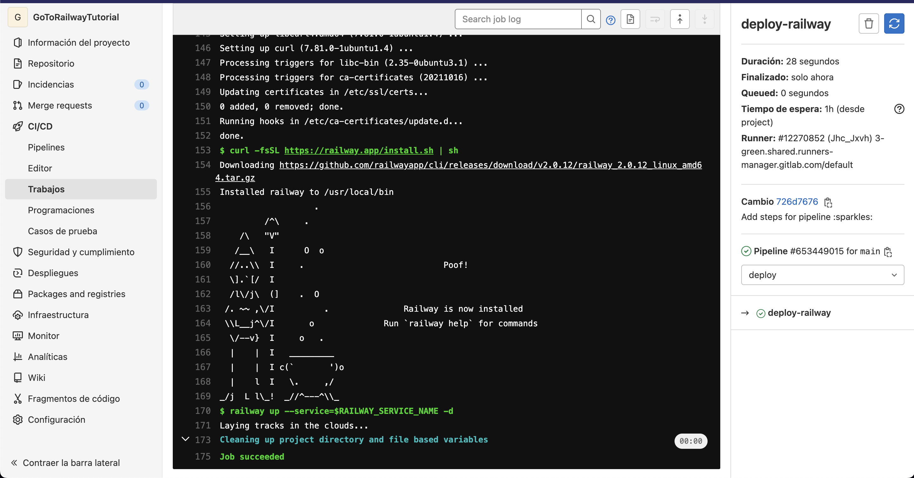

Y en railway podemos ver el servicio ya desplegado, pero al ser la primera vez y como es un servicio web nuevo, nos sugerirá que agreguemos una url para poder acceder a la aplicación, de momento elegiremos generar un dominio:
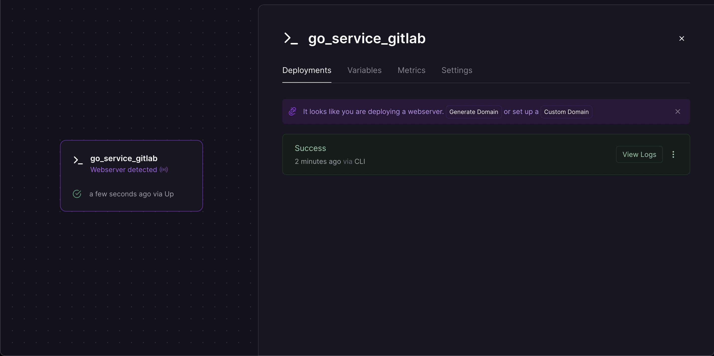
Una vez generado nos lo muestra y desde ahí mismo podremos acceder a nuestra aplicación:
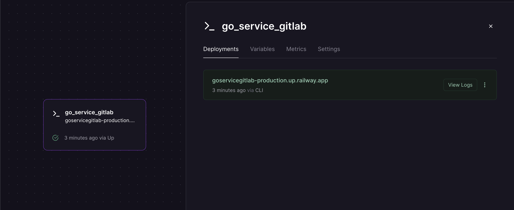
Damos click para navegar al dominio:
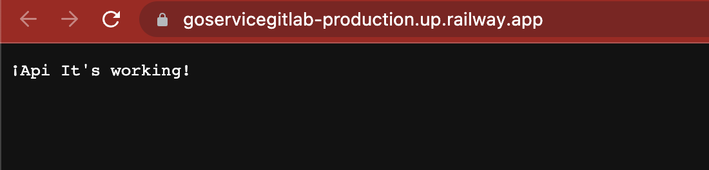
Probamos desde postman el endpoint de /services sin el token, podemos ver que retorna un error de autorización:
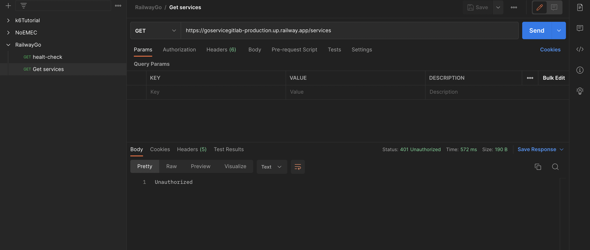
Para configurar el API_KEY volvemos a railway y hacemos click sobre el servicio y vamos a la sección de variables y creamos una nueva:
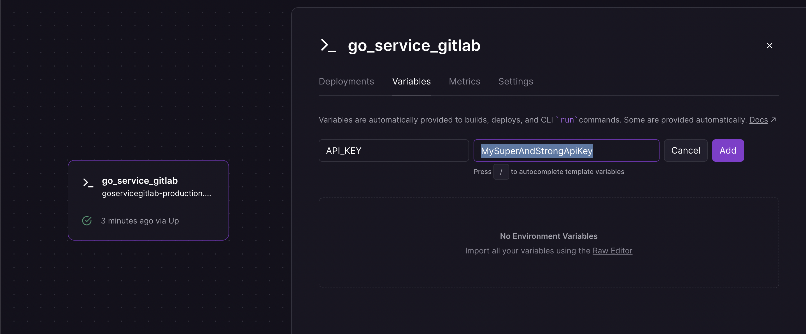
Probamos nuevamente desde postman pero ahora si enviando el header x-api-key con el valor de la variable de entorno API_KEY y vemos que nos responde sin problemas:
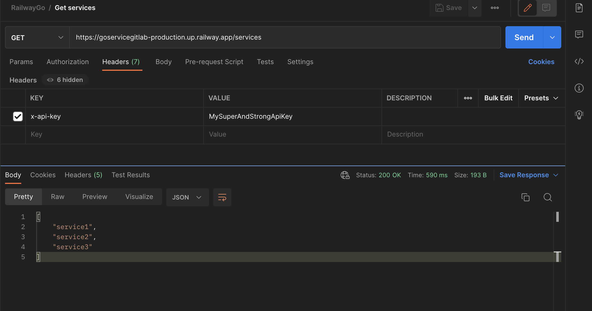

Y con esto ya tendríamos nuestra api de Go desplegada en Railway y con un CI/CD automatizado desde GitLab, espero que les haya gustado el tutorial y que les sirva para sus proyectos, cualquier duda o comentario me pueden encontrar en las redes como @JoralmoPro.

> Nos vemos en línea.
