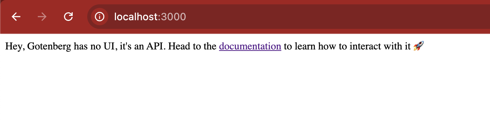
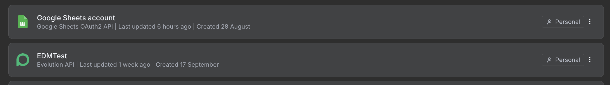
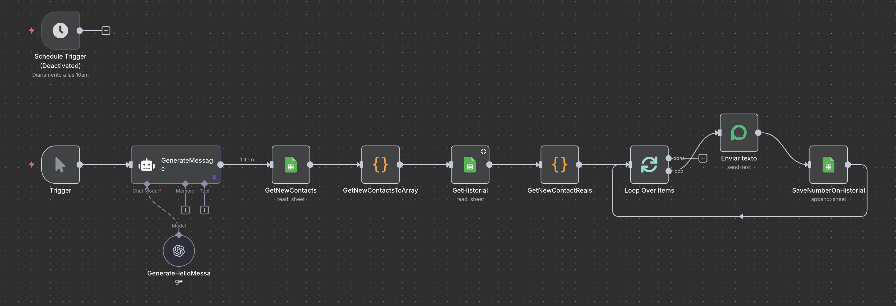
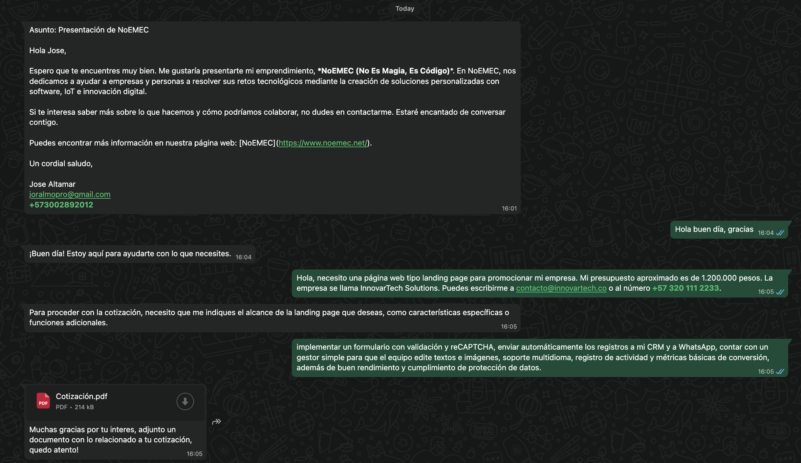

# Dos flujos con n8n + Evolution API en local (Docker): paso a paso básico

En esta guía montamos **dos flujos** con **n8n** y **Evolution API** en local (ambos con **Docker**), usando **OpenAI** para los textos:

1. **Presentación Nuevos Contactos**: Envía un mensaje de presentación por WhatsApp a una lista de contactos.
2. **Asistente Personal**: Entiende la solicitud de un cliente, recopila datos, arma una cotización y **envía un PDF** por WhatsApp.

Ambos flujos están diseñados para ser prácticos y funcionales desde el primer momento. ¡Vamos a ello! 🚀

## 0) Preparación del Entorno (local con Docker)

Antes de importar los flujos, necesitas tener tres servicios corriendo en Docker: **n8n**, **Evolution API** y un conversor de **HTML a PDF**.

### n8n (Docker)

Usa la imagen oficial para levantar tu instancia de n8n. Este será nuestro centro de automatización.

```bash
docker run -d --name n8n \
  -p 5678:5678 \
  -v n8n_data:/home/node/.n8n \
  --add-host=host.docker.internal:host-gateway \
  n8nio/n8n:latest
```

Nota: `host.docker.internal` es clave para que n8n pueda comunicarse con otros contenedores Docker en tu máquina, como el conversor de PDF.

### Evolution API (Docker)

Levanta tu instancia de Evolution API. Este será nuestro gateway para enviar y recibir mensajes de WhatsApp.

```bash
docker run -d --name evolution \
  -p 8080:8080 \
  -e AUTHENTICATION_API_KEY=TU_API_KEY_SECRETA \
  <tu_imagen_de_evolution_api>
```

Una vez levantado, entra a `http://localhost:8080`, escanea el QR con tu WhatsApp y guarda tu `API_KEY` y la `BASE_URL` (`http://localhost:8080`).

### Gotenberg (Conversor HTML → PDF en Docker)

Para que el Asistente Personal pueda generar PDFs, usaremos Gotenberg, un servicio muy potente y fácil de desplegar.

```bash
docker run -d --name gotenberg \
  -p 3000:3000 \
  thecodingmachine/gotenberg:7
```

Este contenedor expondrá un endpoint en el puerto 3000 que n8n usará para convertir el HTML de la cotización en un archivo PDF.



### Claves y Credenciales en n8n

Dentro de tu n8n (`http://localhost:5678`), ve a **Credentials** y añade las siguientes:

- **OpenAI**: Crea una API key en la plataforma de OpenAI y añádela como credencial.
- **Google Sheets**: Si vas a usar una hoja de cálculo para los contactos, crea una credencial OAuth2 y conéctala con tu cuenta de Google.
- **Evolution API**: Crea una credencial de tipo "Header Auth".
  - **Name**: `X-API-KEY`
  - **Value**: `TU_API_KEY_SECRETA` (la misma que usaste en el comando de Docker).



## 1) Flujo: Presentación Nuevos Contactos

### Objetivo

Tomar una lista de contactos (Nombre, Número) de una hoja de Google Sheets, verificar que no se les haya contactado antes y enviarles un mensaje de presentación personalizado por WhatsApp.


### Estructura de Nodos (Paso a Paso)

- **Trigger (Manual o Programado)**: El flujo se inicia manualmente (Manual Trigger) o automáticamente en un horario definido (Schedule Trigger, por ejemplo, todos los días a las 10 AM).
- **GenerateMessage (AI Agent)**: Usamos OpenAI para crear una plantilla de mensaje. Esto permite variar el texto fácilmente en el futuro sin tocar los otros nodos.
- **GetNewContacts (Google Sheets)**: Lee todas las filas de la hoja "Contactos", que debe tener las columnas `Nombre` y `Numero`.
- **GetNewContactsToArray (Code)**: Un nodo simple que formatea los contactos leídos en una lista limpia.
- **GetHistorial (Google Sheets)**: Lee la columna `Numero` de la hoja "Historial" para obtener una lista de todos los números ya contactados.
- **GetNewContactReals (Code)**: Compara la lista de nuevos contactos con el historial y devuelve solo aquellos a los que nunca se les ha enviado un mensaje.
- **Loop Over Items (Split In Batches)**: Procesa la lista de contactos "reales" uno por uno para enviar los mensajes de forma individual.
- **Enviar texto (Evolution API)**: Envía el mensaje de WhatsApp.
  - **RemoteJid**: `{{ String($json.number).replace(/\D/g, '') }}` (limpia el número para dejar solo dígitos).
  - **Message Text**: `{{ $('GenerateMessage').first().json.output.replace('//REPLACENAME//', $json["name"]) }}` (toma la plantilla de OpenAI y reemplaza `//REPLACENAME//` con el nombre del contacto).
- **SaveNumberOnHistorial (Google Sheets)**: Una vez que el mensaje se envía correctamente, este nodo añade el número del contacto a la hoja "Historial" para no volver a contactarlo.

### Prompt para OpenAI (Nodo "GenerateMessage")

Este es el prompt que genera la plantilla del mensaje. Es claro y le da al modelo todo el contexto necesario.

> Redacta un mensaje corto, profesional y amable para presentarle mi emprendimiento a este contacto:
>
> **Nombre**: `//REPLACENAME//`
>
> El emprendimiento se llama **NoEMEC (No Es Magia, Es Código)**, y ayuda a empresas y personas a resolver retos tecnológicos creando soluciones a medida con software, IoT e innovación digital.
>
> Hazlo en tono cercano pero profesional, como si lo escribiera una persona.
>
> **Dueño del emprendimiento**: Jose Altamar  
> **Correo del dueño**: joralmopro@gmail.com  
> **Nro de telefono del dueño**: +573002892012  
> **nuestra página web**: [https://www.noemec.net/](https://www.noemec.net/)
>
> Reglas:
>
> - Solamente deja para reemplazar el nombre

Al final el flujo debería verse así:



## 2) Flujo: Asistente Personal (Cotiza + PDF)

### Objetivo

Recibir mensajes por WhatsApp, mantener una conversación para recopilar los datos mínimos de una cotización (servicio, alcance, nombre, contacto), pedir confirmación y, finalmente, generar un PDF con la cotización y enviarlo por WhatsApp.



### Configuración del Webhook

1. En n8n, copia la URL del **Webhook** de producción del nodo **NewMessage**.
2. En tu instancia de Evolution API, configura el **Global Webhook URL** para que apunte a la URL de n8n que copiaste.
3. Activa los eventos que quieres recibir, como `APPLICATION_STARTUP`, `QRCODE_UPDATED` y, el más importante, `MESSAGES_UPSERT`.

Ahora, cada mensaje que llegue a tu número de WhatsApp será reenviado a n8n.

### Estructura de Nodos (Paso a Paso)

- **NewMessage (Webhook)**: Recibe los datos de los mensajes entrantes desde Evolution API.
- **SetVariablesFromWhatsapp (Set)**: Extrae y nombra variables clave del mensaje recibido, como `userNumber`, `userName` y `userMessage`.
- **AI Agent**: Este es el cerebro del flujo. Usa un modelo de OpenAI (como GPT‑4o Mini) con un System Prompt muy detallado. Su única tarea es recibir el mensaje del usuario y devolver un JSON estructurado. Nunca responde con texto libre.
- **ExtractData (Code)**: El output del AI Agent es un string de texto JSON. Este nodo lo parsea (`JSON.parse`) para convertirlo en un objeto con el que n8n pueda trabajar.
- **¿EnviarPdf? (IF)**: Revisa el campo `chatGptResponse.email.send`.
  - Si es `true`, significa que la cotización fue confirmada y el flujo debe generar y enviar el PDF.
  - Si es `false`, el flujo simplemente envía la respuesta de texto generada por la IA.

#### Ruta "True" (Generar PDF)

- **CreateHtml (Code)**: Usa el objeto `chatGptResponse` para construir dinámicamente un documento HTML con todos los detalles de la cotización.
- **ConvertToHtmlFile**: Convierte el string HTML en un archivo binario que el siguiente nodo pueda procesar.
- **HtmlToPdf (HTTP Request)**: Envía el archivo HTML al servicio de Gotenberg (`http://host.docker.internal:3000/forms/chromium/convert/html`) y recibe a cambio un archivo PDF binario.
- **DocumentToBase64**: Convierte el PDF binario a formato Base64, que es el que necesita el nodo de Evolution API.
- **Enviar documento (Evolution API)**: Envía el PDF al usuario a través de WhatsApp.

#### Ruta "False" (Enviar Texto)

- **Enviar texto (Evolution API)**: Envía la respuesta conversacional (`chatGptResponse.reply`) al usuario. Por ejemplo: "¿Podrías darme más detalles sobre el alcance del proyecto?".

### System Prompt Clave (Nodo "AI Agent")

Este prompt es la regla fundamental que define todo el comportamiento del asistente. Le dice a la IA cómo pensar, qué datos necesita y, lo más importante, que solo debe responder con un JSON válido.

```json
{
  "reply": "texto breve para el cliente",
  "intent": "cotizacion|informacion|saludo|desconocido",
  "status": "collecting|confirming|confirmed|cancelled",
  "missing": ["servicio","alcance","nombre","email|telefono"],
  "project": {
    "servicio": "apps_movil|web|analisis_datos|audiovisual|iot|gerencia_proyectos",
    "alcance": "",
    "nombre": "",
    "email": "",
    "telefono": "",
    "presupuesto": 0,
    "empresa": "",
    "notas": ""
  },
  "email": {
    "send": false,
    "to": "",
    "subject": "",
    "html": "",
    "costo_estimado": "Acá la respuesta es un número calculado de acuerdo al servicio y alcance",
    "justificacion": "Acá va una breve justificación del costo, basada en el alcance que te dio el cliente sin mencionar cuanto cobro por hora o jornada"
  }
}
```

---

### Reglas y conocimientos sobre NoEMEC:

- **Fundador**: José Rafael Altamar Molina (JoralmoPro), programador full stack y emprendedor.
- **Slogan**: "No es Magia, Es Código".
- **Página web oficial**: [https://www.noemec.net](https://www.noemec.net)
- **Ubicación**: Colombia, con proyección nacional e internacional.
- **Costo por jornada**: 120 000 COP (8 horas).
- Si un proyecto (ejemplo página web básica) toma 5 jornadas, el costo estimado es 600 000 COP + IVA + 30 % de imprevistos.

**Servicios principales:**

- Desarrollo de Apps Móviles (`apps_movil`)
- Desarrollo Web (`web`)
- Análisis de Datos (`analisis_datos`)
- Producción Audiovisual (`audiovisual`)
- Soluciones IoT (`iot`)
- Gerencia de Proyectos TI (`gerencia_proyectos`)

**Mapa de sinónimos → código interno (aplica siempre):**

- `apps_movil`: app, aplicación, móvil, android, ios, play store, app informativa, rifas, sorteo
- `web`: página web, sitio web, landing, landing page
- `analisis_datos`: datos, BI, dashboard, reportes, power bi, analytics
- `audiovisual`: video, filmación, grabación, edición, boda, evento, comercial
- `iot`: sensores, arduino, raspberry, domótica, automatización
- `gerencia_proyectos`: PM, gestión de proyecto, scrum, pmo

---

### 📌 Simplificación del proceso de cotización

**Campos mínimos requeridos (`missing`):**

- `servicio`
- `alcance`
- `nombre`
- al menos **uno**: `email` o `telefono`

---

### 📋 Flujo de estados

1. **collecting**: Pide solo el siguiente campo faltante de los 4 mínimos.
2. **confirming**: Solo pasa a `confirming` cuando `missing.length === 0`. Presenta un resumen y pide confirmación.
3. **confirmed**: Si el usuario confirma, pasa a `confirmed`, responde con un agradecimiento breve y arma el correo (`email.send=true`).
4. **cancelled**: Si el usuario dice "cancelar", responde amable y deja `status="cancelled"`.

## 3) Pruebas Rápidas

**Flujo 1 (Presentación):** Añade tu propio número y nombre a la hoja de Google Sheets. Ejecuta el flujo manualmente y verifica que recibes el mensaje de presentación en tu WhatsApp.

**Flujo 2 (Asistente):** Envía mensajes desde otro número de WhatsApp al número conectado a Evolution API.

- **Prueba 1:** "Hola, quiero una página web". El bot debería responder pidiendo más detalles (el alcance).
- **Prueba 2:** "Es para una landing page sencilla, mi nombre es Carlos y mi correo es test@test.com". El bot debería presentar un resumen y pedir confirmación.
- **Prueba 3:** "Confirmo". El bot debería responder con un agradecimiento y enviarte el PDF de la cotización.

## 4) Notas Finales

Estos flujos demuestran cómo puedes crear automatizaciones complejas y útiles con herramientas que corren completamente en tu entorno local (excepto las APIs de OpenAI y Google).

El **System Prompt** es el componente más importante del asistente. Ajústalo para refinar su comportamiento, añadir nuevos servicios o cambiar las reglas de negocio.

Si Evolution API devuelve errores de "Invalid format", asegúrate de que el número de teléfono esté limpio (solo dígitos, sin `+` ni espacios) y que el texto no contenga formatos extraños de Markdown que WhatsApp no soporte.

¡Espero que esta guía te sea de gran utilidad para empezar a automatizar tus conversaciones de WhatsApp con n8n!

## 5) Disclaimer

Este tutorial es una guía básica para montar flujos con n8n y Evolution API en local. No cubre aspectos avanzados como seguridad, escalabilidad o manejo de errores en profundidad. Úsalo como punto de partida y adapta los flujos a tus necesidades específicas, además siempre es mejor usar la API de WhatsApp oficial para proyectos en producción.

> Nos vemos en línea.