### Hola mundo, bienvenidos a este tutorial donde voy a intentar explicar como aplicar pruebas de carga con k6 sobre una pequeña api que construiré en Go.

Como mencioné primero construiré una pequeña api en Go que es la que posteriormente se le aplicará las pruebas, entonces empecemos con el proceso de construcción de la api.

Para este caso vamos a usar <a href="https://docs.gofiber.io/" target="_blank">Fiber</a> una librería de Go que nos permite construir una api rápido y sencillo y además es bastante "similar" a Express para los que nos gusta usar Nodejs.

Entonces empezamos, creamos un directorio y dentro de el creamos nuestro archivo `main.go` y ejecutamos por consola los siguiente comandos:

```bash
go mod init joralmo.pro/JoralmoPro/msExample
go get -u github.com/gofiber/fiber/v2
```
Los anteriores comandos son para iniciar el "proyecto" en Go, y luego instalamos la librería de Fiber.

Ahora en el archivo `main.go`empezamos a escribir la api:

```go
package main

import (
  "os"

  "github.com/gofiber/fiber/v2"
)
func main() {
  app := fiber.New()
  app.Get("/", func(c *fiber.Ctx) error {
		return c.SendString("Hello, World!")
  })
  port := os.Getenv("PORT")
  if port == "" {
    port = "3000"
  }
  app.Listen(":" + port)
}
```

Esto solo para probar que funciona, ejecutamos en consola `go run main.go` y vamos al navegador en <a href="http://localhost:3000" target="_blank">localhost:3000</a> y vemos que nos devuelve el mensaje "Hello, World!".

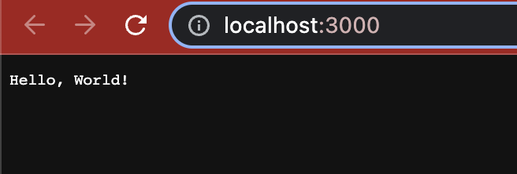

Para colocar mas lógica a nuestra api agregaremos un nuevo endpoint que nos retornará un listado de usuarios generados con <a href="https://pkg.go.dev/github.com/bxcodec/faker/v3#section-readme" target="_blank">Faker</a> (un paquete que genera data aleatoria) y en este caso la generará basada en un modelo de usuarios que crearemos, primero instalamos el paquete, desde la consola ejecutamos:

```bash
go get -u github.com/bxcodec/faker/v3
```

Añadimos el modelo de usuarios a nuestro archivo `main.go` (después de los imports):

```go
type User struct {
	Id         int
	FirstName  string  `faker:"first_name"`
	LastName   string  `faker:"last_name"`
	Email      string  `faker:"email"`
	UserName   string  `faker:"username"`
	IPV4       string  `faker:"ipv4"`
	DomainName string  `faker:"domain_name"`
	Latitude   float32 `faker:"lat"`
	Longitude  float32 `faker:"long"`
	Phone      string  `faker:"phone_number"`
}
```

importamos el paquete de faker:

```go
"github.com/bxcodec/faker/v3"
```

y ahora el endpoint que retorna el listado de usuarios (antes de declarar la variable port):

```go
app.Get("/users", func(c *fiber.Ctx) error {
  var users []User
  err := faker.FakeData(&users)
  if err != nil {
    return err
  }
  return c.JSON(users)
})
```

Corremos nuevamente el proyecto y vemos que nos devuelve un listado de usuarios aleatorios (la cantidad de usuarios varia en cada solicitud que enviamos).

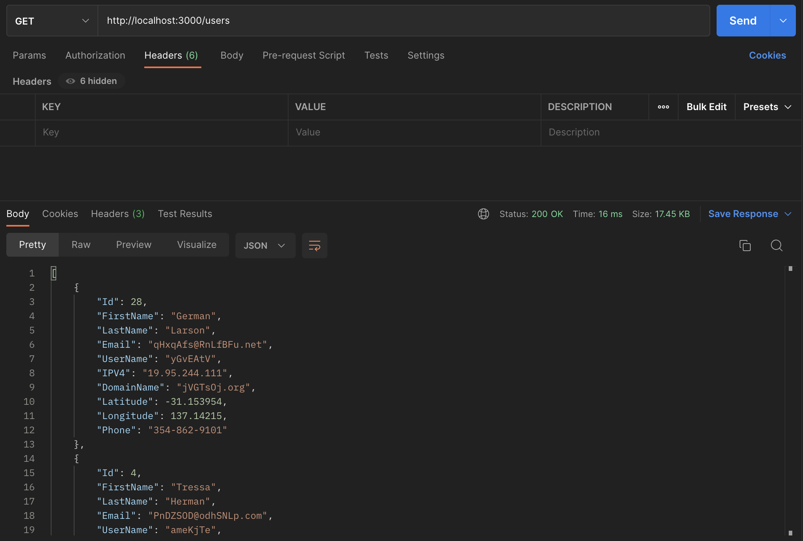

Para añadirle un poco mas de complejidad al momento de hacer las pruebas de carga, vamos a añadir autenticación a nuestra api, utilizaremos jwt para esto, instalaremos los siguientes paquetes:

```bash
go get -u github.com/gofiber/jwt/v3
go get -u github.com/golang-jwt/jwt/v4
```

y ahora en el archivo `main.go` importamos los paquetes instalados:

```go
jwtware "github.com/gofiber/jwt/v3"
"github.com/golang-jwt/jwt/v4"
```
Añadimos un endpoint (después del primer endpoint que añadimos "/") para autenticarnos y obtener un token, solamente validará el password recibido que sea igual a "admin" construirá el token y lo retornará:

```go
app.Post("/login", func(c *fiber.Ctx) error {
  user := c.FormValue("user")
  password := c.FormValue("password")

  if password != "admin" {
    return c.SendStatus(fiber.StatusUnauthorized)
  }

  claims := jwt.MapClaims{
    "name":     user,
    "password": password,
  }

  token := jwt.NewWithClaims(jwt.SigningMethodHS256, claims)

  t, err := token.SignedString([]byte("TheBestSecret"))
  if err != nil {
    return c.SendStatus(fiber.StatusInternalServerError)
  }

  return c.JSON(fiber.Map{"token": t})
})
```

Seguido a este endpoint, le indicaremos a fiber que utilice un middleware para validar el token recibido, importante saber que todos los endpoints definidos antes de esto estarán sin protección, los definidos después validaran que se reciba el token para poder retornar una respuesta (el secret debe ser el mismo).

```go
app.Use(jwtware.New(jwtware.Config{
  SigningKey: []byte("TheBestSecret"),
}))
```
Una vez agregado el endpoint y el middleware corremos nuevamente el proyecto e intentamos de nuevo obtener los usuarios (sin ningún cambio aún) y vemos que nos devuelve un error.

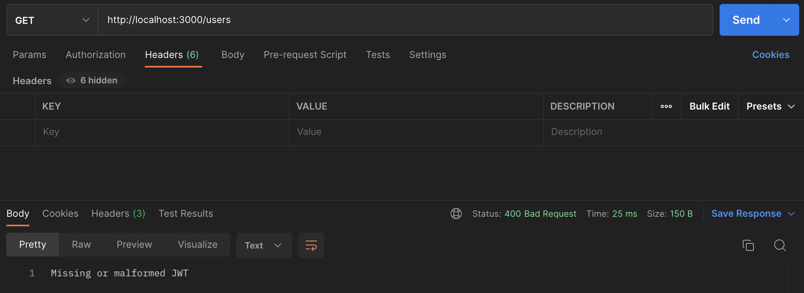

Seguido haremos "inicio de sesión" y veremos que nos devuelve el token:

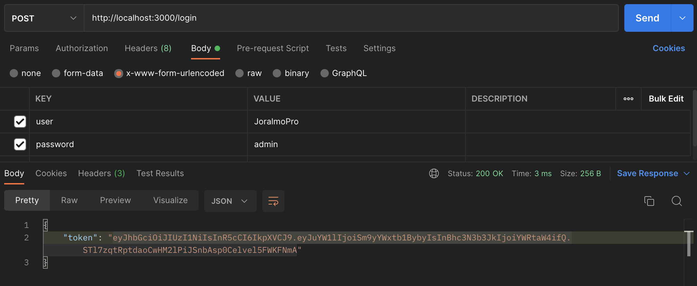

Volvemos a testear el endpoint de usuarios enviando el token y veremos que nos devuelve el listado de usuarios:

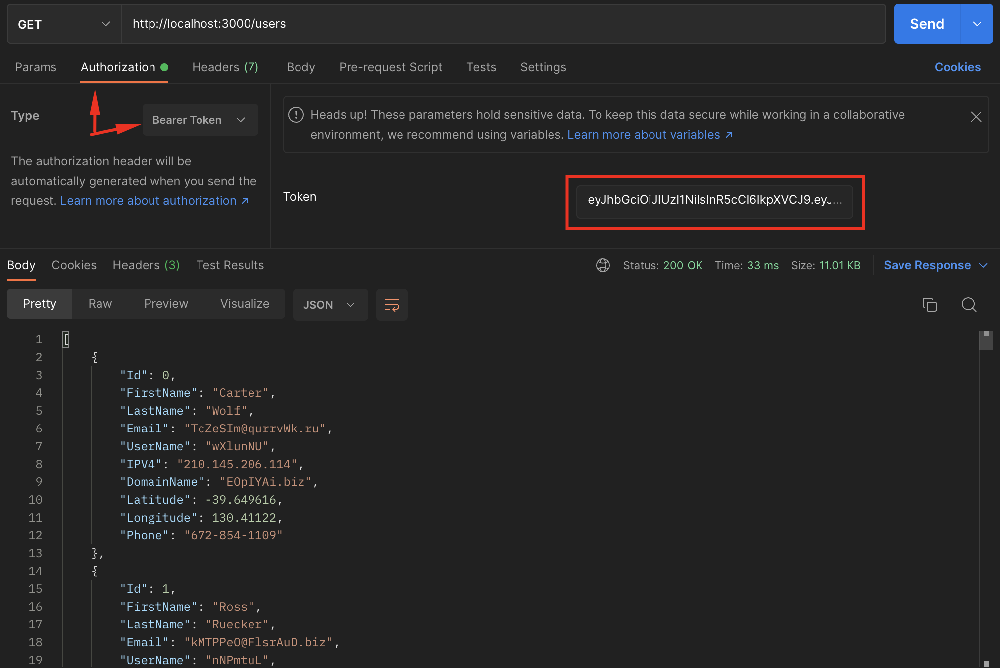

---
Esto sería todo por la parte de Go para nuestra api, el archivo `main.go`quedaría así:

```go
package main

import (
	"os"

	"github.com/bxcodec/faker/v3"
	"github.com/gofiber/fiber/v2"
	jwtware "github.com/gofiber/jwt/v3"
	"github.com/golang-jwt/jwt/v4"
)

type User struct {
	Id         int
	FirstName  string  `faker:"first_name"`
	LastName   string  `faker:"last_name"`
	Email      string  `faker:"email"`
	UserName   string  `faker:"username"`
	IPV4       string  `faker:"ipv4"`
	DomainName string  `faker:"domain_name"`
	Latitude   float32 `faker:"lat"`
	Longitude  float32 `faker:"long"`
	Phone      string  `faker:"phone_number"`
}

func main() {
	app := fiber.New()

	app.Get("/", func(c *fiber.Ctx) error {
		return c.SendString("Hello, World!")
	})

	app.Post("/login", func(c *fiber.Ctx) error {
		user := c.FormValue("user")
		password := c.FormValue("password")

		if password != "admin" {
			return c.SendStatus(fiber.StatusUnauthorized)
		}

		claims := jwt.MapClaims{
			"name":     user,
			"password": password,
		}

		token := jwt.NewWithClaims(jwt.SigningMethodHS256, claims)

		t, err := token.SignedString([]byte("TheBestSecret"))
		if err != nil {
			return c.SendStatus(fiber.StatusInternalServerError)
		}

		return c.JSON(fiber.Map{"token": t})
	})

	// Colocar antes de las rutas que se requieren proteger

	app.Use(jwtware.New(jwtware.Config{
		SigningKey: []byte("TheBestSecret"),
	}))

	app.Get("/users", func(c *fiber.Ctx) error {
		var users []User
		err := faker.FakeData(&users)
		if err != nil {
			return err
		}
		return c.JSON(users)
	})

	port := os.Getenv("PORT")

	if port == "" {
		port = "3000"
	}

	app.Listen(":" + port)
}
```

---
Solo para hacer el tutorial mas interesante (para mí xD) publicaremos esta pequeña app de go en heroku, gracias al cli de heroku esto es un poco sencillo, lo primero es instalar el cli de heroku (<a href="https://devcenter.heroku.com/articles/heroku-cli" target="_blank">Instrucciones de instalación</a>), una vez instalado el cli, ejecutar el comando:

```bash
heroku login
```
Esto abre un navegador y te permite ingresar a heroku
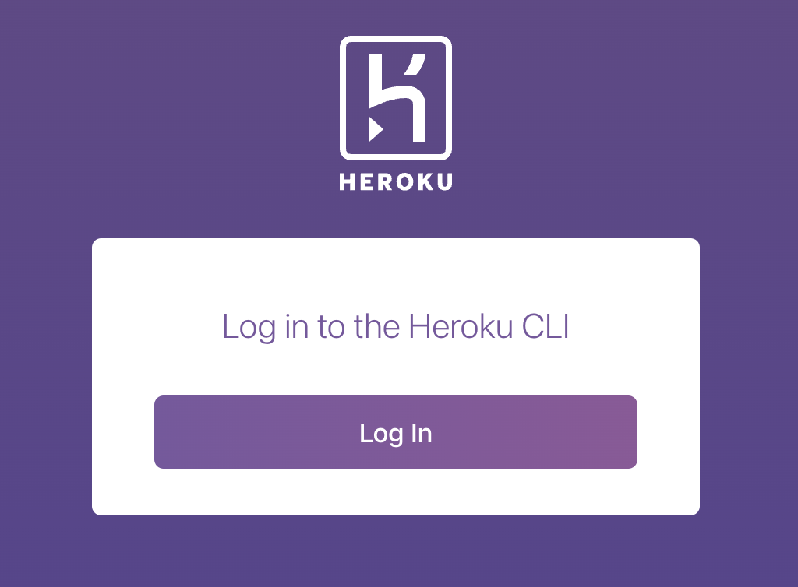
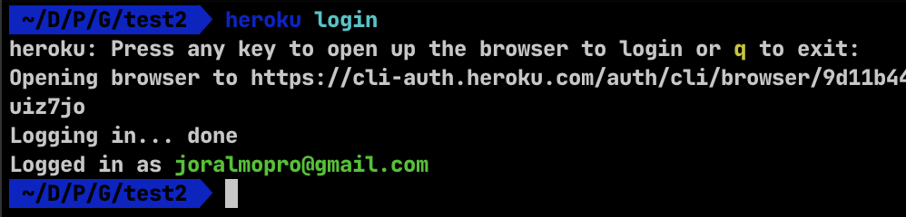

Luego ejecutar el comando:

```bash
heroku create load-test-api-jp
```
> El nombre de la aplicación puede no estar disponible, pueden intentar con otro nombre

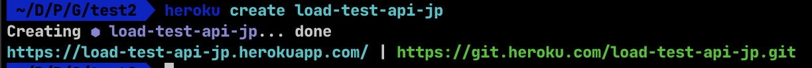

Antes de hacer deploy en el archivo go.mod le especificaremos a heroku que versión de go va a utilizar para evitar errores al desplegar, en el archivo go.mod al final añadimos `// +heroku goVersion go1.18`, quedaría así:

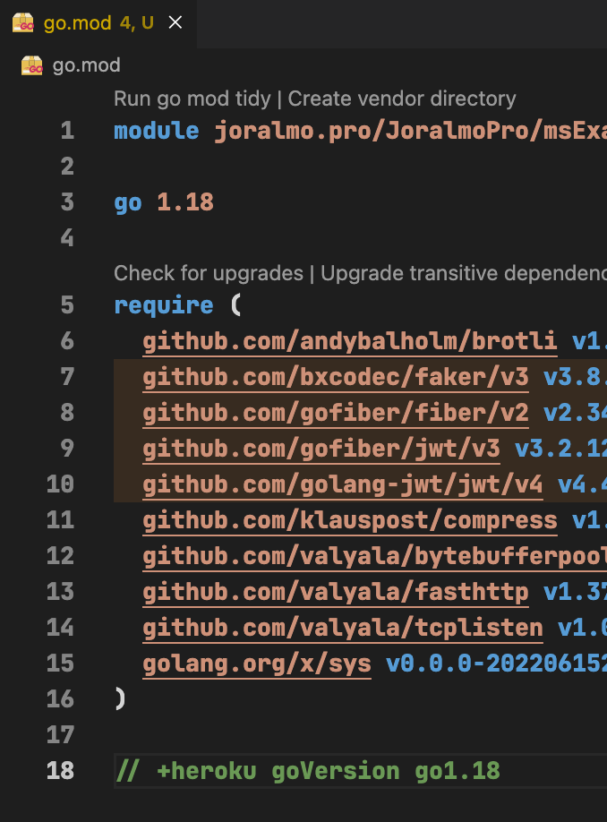

Y ahora solo para poder hacer deploy a heroku, iniciaremos un proyecto de git

```bash
git init
heroku git:remote -a load-test-api-jp
git add .
git commit -m "Make it better :fire:"
git push heroku master
```
Esto iniciará el deploy y al final nos mostrará la url de nuestra aplicación ya desplegada

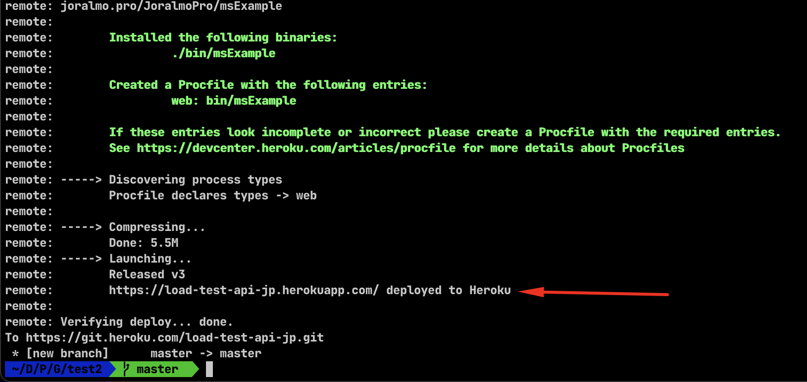

si abrimos en el navegador nos mostrará el resultado que configuramos para el endpoint raíz

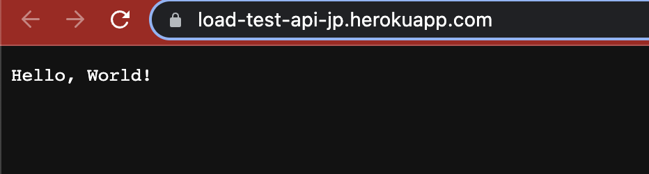

Listo, una vez desplegada la aplicación empezamos con la parte de las pruebas por medio de k6, pero empecemos definiendo primero que es, <a href="https://k6.io/docs/es/#:~:text=%C2%BFQu%C3%A9%20es%20k6%3F,regresiones%20y%20errores%20m%C3%A1s%20tempranamente." target="_blank">la página oficial de k6 lo define así</a>:
> Grafana k6 es una herramienta de pruebas de carga de código libre que hace fácil a equipos de software testear el rendimiento de sus aplicaciones.
Con k6, puedes testear la fiabilidad y rendimiento de aplicaciones e identificar regresiones y errores más tempranamente. k6 te ayudará a construir aplicaciones rápidas y robustas que puedan escalar.

Lo primero será instalar el cli k6, podemos ver <a href="https://k6.io/docs/es/empezando/instalacion/" target="_blank">aquí las instrucciones de instalación</a>

Una vez instalado el cli, veremos la forma más rápida de ejecutar una prueba rápida de k6 utilizando un paquete de npm llamado <a href="https://www.npmjs.com/package/@apideck/postman-to-k6" target="_blank">postman-to-k6</a> este convierte una colección existente de postman a un script de k6 para correrlo como prueba de carga, lo primero será abrir postman, crear una colección nueva y configurar un llamado a nuestro endpoint de la api anteriormente construida

Nos logeamos y copiamos el token de respuesta
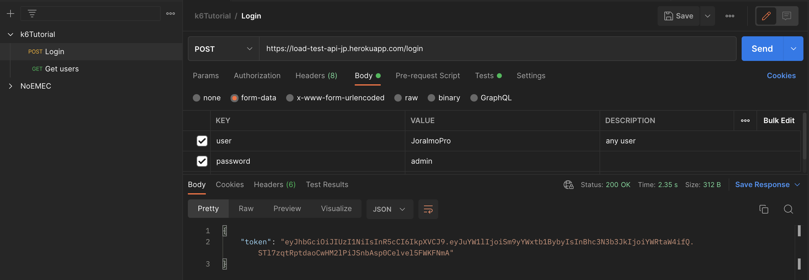

Hacemos una petición de usuarios enviando el token anterior
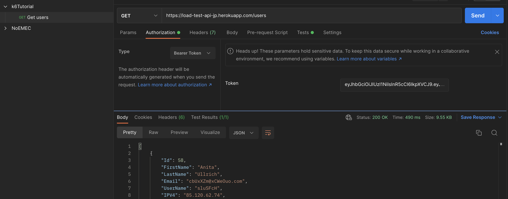

Le añadí un test al endpoint para ver si respondió status 200 y si recibió data

```javascript
pm.test("Status code is 200, and have data", function () {
    pm.response.to.have.status(200);
    pm.expect(pm.response.json().length).to.gt(0)
});
```
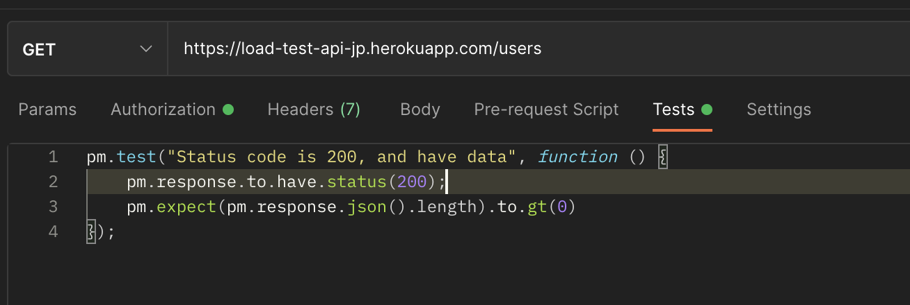

Exportamos la colección
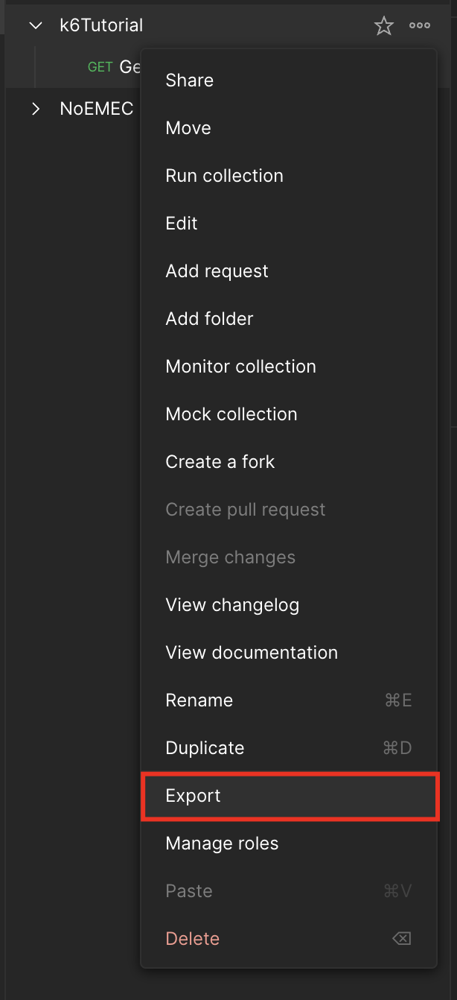

Desde una consola nos situamos en el directorio donde exportamos la colección e instalamos globalmente el paquete de npm postman-to-k6

```bash
npm i -g @apideck/postman-to-k6
```

y ejecutamos el comando

```bash
postman-to-k6 k6Tutorial.postman_collection.json -o k6-script.js
```

Esto tendrá como resultado un archivo javascript y un folder "libs" donde hay una serie de archivos que utilizará k6 para ejecutar la prueba de carga sobre nuestra colección

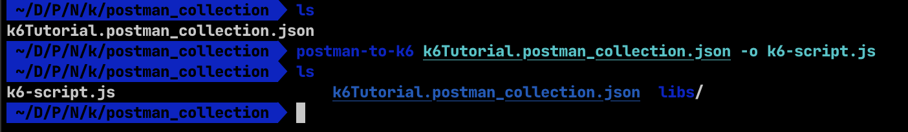

Por ultimo ejecutamos la prueba usando el cli de k6 con el siguiente comando

```bash
k6 run --vus 200 --duration 30s k6-script.js
```

Este comando ejecutará una prueba de carga con 200 usuarios virtuales con una duración de 30 segundos (siempre se ejecuta durante unos segundos mas, mientras configura la ejecución de la prueba), y nos mostrará el resultado de la prueba

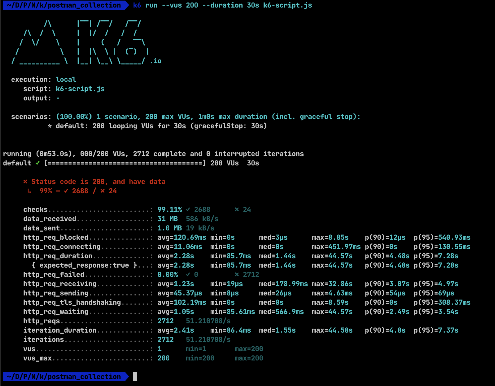

En la salida podemos ver los resultados de la prueba ejecutada e incluso del test que definimos en postman, explicaré lo que entiendo de los mas relevantes del listado

Las letras en rojo son el resultado del test que definimos en postman para cada petición, para este caso 24 de las peticiones trajeron 0 usuarios (no fallaron, solo no trajeron usuarios) y en el test preguntamos si la longitud del array de respuesta era mayor a 0, por eso salen 24 test fallidos.

> http_req_duration..............: avg=2.28s    min=85.7ms  med=1.44s    max=44.57s   p(90)=4.48s p(95)=7.28s

En este resultado podemos observar el promedio del tiempo de respuesta por petición, tiempo mínimo, medio y máximo y los porcentajes de los tiempos de respuesta de los 90%, 95%

> http_req_failed................: 0.00%  ✓ 0         ✗ 2712

Este resultado puede ser un poco confuso (para mí) podríamos entender de las peticiones todas fallaron, pero las que salen con ✓ son las que fallaron y las que salen con ✗ son las que no fallaron, en este caso son 2712 peticiones exitosas, 0.00% de porcentaje de fallos

> http_reqs......................: 2712   51.210708/s

> iteration_duration.............: avg=2.41s    min=86.4ms  med=1.55s    max=44.58s   p(90)=4.8s  p(95)=7.37s

> iterations.....................: 2712   51.210708/s

Estas 3 nos dicen la cantidad de peticiones totales, el promedio de tiempo de respuesta por petición, el tiempo mínimo, medio y máximo y los porcentajes de los tiempos de respuesta de los 90%, 95%, y la cantidad de peticiones por segundo que para este caso fueron 51.210708 peticiones por segundo.

Esta fue una prueba sencilla y rápida de ejecutar construida desde un test que definimos para una colección en postman, pero vayamos a un escenario donde debemos construir los tokens desde una base de usuarios (json) obtener ese token y luego utilizarlo para realizar aparte la petición a nuestra api (incluso obtener mas datos del usuario), para esto construiremos ya un proyecto un poco mas estructurado como ejemplo.

Lo siguiente que haremos es crear un proyecto de nodejs, ya que k6 aunque internamente funciona con Golang, la lógica que escribimos para los test lo hacemos utilizando javascript (aunque typescript para este ejemplo), lo que para mi lo hace mas rápido de aprender y su curva de aprendizaje es menor, entonces iniciamos el proyecto de nodejs e instalaremos algunas dependencias

```bash
npm init -y
npm i k6
npm i -D @babel/cli @babel/core @babel/node @babel/plugin-proposal-class-properties @babel/plugin-proposal-decorators @babel/plugin-proposal-object-rest-spread @babel/preset-env @babel/preset-typescript @types/k6 @types/node babel-loader terser-webpack-plugin webpack webpack-cli
```

Como anteriormente mencionamos este es un caso en el que necesitamos primero obtener los tokens de los usuarios de acuerdo a una base de usuarios (json) previamente definida y luego si utilizar estos para hacer la prueba, entonces lo que haremos será construir dos archivos: uno para el test y otro para la base de usuarios.

    * src/seed.ts
    * src/test.ts

Previo a escribir estos archivos configuramos 3 archivos necesarios para poder usar typescript:
```text:title=.babelrc
{
  "presets": [
    [
      "@babel/typescript"
    ]
  ],
  "plugins": [
    "@babel/proposal-object-rest-spread",
    [
      "@babel/plugin-proposal-decorators",
      {
        "legacy": true
      }
    ],
    [
      "@babel/plugin-proposal-class-properties",
      {
        "loose": true
      }
    ]
  ]
}
```
---
```json:title=tsconfig.json
{
  "compilerOptions": {
    "experimentalDecorators": true,
    // Target ECMAScript.

    "target": "ES6",
    // Search under node_modules for non-relative imports.

    "moduleResolution": "node",
    // Process & infer models from .js files.

    "allowJs": true,
    // Don't emit; allow Babel to transform files.

    "noEmit": true,
    // Enable strictest settings like strictNullChecks & noImplicitAny.

    "strict": true,
    // Disallow features that require cross-file information for emit.

    "isolatedModules": true,
    // Import non-ES modules as default imports.

    "esModuleInterop": true,
    "skipLibCheck": true,
    "noImplicitThis": true,
    "strictNullChecks": true
  },
  "include": [
    "src"
  ]
}
```
---
```javascript:title=webpack.config.js
const path = require('path');
const TerserPlugin = require("terser-webpack-plugin");

module.exports = {
    resolve: {
        extensions: ['.ts', '.js'],
    },
    mode: 'production',
    entry: {
        seed: './src/seed.ts',
    },
    optimization: {
        minimize: true,
        minimizer: [new TerserPlugin()],
    },
    output: {
        path: path.resolve(__dirname, 'dist'),
        libraryTarget: 'commonjs',
        filename: '[name].js'
    },
    module: {
        rules: [
            {
                test: /\.ts$/,
                // exclude: /node_modules/,
                loader: 'babel-loader',
                options: {
                    presets: [['@babel/typescript']],
                    plugins: [
                        '@babel/proposal-class-properties',
                        '@babel/proposal-object-rest-spread'
                    ]
                }
            }
        ]
    },
    stats: {
        colors: true
    },
    // target: 'web',
    externals: /k6(\/.*)?/,
    devtool: 'source-map',
};
```
---
Teniendo estos tres archivos creados, procedemos a crear nuestro archivo json que usaremos como base para obtener los tokens (agregaré en total 100 usuarios, pero lo simplificaré)
```json:title=data.json
[
  {
    "user": "test1"
  },
  ...
  {
    "user": "test100"
  }
]
```

En este punto vale la pena mencionar que k6 cuenta con una serie de <a href="https://k6.io/docs/extensions/" target="_blank">extensiones</a> que nos ayudan en el desarrollo de nuestra prueba, como para nuestro caso necesitamos guardar un archivo con los tokens ya generados por cada usuario para posteriormente utilizarlo en el test, para este tutorial utilizaremos una <a href="https://github.com/avitalique/xk6-file" target="_blank">extensión para escribir un archivo</a>, muy parecido a lo que hace el paquete "fs" de node, para poder usar algunas extensiones de k6 necesitamos instalar un <a href="https://github.com/grafana/xk6">builder de paquetes para k6 (xk6)</a> que nos ayudará con la extensión que necesitamos ahora, para instalarlo usaremos el comando:

```bash
go install go.k6.io/xk6/cmd/xk6@latest
```
y luego para instalar la extensión
```bash
xk6 build v0.36.0 --with github.com/avitalique/xk6-file@latest
```

> En caso de error (como me sucedió a mi) <a href="https://community.k6.io/t/unable-to-locate-xk6-after-installing-it/1866/3" target="_blank">esto me ayudó a solucionar el error</a>

Los anteriores comandos instalarán la extensión file y construirán un binario que será el que usaremos para correr la prueba y usar la extension, una vez corrido los comandos dará una salida como esta

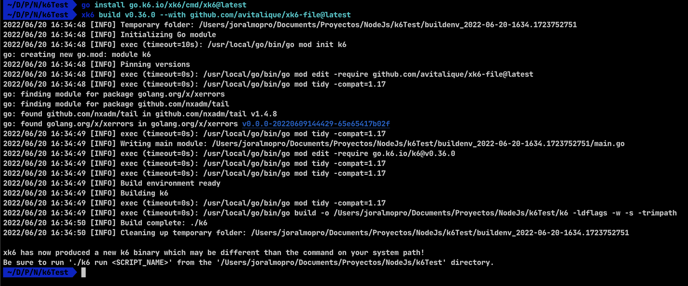

Luego nuestro archivo seed.ts importamos la extensión instalada, el paquete http que viene dentro de k6, declararemos una variable para el password que definimos, y recorreremos uno por uno los usuarios para obtener su token, lo guardamos en un array y al final esto lo guardamos en un nuevo archivo json, quedará con el siguiente contenido:

```typescript:title=src/seed.ts
// @ts-ignore
import file from 'k6/x/file';
import http from "k6/http";

const DEFAULT_PASSWORD = "admin";

const data = require("../data.json");
const resultDataFile = "resultData.json";

export function setup() {
  const authData: any = [];
  data.forEach((userData: any) => {
    const { user } = userData;
    const resp = http.post("https://load-test-api-jp.herokuapp.com/login", {
      user,
      password: DEFAULT_PASSWORD,
    });
    userData.token = (<any>resp.json()).token;
    authData.push(userData);
  });
  try {
    file.writeString(resultDataFile, JSON.stringify(authData));
  } catch (error) {
    console.error(error);
  }
}

export default () => {};
```
En nuestro package.json definiremos 3 scripts
```json
"scripts": {
  "seed": "npm run build && ./k6 run ./dist/seed.js",
  "test": "npm run build && ./k6 run ./dist/test.js",
  "build": "webpack"
}
```

y corremos el proceso de seed con el comando
```bash
npm run seed
```
esto generará el archivo resultData.json con los tokens generados por cada usuario, adicionalmente podríamos guardar cualquier otra info necesaria para posteriormente usarla en la prueba

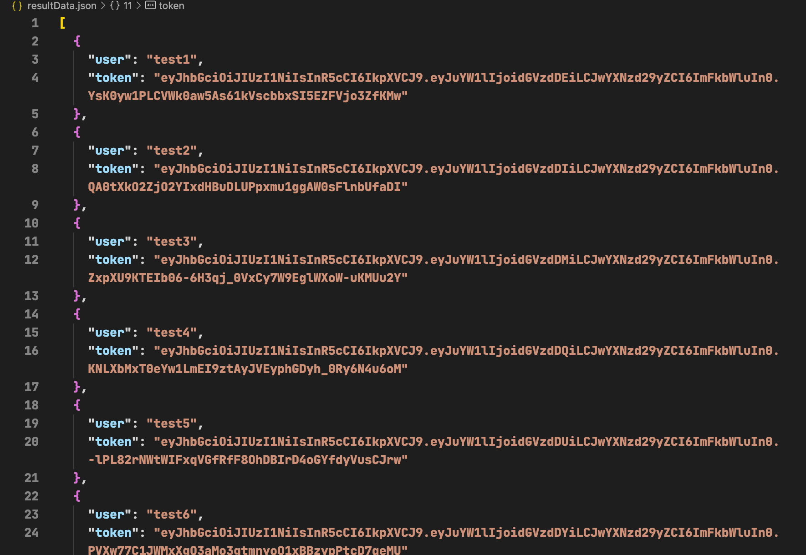

Como resultado tendríamos un archivo listo para ahora proceder a ejecutar nuestra prueba, por lo que procedemos ahora a crear un archivo para ejecutar el test.

Los archivos para k6, como pudimos tal vez observar en el archivo seed.ts se componen de una función setup que se ejecuta antes de nuestro test y una función exportada por defecto que es la que en teoría se encarga de ejecutar nuestras pruebas, pero además de esto podemos definir ciertas opciones para ejecutar nuestra prueba con distintos escenarios, k6 cuenta con una serie de "ejecutores" (<a href="https://k6.io/docs/es/usando-k6/escenarios/executors/" target="_blank">executors</a>) que nos ayuda a definir estos escenarios y no tener que definir en el comando de ejecución cuantos usuarios virtuales usar o cuanto tiempo ejecutar la prueba, sino que los definimos en estas opciones que k6 tendrá en cuenta para correr las pruebas, podemos definir varios escenarios pero para este caso definiremos solo uno que lo que haces es ejecutar un número fijo de iteraciones en un periodo de tiempo determinado, de igual modo haremos uso del json de usuarios generados en el seed para enviar solicitudes constantes a nuestra api, el archivo quedaría así:

```typescript:title=src/test.ts
import http from "k6/http";

const users = require("../resultData.json");

export const options = {
  scenarios: {
    constant_request_rate: {
      executor: "constant-arrival-rate",
      rate: 1000,
      timeUnit: "1s",
      duration: "30s",
      preAllocatedVUs: 100,
      maxVUs: 200,
    },
  },
};

export function setup() {}

export default () => {
  for (let user of users) {
    if (user.token) {
      const url = `https://load-test-api-jp.herokuapp.com/users`;
      const params = {
        headers: {
          Authorization: `Bearer ${user.token}`,
        },
      };
      http.get(url, params);
    }
  }
};
```

Ya en el package.json colocamos previamente el script de build y el de test, pero nos falta añadir en la línea 10 del webpack.config.js la instrucción para transpilar el archivo de test

> test: './src/test.ts',

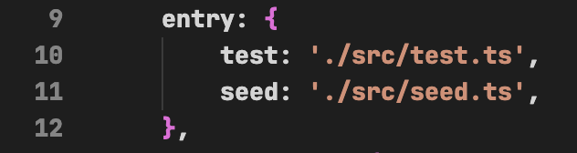

Ahora podemos correr nuestra prueba con el comando
```bash
npm run test
```
Esto empezaría a ejecutar nuestro test

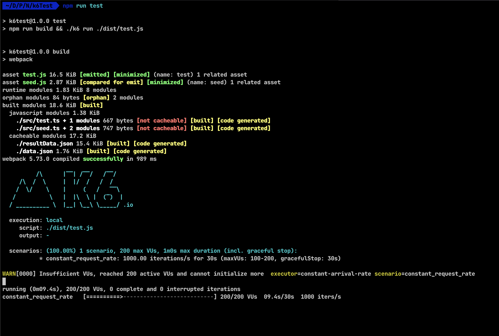
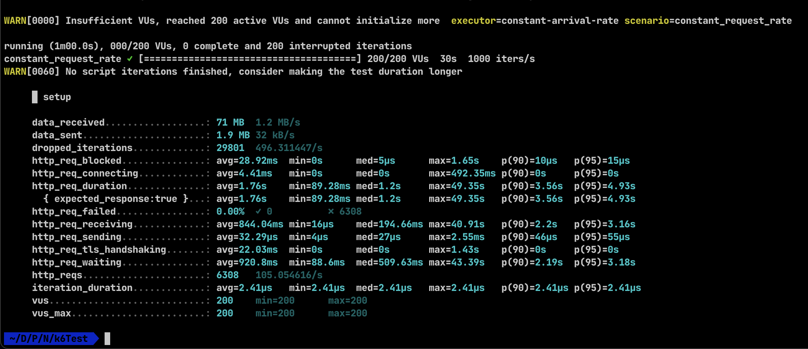

> El warning que aparece es porque mi maquina no soporta la cantidad de usuarios virtuales que definí xD

En los resultados podemos observar que en total hizo 6308 request, 105 request por segundo aproximadamente y cero por ciento de porcentaje de error.

En conclusión y desde mi punto de vista k6 es una forma rápida de ejecutar pruebas de carga, bastante sencilla ya que utiliza javascript para definir las pruebas y escenarios, con las extensiones también nos da la posibilidad y el paquete postman-to-k6 nos permite definir y ejecutar una prueba aún mas rápido en caso de estar familiarizado con postman.

Y bueno, espero haber sido lo bastante claro y explicativo durante el post y que se haya entendido todo, cualquier duda o sugerencia no dudes en contactarme, estoy en las redes como @JoralmoPro.

> Nos vemos en línea.
