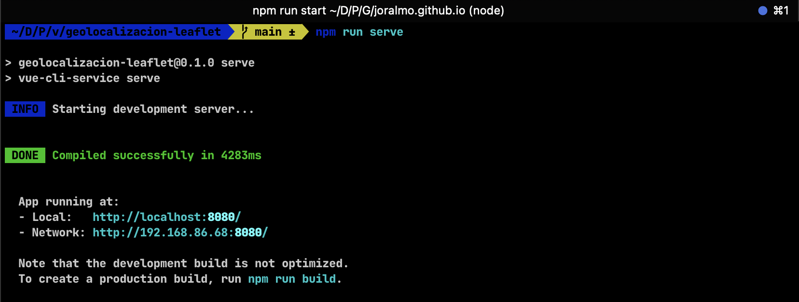
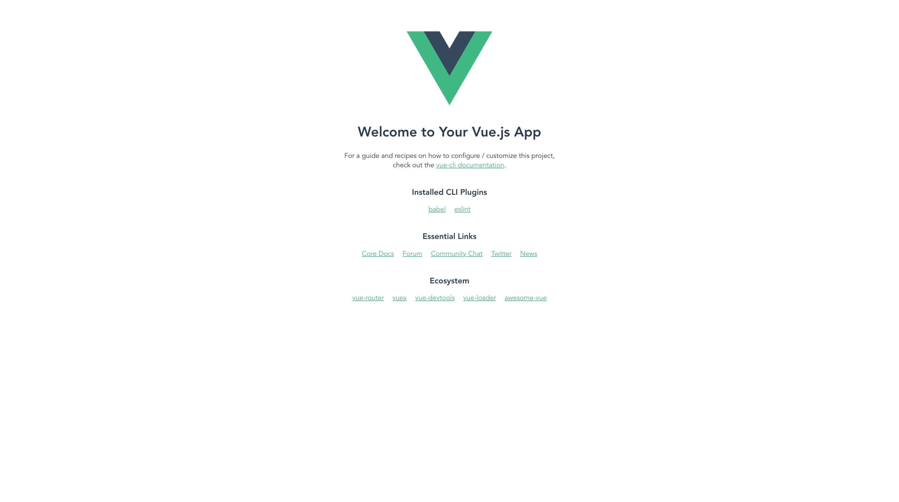

import VideoPlayer from './../videoPlayer.js';

#### Hola, ¿qué tal? 👋 

En este tutorial, como bien dice en el titulo, veremos como transformar direcciones en coordenadas y viceversa usando una API gratuita que nos provee OpenStreetMap, por otro lado esto lo integraremos con otra capa de mapas, que también es gratuito y muy popular, Leaflet.

En esta ocasión usaré Vue.js, pero tengamos en cuenta que esto es aplicable a cualquier framework o librería de JavaScript.

¡Vamos a ello! 🚀 

Si quieres seguir este tutorial, necesitarás:

- Conocimientos básicos de Javascript
- Node.js instalado en tu computadora
- Vue.js instalado en tu computadora

## Paso 1: Crear un nuevo proyecto de Vue.js

Para comenzar, crearemos un nuevo proyecto de Vue.js. Para ello, ejecutamos el siguiente comando en nuestra terminal:

```bash
npm install -g @vue/cli
vue create geolocalizacion-leaflet #(En este paso el proyecto por defecto de vue3 y usando npm)
cd geolocalizacion-leaflet
```

## Paso 2: Instalar Leaflet y Axios

Axios nos ayudará a realizar peticiones a la API de OpenStreetMap, mientras que Leaflet nos ayudará a mostrar el mapa en nuestra aplicación. Instalamos ambas dependencias con el siguiente comando:

```bash
npm install axios leaflet vue3-leaflet
```

#### Solo para asegurarnos que hasta ahora todo va bien, dentro de la carpeta de nuestro proyecto ejecutamos el siguiente comando:

```bash
npm run serve
```
Si todo va bien, deberíamos ver algo así en nuestra terminal:

[](./resultadoConsola.png)

Y al ingresar a `http://localhost:8080/` deberíamos ver algo como esto:

[](./resultadoNavegador.png)

## Paso 3: Crear un componente de mapa

Dentro de la carpeta `src/components` creamos un nuevo archivo llamado `Map.vue` y agregamos el siguiente código:

```vue:title=Map.vue
<template>
  <div>
    <l-map ref="map" :zoom="zoom" :center="center">
      <l-tile-layer :url="url" />
      <l-marker :lat-lng="center"></l-marker>
    </l-map>
  </div>
</template>

<script>
import { LMap, LTileLayer, LMarker } from "vue3-leaflet";
import "leaflet/dist/leaflet.css";

export default {
  name: "MapComponent",
  components: {
    LMap,
    LTileLayer,
    LMarker
  },
  props: {
    center: {
      type: Array,
      required: true
    },
    zoom: {
      type: Number
    },
  },
  data() {
    return {
      url: "https://{s}.tile.openstreetmap.org/{z}/{x}/{y}.png"
    };
  },
  methods: {
    recenterMap() {
      setTimeout(() => {
        this.$refs.map.setZoom(this.zoom);
        this.$refs.map.setView(this.center);
      }, 100);
    }
  }
};
</script>

<style>
  div[center] {
    height: 80vh;
  }
  div#map {
    height: 80vh !important;
  }
</style>
```

Este componente utiliza `vue3-leaflet` para mostrar un mapa de OpenStreetMap, con un marcador en el centro del mapa. A continuación, explicamos cada parte del componente:

la parte
```html
<template>
  <div>
    <l-map ref="map" :zoom="zoom" :center="center">
      <l-tile-layer :url="url" />
      <l-marker :lat-lng="center"></l-marker>
    </l-map>
  </div>
</template>
```
1. `<l-map>`: Este componente es el contenedor principal del mapa. Se le pasan dos propiedades: `zoom` y `center` y adicionalmente tiene un ref para poder acceder a él desde el código.
- `zoom`: Es el nivel de zoom del mapa
- `center`: Es el centro del mapa, en este caso, la posición del marcador
- `ref`: Referencia al mapa para poder acceder a él desde el código

2. `<l-tile-layer>`: Este componente añade las capas de mosaicos (tiles) al mapa, utilizando una URL específica para obtener las imágenes. En este caso, estamos utilizando los mosaicos de OpenStreetMap.

3. `<l-marker>`: Este componente coloca un marcador en el mapa en las coordenadas especificadas por `lat-lng`.

la parte
```javascript
<script>
import { LMap, LTileLayer, LMarker } from "vue3-leaflet";
import "leaflet/dist/leaflet.css";

export default {
  name: "MapComponent",
  components: {
    LMap,
    LTileLayer,
    LMarker
  },
  props: {
    center: {
      type: Array,
      required: true
    },
    zoom: {
      type: Number
    },
  },
  data() {
    return {
      url: "https://{s}.tile.openstreetmap.org/{z}/{x}/{y}.png"
    };
  },
  methods: {
    recenterMap() {
      setTimeout(() => {
        this.$refs.map.setZoom(this.zoom);
        this.$refs.map.setView(this.center);
      }, 100);
    }
  }
};
</script>
```

1. Importaciones
- `LMap`, `LTileLayer` y `LMarker`: Componentes de `vue3-leaflet` que necesitamos para mostrar el mapa y el marcador
- `leaflet/dist/leaflet.css`: Estilos de Leaflet para que el mapa se vea correctamente

2. `name`: Nombre del componente
3. `components`: Componentes que estamos utilizando en este componente
4. `props`: Propiedades que recibe el componente `center` y `zoom`
  - `center`: Coordenadas del centro del mapa
  - `zoom`: Nivel de zoom del mapa
5. `data`: Datos del componente
  - `url`: URL de los mosaicos de OpenStreetMap
6. `methods`: Métodos del componente
  - `recenterMap`: Método para centrar el mapa en las coordenadas especificadas por `center`, se utiliza un `setTimeout` para asegurarse de que el mapa se haya renderizado antes de centrarlo

Por ultimo el bloque de estilos es para darle altura al mapa, en este caso le damos una altura de 80vh.

## Paso 4: Crear un servicio de Geolocalización

Dentro de la carpeta `src` creamos una nueva carpeta llamada `services` y dentro de ella un archivo llamado `geolocation.js`, en este archivo agregamos el siguiente código:

```javascript:title=src/services/geolocation.js
import axios from 'axios';

const GEOCODE_API_URL = 'https://nominatim.openstreetmap.org/search';
const REVERSE_GEOCODE_API_URL = 'https://nominatim.openstreetmap.org/reverse';

export const geocode = (address) => {
  return axios.get(GEOCODE_API_URL, {
    params: {
      q: address,
      format: 'json'
    }
  });
};

export const reverseGeocode = (lat, lon) => {
  return axios.get(REVERSE_GEOCODE_API_URL, {
    params: {
      lat,
      lon,
      format: 'json'
    }
  });
};
```

Este servicio contiene dos funciones principales:

1. `geocode`: Esta función recibe una dirección y realiza una petición a la API de OpenStreetMap para obtener las coordenadas correspondientes a esa dirección.
2. `reverseGeocode`: Esta función recibe una latitud y longitud y realiza una petición a la API de OpenStreetMap para obtener la dirección correspondiente a esas coordenadas.

## Paso 5: Integrar el servicio de Geolocalización en el componente de mapa

Vamos a usar el archivo App.vue para integrar el componente de mapa y el servicio de geolocalización. Borramos todo el contenido de`src/App.vue` y agregamos el siguiente código:

```vue:title=App.vue
<template>
  <div id="app">
    <div class="input-container">
      <input v-model="address" placeholder="Enter an address" />
      <button @click="getCoordinates">Get Coordinates</button>
    </div>
    <div class="info">
      <p>Latitud: {{ coordinates.lat }}</p>
      <p>Longitud: {{ coordinates.lon }}</p>
      <p>
        Nombre de la dirección:
        {{ reverseResponse.display_name || "Busca una dirección" }}
      </p>
    </div>
    <MapComponent
      ref="mapComponent"
      :center="[coordinates.lat, coordinates.lon]"
      :zoom="zoom"
    />
  </div>
</template>

<script>
import { geocode, reverseGeocode } from "./services/geolocation";
import MapComponent from "./components/Map.vue";

export default {
  name: "App",
  components: {
    MapComponent,
  },
  data() {
    return {
      address: "",
      coordinates: {
        lat: 4.570868,
        lon: -74.297333,
      },
      zoom: 15,
      reverseResponse: {},
    };
  },
  methods: {
    async getCoordinates() {
      try {
        const response = await geocode(this.address);
        if (response.data && response.data.length > 0) {
          this.coordinates = {
            lat: parseFloat(response.data[0].lat),
            lon: parseFloat(response.data[0].lon),
          };
          this.$refs.mapComponent.recenterMap();
          const reverseResponse = await reverseGeocode(
            this.coordinates.lat,
            this.coordinates.lon
          );
          this.reverseResponse = reverseResponse.data;
        }
      } catch (error) {
        console.error("Error fetching coordinates:", error);
      }
    },
  },
};
</script>

<style>
#app {
  font-family: Arial, sans-serif;
  margin: 0 auto;
  padding: 20px;
}

.input-container {
  display: flex;
  gap: 10px;
  margin-bottom: 20px;
}

input {
  flex: 1;
  padding: 10px;
  font-size: 16px;
  border: 1px solid #8501B0;
  border-radius: 4px;
}

button {
  padding: 10px 20px;
  font-size: 16px;
  color: #fff;
  background-color: #8501B0;
  border: none;
  border-radius: 4px;
  cursor: pointer;
}

button:hover {
  background-color: #6a0186;
}

.info {
  margin-bottom: 20px;
}

.info p {
  margin: 5px 0;
  font-size: 16px;
}

l-map {
  border: 1px solid #8501B0;
  border-radius: 4px;
}
</style>
```

Este archivo contiene lo siguiente:

1. Un campo de entrada para ingresar una dirección y un botón para obtener las coordenadas correspondientes a esa dirección.
2. El componente `MapComponent` que recibe las coordenadas y el nivel de zoom del mapa.
3. Un objeto `coordinates` que contiene las coordenadas de la dirección ingresada por el usuario (por defecto, Bogotá, Colombia) y que es la respuesta de la API de OpenStreetMap al realizar una petición de geolocalización.
4. Un objeto `reverseResponse` que contiene la respuesta de la API de OpenStreetMap al realizar una petición de geolocalización inversa, usamos las coordenadas de la respuesta de la petición de geolocalización para obtener la dirección correspondiente.
5. El método `getCoordinates` que se encarga de llamar al servicio de geolocalización para obtener las coordenadas de la dirección ingresada por el usuario y de llamar al servicio de geolocalización inversa para obtener la dirección correspondiente a esas coordenadas.
6. Estilos para darle un aspecto visual a la aplicación.

## Paso 6: Ejecutar la aplicación

Para ejecutar la aplicación, ejecutamos el siguiente comando en nuestra terminal:

```bash
npm run serve
```

Si todo va bien, al ingresar a `http://localhost:8080/` deberíamos ver algo así:

<VideoPlayer src="https://joralmo.pro/resultadoFinal.mp4" />

¡Y listo! Hemos creado una aplicación de geolocalización que transforma direcciones en coordenadas y viceversa utilizando Vue.js, OpenStreetMap y Leaflet.

Podemos ver que realmente no es complejo de implementar, tiene tiempos de respuesta muy rápidos y, además, ¡es gratuito!

Espero que este tutorial te haya sido de utilidad, y que puedas aplicar estos conocimientos en tus proyectos.

<a href="https://github.com/Joralmo/geolocalization-tutorial-vue" target="_blank">Repositorio del proyecto en GitHub</a>

> Nos vemos en línea