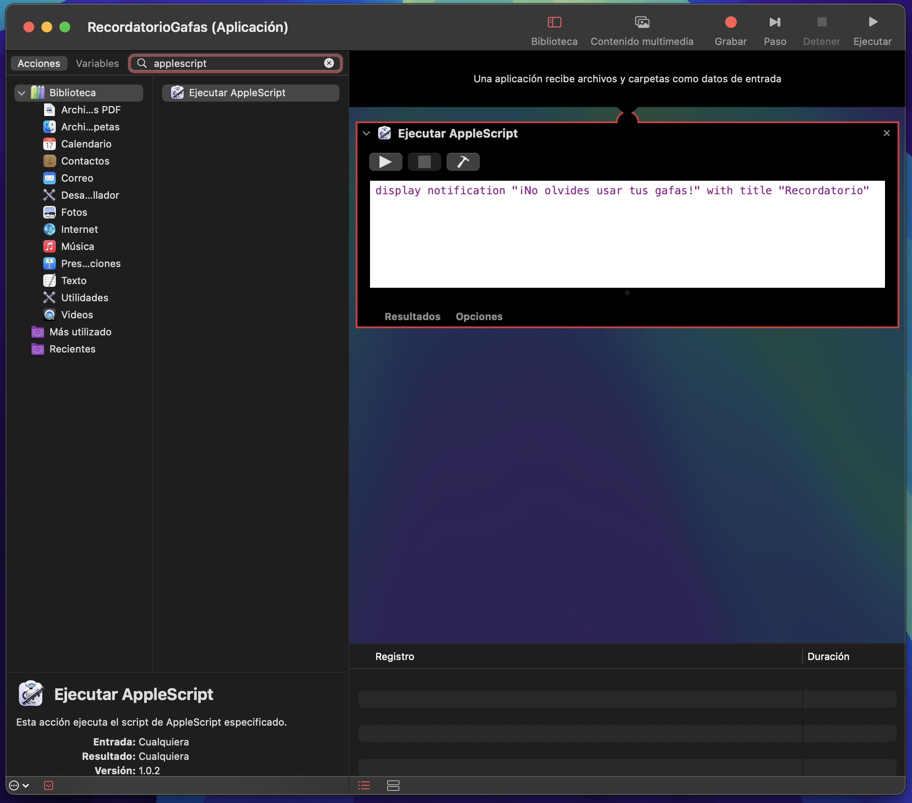
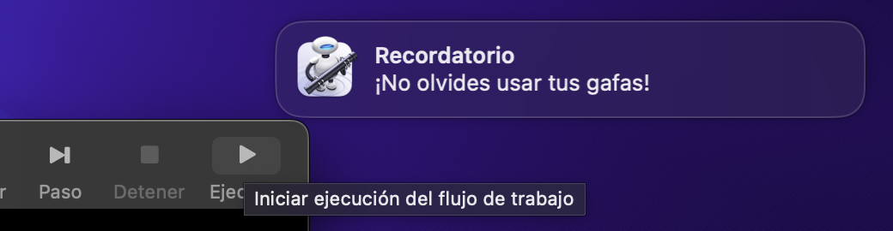
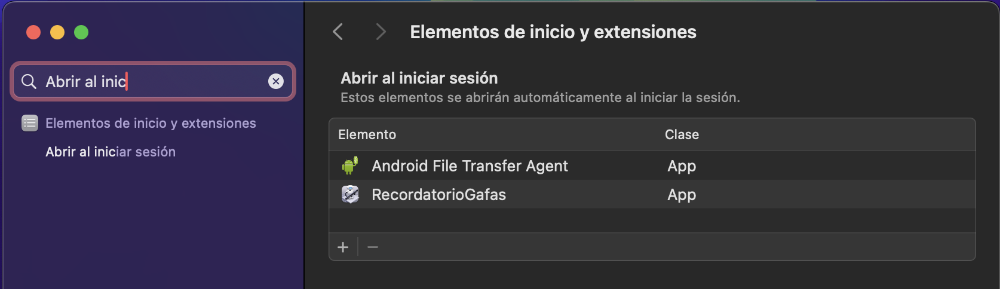

import VideoPlayer from './../videoPlayer.astro';

#### ¡Hola, qué tal! 👋

Mas que un tutorial decidí escribir un pequeño articulo de algo que me sucedió hace poco y que me pareció interesante compartir, espero que te parezca interesante al igual que a mi.

Hace un tiempo me ha tocado empezar a usar mis gafas con filtro anti luz azul, y para mi ha sido muuuy difícil acostumbrarme a usarlas, siempre se me olvida ponérmelas, y aunque tengo una rutina de trabajo en la que debería usarlas, siempre se me olvida.

Por este motivo pensé en como ayudarme a mi mismo a recordar usarlas, y se me ocurrió que cada vez que abriera mi Mac, me recordara que debía usarlas, y así fue como se me ocurrió la idea de crear una notificación automática en mi pc.

El problema al final lo resolví en dos partes:

## Método 1: Usando Automator

Automator es una herramienta poderosa y fácil de usar para automatizar tareas en tu Mac. Estos son los pasos:

### Paso 1: Crear una Aplicación con Automator

1. **Abrir Automator:**
   - Buscar "Automator" en Spotlight (Cmd + Espacio) y ábrelo.

2. **Crear un Nuevo Documento:**
   - Selecciona "Aplicación" cuando se te pida elegir un tipo de documento.

3. **Agregar una Acción de AppleScript:**
   - En el panel de la izquierda, buscar "Ejecutar AppleScript" y arrastrar la acción al panel de flujo de trabajo a la derecha.

4. **Escribir el AppleScript:**
   - Añadir el siguiente código en el cuadro de AppleScript:

     ```applescript
     display notification "¡No olvides usar tus gafas!" with title "Recordatorio"
     ```

5. **Guardar la Aplicación:**
   - Guardar la aplicación con un nombre como "RecordatorioGafas.app" en una ubicación conveniente (por ejemplo, tu carpeta de Aplicaciones).

Al final debería quedar algo como esto:



Aquí mismo podemos probar la aplicación para ver si funciona correctamente, dando click en el botón de "Ejecutar" en la parte superior derecha.



### Paso 2: Configurar la Aplicación para que se Ejecute al Iniciar Sesión

1. **Abrir Preferencias del Sistema:**
   - Ir a "Configuración del Sistema" > "Elementos de inicio de sesión y extensiones" > "Abrir al iniciar sesión". (o algo parecido, dependiendo de la versión de tu Mac).
   - Asegúrate de que tu usuario esté seleccionado en el panel de la izquierda.

2. **Agregar la Aplicación:**
   - Arrastra y suelta tu aplicación "RecordatorioGafas.app" en la lista de elementos de inicio.

Queda algo como esto


Este método es útil pero luego de probarlo me di cuenta que solo funcionará al reiniciar o apagar tu Mac, yo necesitaba algo que me recordara cada vez que abriera mi Mac o cuando volviera de reposo (ya que no acostumbro mucho a apagar mi Mac XD), para esto encontré una solución tal vez un poco mas técnica pero que me ha funcionado muy bien.

## Método 2: Usando SleepWatcher

SleepWatcher es una herramienta de línea de comandos que te permite ejecutar scripts cuando tu Mac entra o sale del modo de suspensión, básicamente supervisa el modo de suspensión, activación e inactividad de una Mac.

Entonces para lograr lo que necesitaba hice lo siguiente:

### Paso 1: Instalar SleepWatcher

1. **Instalar Homebrew (si no lo tienes):**
   - Abrí la Terminal y ejecuté el siguiente comando para instalar Homebrew:
     ```sh
     /bin/bash -c "$(curl -fsSL https://raw.githubusercontent.com/Homebrew/install/HEAD/install.sh)"
     ```

2. **Instalar SleepWatcher:**
   - Una vez teniendo Homebrew instalado, ejecuté el siguiente comando en la Terminal para instalar SleepWatcher:
     ```sh
     brew install sleepwatcher
     ```

### Paso 2: Crear el Script de Notificación

1. **Crear un Script Shell:**
   - Abrí la Terminal y crea un nuevo archivo de script con el siguiente comando:
     ```sh
     nano ~/notificacion_gafas.sh
     ```

2. **Agregar el Código del Script:**
   - Añadí el siguiente código en el editor nano:
     ```sh
     #!/bin/bash
     osascript -e 'display notification "¡No olvides usar tus gafas!" with title "Recordatorio"'
     ```
    Este script básicamente ejecuta una notificación de AppleScript (Parecida a la que hicimos en Automator).

3. **Guardar y Salir:**
   - Presionar `Ctrl + X` para salir, luego `Y` para guardar los cambios, y `Enter` para confirmar.

4. **Hacer el Script Ejecutable:**
   - En la Terminal, ejecuté el siguiente comando para hacer el script ejecutable:
     ```sh
     chmod +x ~/notificacion_gafas.sh
     ```

### Paso 3: Configurar SleepWatcher

1. **Crear los Archivos de Configuración:**
   - En la Terminal, ejecuté los siguientes comandos para crear los archivos necesarios:
     ```sh
     touch ~/.sleep
     touch ~/.wakeup
     ```

2. **Agregar el Script al Archivo de Wakeup:**
   - Abrí el archivo `~/.wakeup` con nano:
     ```sh
     nano ~/.wakeup
     ```
   - Agrega la siguiente línea al archivo:
     ```sh
     ~/notificacion_gafas.sh
     ```

3. **Darle Permisos de Ejecución a SleepWatcher:**
   - En la Terminal, ejecuté el siguiente comando para darle permisos de ejecución a SleepWatcher:
     ```sh
     chmod +x /usr/local/sbin/sleepwatcher
     ```
   - Y permisos de ejecución a los archivos de configuración:
     ```sh
     chmod +x ~/.sleep
     chmod +x ~/.wakeup
     ```

### Paso 4: Iniciar SleepWatcher

1. **Configurar SleepWatcher para que se Inicie Automáticamente:**
   - Esto regularmente se haría en el archivo `~/.zshrc` (o `~/.bash_profile` si usas bash), pero como yo utilizo fish como consola, lo hice en el archivo `/Users/user/.config/fish/config.fish`:
     ```sh
     nano ~/.config/fish/config.fish
     ```
   - Agregué la siguiente línea al final del archivo:
     ```sh
     /usr/local/sbin/sleepwatcher --wakeup ~/.wakeup &
     ```

2. **Recargar el Archivo de Configuración del Shell:**
    - En la Terminal, ejecuté el siguiente comando para recargar el archivo de configuración:
      ```sh
      source ~/.config/fish/config.fish
      ```
    - O simplemente cerrar y abrir la Terminal.

### Probar la Configuración

<VideoPlayer src="https://joralmo.pro/notification.mp4" />

Y gualá, cada vez que abro mi Mac, me aparece una notificación recordándome que debo usar mis gafas, y así no se me olvida (o eso espero 😅).

Espero que este pequeño articulo te sirva para algo, o simplemente te haya parecido interesante como a mi 😄.

> Nos vemos en línea
